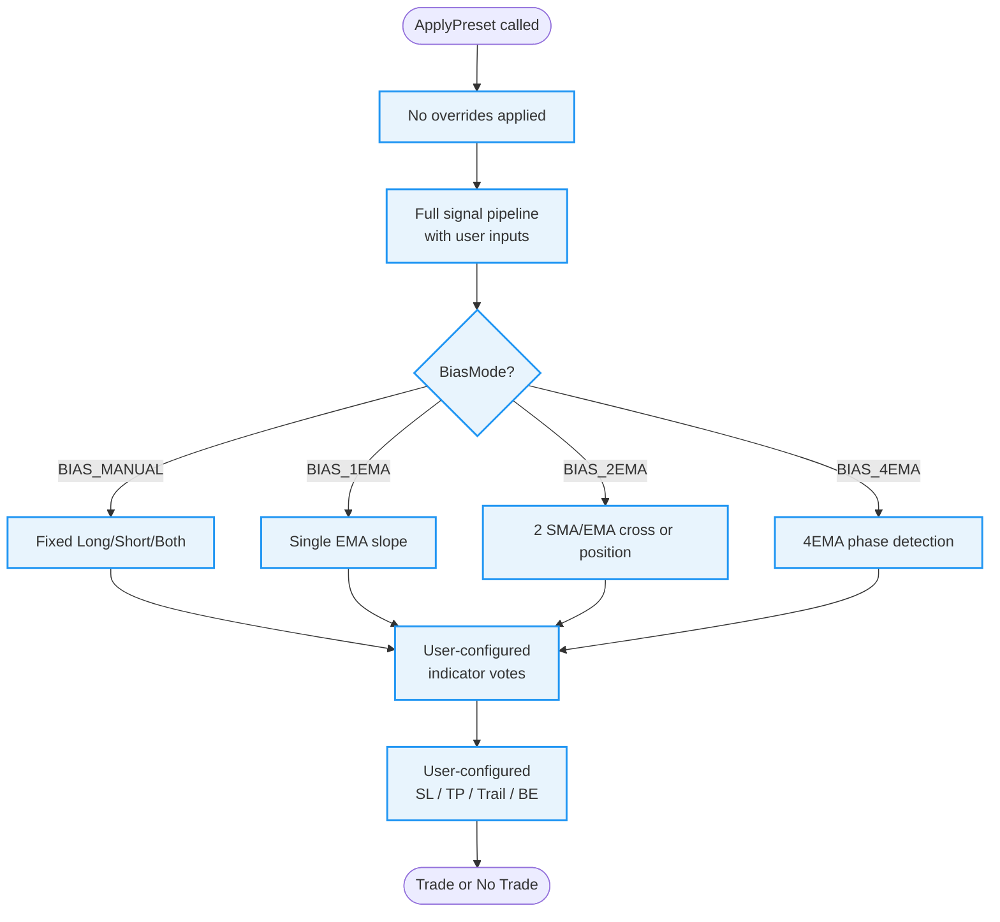
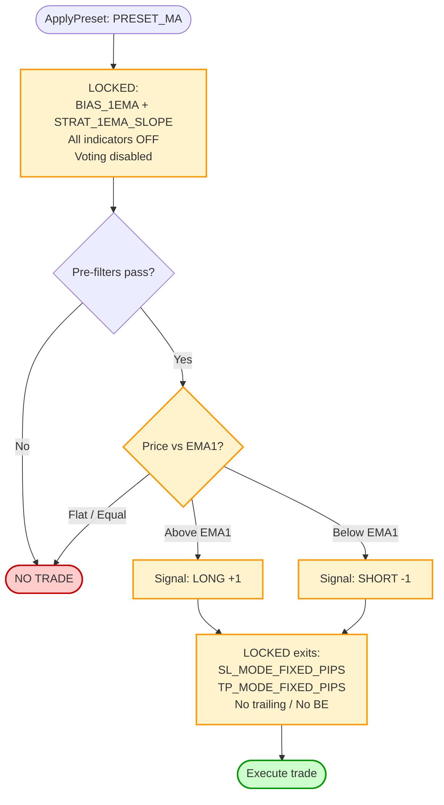
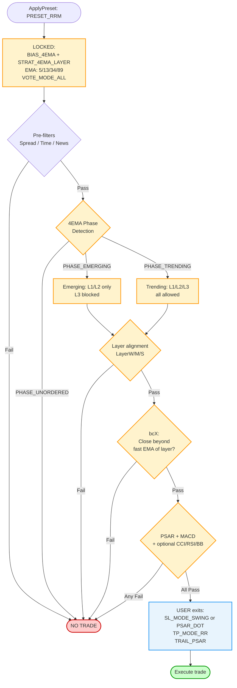
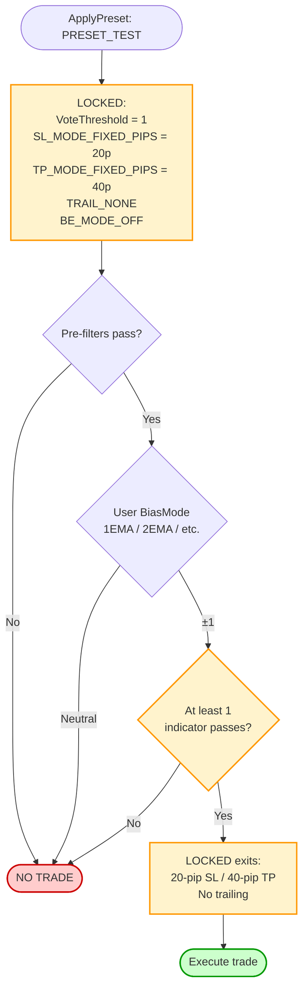
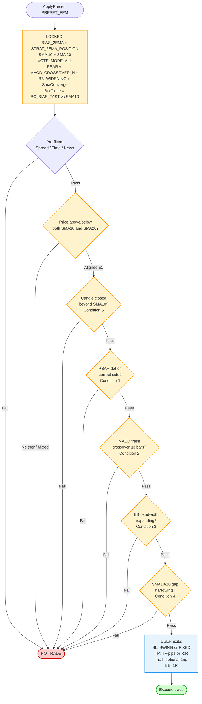

# SEA Preset Reference

## Overview

Presets are applied in `OnInit()` via `ApplyPreset()` (in `SEA_Presets.mqh`).
They overwrite strategy-critical fields **on top of** already-hydrated `Settings`.
**Policy A** gates (spread, time, news, risk) are **always user-controlled** — no preset ever locks them.

| Preset | Purpose | Indicators Locked? | Exits Locked? |
|---|---|---|---|
| `PRESET_CUSTOM` | Full user control | ✗ | ✗ |
| `PRESET_MA` | MT5 MA benchmark | ✓ (none — voting off) | ✓ fixed pips |
| `PRESET_RRM` | Phase-based trend pullback | ✓ PSAR+MACD+CCI core | Partially (trail locked, SL/TP user) |
| `PRESET_TEST` | Dev/debug bypass | ✗ (threshold=1) | ✓ fixed pips |
| `PRESET_FPM` | Five-Point Method | ✓ PSAR+MACD+BB+SmaConv | ✗ (SL/TP/Trail user) |

---

## PRESET_CUSTOM

No overrides. Every input is respected exactly as entered by the user.
The signal pipeline runs in full with whatever indicators, bias mode, and exits are configured.



**Use when:** You want full manual control, backtesting custom indicator combinations, or building your own strategy on top of the SEA framework.

---

## PRESET_MA

Replicates the classic MT5 Moving Average sample EA. Single EMA, price-cross signal, no indicators, fixed pip exits. Exists purely as a benchmark baseline.



**Locked settings:** `BIAS_1EMA`, `STRAT_1EMA_SLOPE`, all indicators disabled, fixed SL/TP pips.
**User controls:** Policy A gates (spread/time/news/risk) only.
**Use when:** Benchmarking — run this alongside PRESET_RRM or PRESET_FPM to compare against the naive baseline.

---

## PRESET_RRM

Phase-based trend pullback system. Uses 4 EMAs to detect market structure phases, requires price to be in a valid pullback layer, and gates entry through PSAR + MACD + optional CCI/RSI/BB votes.



**Locked settings:** `BIAS_4EMA`, `STRAT_4EMA_LAYER`, EMA periods (5/13/34/89), `VOTE_MODE_ALL`, `MACD_CROSSOVER` mode, phase & layer detection ON.
**User controls (Zone 3B):** PSAR step/max, MACD fast/slow/sig, CCI period/mode, RSI period, SL mode, TP mode, R:R ratio, trailing mode, Policy A gates.
**Use when:** Trend-following on M5–H1 with structured pullback entries. Works best in directional trending markets.

---

## PRESET_TEST

Minimal development/debug preset. Bypasses the indicator consensus requirement (threshold = 1, so any single indicator passing is enough), uses fixed SL/TP, no trailing. Designed for rapid iteration during development.



**Locked settings:** Vote threshold = 1, fixed SL 20 pips, fixed TP 40 pips, no trailing, BE off.
**User controls:** Bias mode and indicator selection (to test individual indicators in isolation).
**Use when:** Debugging a new indicator or bias mode. Never use on a live account.

---

## PRESET_FPM

Implements the Five-Point Method (Forex Profit Model) cheat sheet exactly. Five conditions must all pass. Exits are fully user-controlled.



### Entry Conditions (all 5 must pass)

| # | Cheat Sheet | EA Implementation |
|---|---|---|
| 1 | PSAR crossed below/above price | `Ind_Psar`: dot on correct side of price |
| 2 | MACD crossed above/below signal | `Ind_Macd`: `MACD_CROSSOVER_N` ≤ 3 bars fresh |
| 3 | Bollinger Bands widening | `Ind_Bb`: `BB_WIDENING` — bandwidth > previous bar |
| 4 | 10 + 20 SMA converging | `Ind_SmaConverge`: gap narrowing bar-to-bar |
| 5 | Candle closed above/below both SMAs | `BarClose`: `BC_BIAS_FAST` vs SMA10 |

### User-Controlled Exits (Zone 3C)

| Input | Default | Options |
|---|---|---|
| `Inp_FPM_SLMode` | `SL_MODE_SWING` | `SL_MODE_SWING` or `SL_MODE_FIXED_PIPS` |
| `Inp_FPM_SwingLookback` | `5` | Bars for swing anchor |
| `Inp_FPM_SLFixedPips` | `15.0` | Pips (fixed mode only) |
| `Inp_FPM_TPMode` | `TP_MODE_FIXED_PIPS` | `TP_MODE_FIXED_PIPS` (TF table) or `TP_MODE_RR` |
| `Inp_FPM_RRRatio` | `2.0` | Any double e.g. 1.5, 2.0, 3.0 |
| `Inp_FPM_UseTrailing` | `true` | On/off |
| `Inp_FPM_TrailDistancePips` | `15.0` | Pips |

**Cheat sheet TP targets** (used with `TP_MODE_FIXED_PIPS`):

| TF | Range | EA midpoint |
|---|---|---|
| M5 | 7–15 pips | 11 pips |
| M15 | 10–20 pips | 15 pips |
| M30 | 30–50 pips | 40 pips |
| H1+ | — | 50 pips |

**Breakeven** is always on at 1R (`BE_MODE_R_MULTIPLE`).
**Trailing** activates after breakeven (`TRIGGER_BREAKEVEN`), 15-pip distance by default.

### Recommended Configurations

**Cheat sheet faithful:**
```
Inp_FPM_SLMode             = SL_MODE_SWING
Inp_FPM_SwingLookback      = 5
Inp_FPM_TPMode             = TP_MODE_FIXED_PIPS
Inp_FPM_UseTrailing        = true
Inp_FPM_TrailDistancePips  = 15.0
```

**Proportional R:R:**
```
Inp_FPM_SLMode             = SL_MODE_SWING
Inp_FPM_TPMode             = TP_MODE_RR
Inp_FPM_RRRatio            = 2.0
Inp_FPM_UseTrailing        = true
```

**Fixed distance (no swing):**
```
Inp_FPM_SLMode             = SL_MODE_FIXED_PIPS
Inp_FPM_SLFixedPips        = 15.0
Inp_FPM_TPMode             = TP_MODE_RR
Inp_FPM_RRRatio            = 1.5
Inp_FPM_UseTrailing        = false
```

### Things to Remember
- **25-pip SL cap is manual.** No automatic cap. If swing anchor is deeper than 25 pips, skip the trade.
- **Late to the party? Wait.** `MACD_CROSSOVER_N` enforces a 3-bar freshness window automatically.
- **BB_WIDENING is a one-bar test.** Choppy days may produce false positives — the other 4 conditions filter them.
- **SmaConverge is direction-neutral.** Bias and bar-close handle direction; convergence only checks gap size.
- **Check the news.** Use `UseNews` + `NewsPre`/`NewsPost` to automate blackouts.
