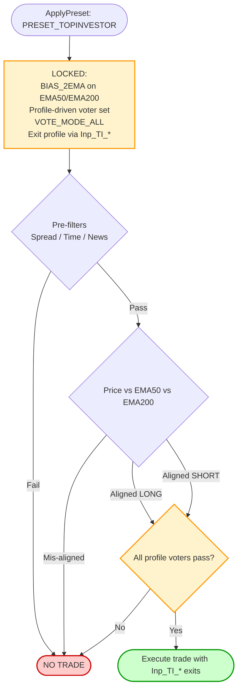
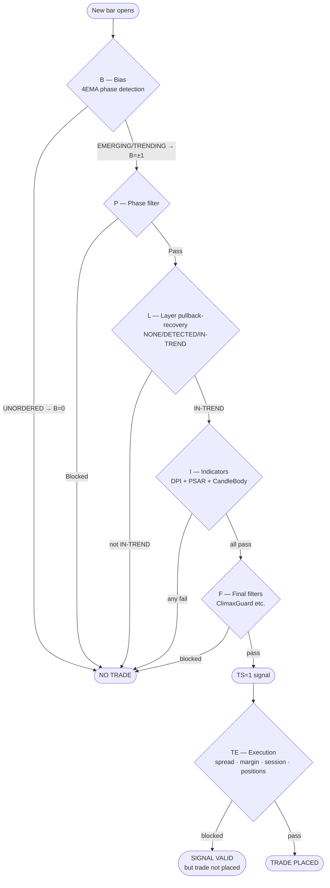
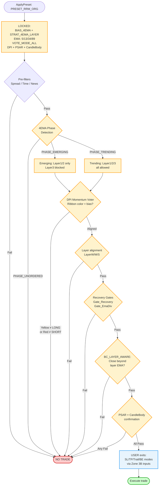

# SEA Preset Reference

## Overview

Presets are applied in `OnInit()` via `ApplyPreset()` (in `SEA_Presets.mqh`).
They overwrite strategy-critical fields **on top of** already-hydrated `Settings`.
**Policy A** gates (spread, time, news, risk) are **always user-controlled** — no preset ever locks them.

> **2026-06 refactor note.** Three presets were removed: `PRESET_CUSTOM` (its `Inp_CUSTOM_*` inputs were only seed defaults for other presets, not a real preset — globals moved to `Inp_Global_*`), `PRESET_RRM` (an untraded variant of `PRESET_RRM_ORG`), and `PRESET_TEST` (a dev scaffold that was `#ifdef`-gated off). The sections describing them further down this document are **historical only** and marked `[REMOVED]`. The current set is the four presets in the table below. The user-control surface that `PRESET_CUSTOM` formerly provided now lives in `Inp_Global_*` globals plus per-preset override blocks (`Inp_RRM_ORG_*`, `Inp_FPM_*`, `Inp_TI_*`, `Inp_MA_*`).

## Current presets

| Preset | Purpose | Indicators Locked? | Exits Locked? |
|---|---|---|---|
| `PRESET_RRM_ORG` | Russ Horn Original RRM — 4EMA, TM phase only, DPI+PSAR+CandleBody+MTF voting. **Current default.** | ✓ DPI+PSAR+CBody+MTF core | Configurable via `Inp_RRM_ORG_*` |
| `PRESET_FPM` | Five-Point Method (Crucial Carlos) | ✓ PSAR+MACD+BB widening+SmaConverge+bar-close | ✗ (SL/TP/Trail user-controlled) |
| `PRESET_TOPINVESTOR` | Dr Świerk TopInvestor / OXO — EMA50/200 confluence | ✓ profile-driven (CONSERVATIVE / BALANCED / AGGRESSIVE) | Configurable via `Inp_TI_*`. See `README_SEA_PRESET_TOPINVESTOR_MANUAL.md`. |
| `PRESET_MA` | MT5 `Moving Average.mq5` sample EA benchmark | ✓ (none — voting disabled, threshold-=1) | ✓ fixed pips |

---

## ~~PRESET_CUSTOM~~ [REMOVED 2026-06]

> Historical content preserved below for reference. `PRESET_CUSTOM` no longer exists. The user-control surface it provided has been split: cross-preset globals are now `Inp_Global_*`, and per-preset overrides live in dedicated blocks (`Inp_RRM_ORG_*`, `Inp_FPM_*`, `Inp_TI_*`, `Inp_MA_*`).

No overrides. Every input is respected exactly as entered by the user.
The signal pipeline runs in full with whatever indicators, bias mode, and exits are configured.


**Use when:** You want full manual control, backtesting custom indicator combinations, or building your own strategy on top of the SEA framework.

---

## PRESET_MA

Replicates the classic MT5 Moving Average sample EA. Single EMA, price-cross signal, no indicators, fixed pip exits. Exists purely as a benchmark baseline.


**Locked settings:** `BIAS_1EMA`, `STRAT_1EMA_SLOPE`, all indicators disabled, fixed SL/TP pips.
**User controls:** Policy A gates (spread/time/news/risk) only.
**Use when:** Benchmarking — run this alongside PRESET_RRM or PRESET_FPM to compare against the naive baseline.

---

## ~~PRESET_RRM~~ [REMOVED 2026-06]

> Historical content preserved below for reference. `PRESET_RRM` no longer exists. It was an untraded variant of `PRESET_RRM_ORG` (the current canonical RRM preset). The mechanics described here remain accurate for `PRESET_RRM_ORG` — phase-based trend pullback, 4EMA detection, layer-gated entries — though the indicator vote panel for `PRESET_RRM_ORG` is **DPI + PSAR + CandleBody + MTF** (not MACD + CCI/RSI/BB as listed for the old RRM).

Phase-based trend pullback system. Uses 4 EMAs to detect market structure phases, requires price to be in a valid pullback layer, and gates entry through PSAR + MACD + optional CCI/RSI/BB votes.


**Locked settings:** `BIAS_4EMA`, `STRAT_4EMA_LAYER`, EMA periods (5/13/34/89), `VOTE_MODE_ALL`, `MACD_CROSSOVER` mode, phase & layer detection ON.
**User controls (Zone 3B):** PSAR step/max, MACD fast/slow/sig, CCI period/mode, RSI period, SL mode, TP mode, R:R ratio, trailing mode, Policy A gates.
**Use when:** Trend-following on M5–H1 with structured pullback entries. Works best in directional trending markets.

---

## ~~PRESET_TEST~~ [REMOVED 2026-06]

> Historical content preserved below for reference. `PRESET_TEST` no longer exists. It was a dev scaffold preset that was `#ifdef`-gated off in shipping builds and never enabled in production.

Minimal development/debug preset. Bypasses the indicator consensus requirement (threshold = 1, so any single indicator passing is enough), uses fixed SL/TP, no trailing. Designed for rapid iteration during development.


**Locked settings:** Vote threshold = 1, fixed SL 20 pips, fixed TP 40 pips, no trailing, BE off.
**User controls:** Bias mode and indicator selection (to test individual indicators in isolation).
**Use when:** Debugging a new indicator or bias mode. Never use on a live account.

---

## PRESET_TOPINVESTOR

Dr Świerk TopInvestor / OXO methodology — EMA50/200 confluence with profile-driven indicator voting. Three profiles trade off filter strictness against trade frequency:

| Profile | Voters | Use case |
|---|---|---|
| `TI_CONSERVATIVE` | 4 (PSAR + ADX + CandleBody + MTF) | Strict, low-frequency, high-conviction setups |
| `TI_BALANCED` | 5 (adds MACD) | Default profile |
| `TI_AGGRESSIVE` | 6 (adds RSI) | More entries, looser filter |



**Locked settings:** `BIAS_2EMA` (EMA50/EMA200), profile-driven voter set, `VOTE_MODE_ALL`.
**User controls:** profile selection via `Inp_TI_Profile`, all exit logic via `Inp_TI_*` block, Policy-A gates.
**Use when:** longer-timeframe (M15-H4) trend-confluence trading where EMA50 over EMA200 is the structural anchor.

**See `README_SEA_PRESET_TOPINVESTOR_MANUAL.md` for the full configuration and methodology reference.**

---

## PRESET_FPM

Implements the Five-Point Method (Forex Profit Model) cheat sheet exactly. Five conditions must all pass. Exits are fully user-controlled.


### Entry Conditions (all 5 must pass)

| # | Cheat Sheet | EA Implementation |
|---|---|---|
| 1 | PSAR crossed below/above price | `Ind_Psar`: dot on correct side of price |
| 2 | MACD crossed above/below signal | `Ind_Macd`: `MACD_CROSSOVER_N` ≤ 3 bars fresh |
| 3 | Bollinger Bands widening | `Ind_Bb`: `BB_WIDENING` — bandwidth > previous bar |
| 4 | 10 + 20 SMA converging | `Ind_SmaConverge`: gap narrowing bar-to-bar |
| 5 | Candle closed above/below both SMAs | `BarClose`: `BC_BIAS_FAST` vs SMA10 |

### User-Controlled Exits (Zone 3C)

| Input | Default | Options |
|---|---|---|
| `Inp_FPM_SLMode` | `SL_MODE_SWING` | `SL_MODE_SWING` or `SL_MODE_FIXED_PIPS` |
| `Inp_FPM_SwingLookback` | `5` | Bars for swing anchor |
| `Inp_FPM_SLFixedPips` | `15.0` | Pips (fixed mode only) |
| `Inp_FPM_TPMode` | `TP_MODE_FIXED_PIPS` | `TP_MODE_FIXED_PIPS` (TF table) or `TP_MODE_RR` |
| `Inp_FPM_RRRatio` | `2.0` | Any double e.g. 1.5, 2.0, 3.0 |
| `Inp_FPM_UseTrailing` | `true` | On/off |
| `Inp_FPM_TrailDistancePips` | `15.0` | Pips |

**Cheat sheet TP targets** (used with `TP_MODE_FIXED_PIPS`):

| TF | Range | EA midpoint |
|---|---|---|
| M5 | 7–15 pips | 11 pips |
| M15 | 10–20 pips | 15 pips |
| M30 | 30–50 pips | 40 pips |
| H1+ | — | 50 pips |

**Breakeven** is always on at 1R (`BE_MODE_R_MULTIPLE`).
**Trailing** activates after breakeven (`TRIGGER_BREAKEVEN`), 15-pip distance by default.

### Recommended Configurations

**Cheat sheet faithful:**
```
Inp_FPM_SLMode             = SL_MODE_SWING
Inp_FPM_SwingLookback      = 5
Inp_FPM_TPMode             = TP_MODE_FIXED_PIPS
Inp_FPM_UseTrailing        = true
Inp_FPM_TrailDistancePips  = 15.0
```

**Proportional R:R:**
```
Inp_FPM_SLMode             = SL_MODE_SWING
Inp_FPM_TPMode             = TP_MODE_RR
Inp_FPM_RRRatio            = 2.0
Inp_FPM_UseTrailing        = true
```

**Fixed distance (no swing):**
```
Inp_FPM_SLMode             = SL_MODE_FIXED_PIPS
Inp_FPM_SLFixedPips        = 15.0
Inp_FPM_TPMode             = TP_MODE_RR
Inp_FPM_RRRatio            = 1.5
Inp_FPM_UseTrailing        = false
```

### Things to Remember
- **25-pip SL cap is manual.** No automatic cap. If swing anchor is deeper than 25 pips, skip the trade.
- **Late to the party? Wait.** `MACD_CROSSOVER_N` enforces a 3-bar freshness window automatically.
- **BB_WIDENING is a one-bar test.** Choppy days may produce false positives — the other 4 conditions filter them.
- **SmaConverge is direction-neutral.** Bias and bar-close handle direction; convergence only checks gap size.
- **Check the news.** Use `UseNews` + `NewsPre`/`NewsPost` to automate blackouts.

---

## PRESET_RRM_ORG

Implements the original Russ Horn RRM methodology. Four EMAs (5/13/34/89) define market structure. Entries require a confirmed pullback-recovery cycle (price pulls back to the EMA band and closes back through it). DPI (Dynamic Price Index), PSAR, and CandleBody vote unanimously for entry.

---

### Architecture: TS pipeline vs TE execution

**Critical separation — never mix these up:**

| | When | Data | What it does |
|--|--|--|--|
| **TS=1 (signal)** | Shift=1 — previous closed bar | Immutable historical | Evaluates all signal conditions. If all pass → TS=1. |
| **TE=1 (execute)** | Shift=0 — current open bar | Live market | Checks execution conditions only: spread, margin, session filter, position count. Never re-evaluates signal indicators. |

A TS=1 generated at shift=1 is a valid signal. The PSAR dot at shift=0 (the entry bar) is irrelevant — the signal was evaluated against the dot at shift=1 (the signal bar close). What the chart shows at the entry candle is shift=0 data.

---

### Signal pipeline (TS equation)

```
TS = B[±1] × P[1] × L[1] × I[1] × F[1]
```

All six factors must equal 1. One zero kills the signal.



---

### B — Bias (4EMA phase detection)

Uses EMAs: EMA1=5, EMA2=13, EMA3=34, EMA4=89.

| EMA ordering | Phase | B |
|---|---|---|
| EMA13 > EMA34 > EMA89 | TRENDING UP | +1 |
| EMA89 > EMA34 > EMA13 | TRENDING DN | −1 |
| EMA13 > EMA89 > EMA34 | EMERGING UP | +1 |
| EMA34 > EMA89 > EMA13 | EMERGING DN | −1 |
| Any other ordering | UNORDERED | 0 → blocked |

When EMA13 < EMA34 but EMA89 is still at the bottom (e.g. EMA34 > EMA13 > EMA89) the phase is UNORDERED. This is a transitional state during deep pullbacks; the EA waits for it to resolve before entering.

---

### P — Phase filter

| Phase | LayerW | LayerM | LayerS |
|---|---|---|---|
| TRENDING | ✓ | ✓ | ✓ |
| EMERGING | ✓ | ✓ | ✗ (always blocked) |
| UNORDERED | ✗ | ✗ | ✗ |

Strong setups (LayerS = EMA34/EMA89) are always blocked in EMERGING phase. This is enforced via `Emerging_AllowStrongTrades = false` (hard-coded in preset). User cannot change this.

`LayerS_RequireDirAlign = false` in this preset — without this setting, the gate inside `EvaluateL` would block LayerW and LayerM entries when EMA34's slope flattens during pullbacks (which happens in EM phase by definition). This was the primary cause of missed EM-phase entries before 2026-07.

---

### L — Layer pullback-recovery state machine

Each of the three EMA pairs runs an **independent** state machine: `NONE → DETECTED → IN-TREND`. Entry is only allowed when the state is `IN-TREND`. The cascade:

**Pair assignments:**

| Layer | Fast EMA | Slow EMA | Recovery close condition |
|---|---|---|---|
| W (Weak) | EMA1 (5) | EMA2 (13) | close > EMA5 (LONG) |
| M (Medium) | EMA2 (13) | EMA3 (34) | close > EMA13 (LONG) |
| S (Strong) | EMA3 (34) | EMA4 (89) | close > EMA34 (LONG) |

**Cascade rule:** `EvaluateL` checks LayerS first, then M, then W. The first layer in IN-TREND state with positional alignment wins. When EMA5 crosses below EMA13 (LayerW position fails), LayerM evaluates. When EMA13 also crosses below EMA34, LayerS evaluates (TM only).

**DETECTED triggers (slope-only, either one fires):**

1. **Slope flat**: ratio `< LayerFlatRatio` (default 0.1) — the fast EMA has stopped advancing.
2. **Slope reversed**: fast-EMA slope sign now opposite `bias_dir` (`LayerAllowReversalPullback = true`) — the fast EMA is rolling over toward the slow EMA.

The old magnitude-ratio **"slope weakened"** trigger (`LayerPullbackRatio`) has been **disabled** — a fast EMA still sloping in `bias_dir`, merely at a shallower angle, is normal trend breathing, not a pullback (the ratio trigger oscillated state and produced noise entries). The engine no longer reads `LayerPullbackRatio`; the input (`Inp_RRM_ORG_LayerPBPullbackRatio`), the `ST_Settings` field and the config-sync entry **still exist as dead knobs** for back-compat — changing them has no effect. (It was always a *slope* ratio — `|current_pace| / |baseline_pace|`, two EMA-slope paces — never a price test.)

The **S2 price-zone touch** DETECTED gate is likewise removed: the layer model is pure position + slope, and price-vs-EMA is confirmed only at the separate **BC** gate. `LayerPriceTouchEnabled` defaults **false** and is **inert** — the gate code is gone from `UpdateSingleLayerPullback` and the `use_price_touch` parameter is never read, so setting it `true` changes nothing.

**No one-bar completion.** The former S2 shortcut (wick touches the zone → DETECTED, same candle closes beyond the fast EMA → IN-TREND, all in one bar) is **removed**. A fresh pullback always enters DETECTED, and the A21 gate is never bypassed: a pullback-recovery cycle cannot complete inside a single candle.

**A21 minimum pullback bars:** After DETECTED fires, at least `LayerMinPullbackBars` bars must stay in DETECTED before IN-TREND is allowed (default: **W=2, M=2, S=2**). Prevents 1-bar spike entries.

> **Why the layer model is EMA-only:** the Oracle states pullback-and-recovery as one human-perceptual packet; the EA splits it into two separately-decidable predicates — structure (P-R: EMA position + slope) and price (BC: close beyond the fast EMA) — and requires both on the same closed bar. Canonical rationale, invariant and accepted divergences: **`README_SEA_TRADE_LOGIC.md` §1.1**.

**IN-TREND:** `close > fast_EMA` (LONG) or `close < fast_EMA` (SHORT) — after the minimum bar count is met.

**After TS=1 is consumed:** only the winning layer resets to NONE. Other layers retain their state.

---

### I — Indicator voters (unanimous — all must pass)

Three voters enabled. All must pass (`VOTE_MODE_ALL`). One fail → I=0 → TS=0.

**DPI (Dynamic Price Index):**
- Ribbon histogram direction must match bias (positive for LONG, negative for SHORT)
- Default: Fast=8, Slow=13, RedSignalType=3 (EMA13), CCI reset=true

**PSAR:**
- Dot must be on the correct side at the signal bar (shift=1), measured against the candle **body**: dot below `min(Open,Close)` (LONG), dot above `max(Open,Close)` (SHORT). A dot inside the body is on neither side. (Not measured against Close alone — see Signal Reference § PSAR.)
- Mode: governed by `Vote_AllowPsarFlip` plus `Vote_PsarFlipDelay{,_W,_M,_S}`. Dot side is tested **first**; only when it passes does any flip window apply. Delay semantics: `-1` persistent (dot position only) · `0` flip on this bar · `1..10` flip within the last N closed bars. A per-layer value overrides the global whenever it is not `-99`, so layers may be windowed independently or uniformly.
- A window is evaluated by a **stateless re-scan** of the window bars (a bar in it with the dot on the opposite side of the body = a flip into the correct side). No stored flip record; nothing to carry or clear.
- **Property of any window mode:** once the dot has been correctly-sided for longer than the window, PSAR fails `PSAR_FLIP_STALE` on every windowed layer until the next flip — a window expires the vote inside a sustained trend. Persistent mode has no such expiry. This is the accepted cost of a freshness gate and an admin-chosen divergence from Oracle checklist item 4 (dot position only, no recency clause), not a defect.
- **⚠️ PSAR parameters: Step=0.05, Max=0.5** — more aggressive than MT5 default (0.02/0.2). These are intentional RRM-ORG settings. If you display PSAR on the chart, set it to Step=0.05, Max=0.5 to match the EA's internal PSAR. Mismatched parameters mean the chart dot and the EA's decision will diverge.

**CandleBody:**
- Entry candle body size must exceed minimum threshold

---

### Trade management defaults

| Parameter | Default | Notes |
|---|---|---|
| `SLMode` | `SL_MODE_SWING` | Initial SL under recent swing low/high |
| `SwingLookback` | `34` | **Search window** (not exact bar): scans up to 34 bars for the nearest structural swing. Wider window = less likely to miss a swing that occurred slightly outside a narrow window. |
| `RRRatio` | `2.5` | TP = 2.5× SL distance. Minimum for positive expected value at ~52% win rate. |
| `TrailMode` | `TRAIL_PSAR` | Trailing stop follows PSAR dots |
| `TrailStartsAfterBE` | `false` | Trail engages immediately. **Oracle-anchored:** manual §IV.B — trailing starts as soon as the trade moves in your favour, not after break-even. *Changed 2026-07 from `true`.* |
| `TrailAllowLossSide` | `true` | The PSAR trail may tighten the SL **while it is still at a loss**. **Oracle-anchored:** Stop Loss card, *"Move Stop Loss Towards Entry"*. This is what makes a partial loss reachable at all; with `false` every loser costs the full R. *Added 2026-07.* |
| `BE_Mode` | `BE_MODE_R_MULTIPLE` | Move SL to BE when price reaches 0.7R profit |
| `BE_RMultiple` | `0.7` | BE triggers at 0.7× the initial risk distance. **Oracle-anchored:** the Stop Loss card and manual §IV.E both set break-even at ~70% (two-thirds) of the initial stop. *Corrected 2026-07 — this table previously read `1.0`, which matched neither the committed input nor the Oracle.* |
| `BE_TriggerSource` | `BE_SRC_TICK` | Which price sample fires BE. Oracle (manual §IV.E, p.88): price only has to **touch** the level — the candle need not close there. `BE_SRC_TICK` evaluates every tick and is the Oracle-exact sampler; `BE_SRC_BAR_EXTREME` checks the closed bar's high/low once per bar (one bar late); `BE_SRC_BAR_CLOSE` is the pre-2026-07 behaviour and misses any intrabar touch that retraces before the close. |

---

### Session filter (global — not preset-owned)

The session filter is a global operator setting, not locked by the preset. Set via `Inp_Session_*` inputs.

| Input | Default | Description |
|---|---|---|
| `Inp_Session_Enabled` | `true` | Master on/off |
| `Inp_Session_London` | `true` | London 09:00–17:00 EET |
| `Inp_Session_London_Margin` | `0` | ±hours: 2 → 07:00–19:00 |
| `Inp_Session_NY` | `true` | New York 14:00–22:00 EET |
| `Inp_Session_NY_Margin` | `0` | ±hours extension |
| `Inp_Session_Asia` | `false` | Asian 01:00–09:00 EET |
| `Inp_Session_Win1/Win2` | `false` | Custom windows — e.g. 08:00–12:00 + 16:00–21:00 |

Gate passes if ANY enabled session covers the current broker hour (OR logic). All hours are **broker time** — check your broker's server clock (typically EET = UTC+2 winter / UTC+3 summer).

---

### TE — Execution conditions (shift=0 only)

The TE decision is entirely separate from the TS signal. It checks only:
- Spread ≤ MaxSpread
- Session filter active
- Margin sufficient
- Open positions ≤ MaxOpenTrades (risk-free positions at BE or better are exempt when `AllowReEntryAfterBE = true`)
- Cooldown bars after last close

TE **never** re-reads DPI, PSAR, layer states, or any signal indicator at shift=0. The TS=1 generated at shift=1 is final.

---

### Use when
- Trading any timeframe with the Russ Horn RRM methodology
- Structured pullback entries within EMA-ordered trending/emerging markets
- Want Oracle-faithful wick-rejection entries (S2 one-bar completion)
- Need DPI ribbon + PSAR + CandleBody confirmation



### Signal Formula (6-step multiplicative chain)

All steps must pass for entry:

| Step | Component | Description |
|------|-----------|-------------|
| 1 | **DPI Voter** | Momentum direction — ribbon color must match bias |
| 2 | **Phase Detection** | 4-EMA structure (UNORDERED blocked, EMERGING/TRENDING allowed) |
| 3 | **Layer Alignment** | EMA pair spacing (WEAK/MEDIUM/STRONG) |
| 4 | **Recovery Gates** | Gate_Recovery + Gate_EmaDiv pullback validation |
| 5 | **Bar Close (BC_LAYER_AWARE)** | Close beyond role-based EMA |
| 6 | **PSAR + CandleBody** | Timing and direction confirmation |

### Locked Settings

**Signal Architecture:**
- `BiasMode = BIAS_4EMA` — 4-EMA phase detection
- `AutoStrat = STRAT_4EMA_LAYER` — Layer-based pullback entry
- `VoteMode = VOTE_MODE_ALL` — Unanimous indicator agreement required
- `PhaseDetectionEnabled = true` — Phase filtering active
- `EnableLayerDetection = true` — Layer filtering active
- `BlockUnorderedPhase = true` — UNORDERED phase blocked
- `BarClose_Mode = BC_LAYER_AWARE` — Layer-aware bar close confirmation

**Indicators (fixed):**
- `Ind_Dpi_Enabled = true` — DPI momentum voter (primary)
- `Ind_Psar_Enabled = true` — Timing confirmation
- `Ind_CandleBody_Enabled = true` — Direction confirmation
- All others OFF (MACD, RSI, CCI, etc. — not part of RRM_ORG)

**Recovery Gates:**
- `RequireRecoveryMomentum = true` — Pullback recovery detection active
- `Gate_Recovery` — Phase-scaled threshold
- `Gate_EmaDiv` — EMA divergence gate
- `RRM_Lookback` — Pullback lookback period

### User Controls (Zone 3D Inputs)

**DPI Settings:**
- `Inp_RRM_ORG_ForceDpiOn` — Force DPI voter ON (default: true)
- `Inp_RRM_ORG_MACD_Fast` — DPI Fast EMA (default: 8)
- `Inp_RRM_ORG_MACD_Slow` — DPI Slow EMA (default: 13)
- `Inp_RRM_ORG_DPI_RedSignalType` — Red signal calculation (1-5, default: 3=EMA13)
- `Inp_RRM_ORG_DPI_UseCCIReset` — Enable CCI trend filter (default: true)
- `Inp_RRM_ORG_DPI_CCI_Period` — CCI period (default: 13)
- `Inp_RRM_ORG_DPI_UseGreenHist` — Enable GREEN visualization (default: true)

**PSAR Settings:**
- `Inp_RRM_ORG_PsarStep` — PSAR step (default: 0.05)
- `Inp_RRM_ORG_PsarMax` — PSAR max (default: 0.5)
- `Inp_RRM_ORG_Vote_AllowPsarFlip` — Enable PSAR flip detection (default: true)
- `Inp_RRM_ORG_Vote_PsarFlipDelay` — global PSAR flip delay window `(-1, 0, 1..10)` and per-layer overrides `PsarFlipDelay_W/_M/_S`, where `-99` means "use the global". **This file does not restate the configured values** — per the convention in `README_SEA_FRAMEWORK.md` Part G, so it cannot drift when the inputs are tuned. For what is actually in force, read the `[PSAR_RESOLVED]` line printed at EA start, or the cockpit `PSAR:` row — both read live `Settings`. Source defaults in `SEA_Inputs.mqh` are **not** ground truth, because the MT5 dialog can override them.
- `Inp_RRM_ORG_PSAR_FlipGraceBars` — Grace bars after adverse flip (default: 0)

> **A22 — buffer-read hardening (symmetric, iSAR-parity-safe).** Every indicator voter that reads a buffer and compares it to a threshold or price level was exposed to a "not-ready" hazard: at an M1 bar boundary the handle read can transiently fail, and the reader returned a silent `0.0`. Because `0.0` sits on one side of the test, it **manufactured a spurious directional PASS** (PSAR/BB-trend → long with the dot/mid above price; RSI-filter/Sto-zone/MFI → wrong-side pass; MACD/CCI on partial reads) and the pass was then cached for the whole bar. Fixes:
> - **PSAR:** reads go through `GetPSARValue()` — **iSAR primary** (exact chart parity at Step=0.05/Max=0.5); **manual Wilder SAR fallback** (`ComputePSARManual`, same Step/Max, from OHLC) when the handle is not-ready; if both fail, **fail-closed identically for LONG and SHORT**, uncached.
> - **ADX / BB / CCI / MACD / MFI / RSI / Stochastic:** all base-vote reads go through `IndReadOK()` (validity-checked) and **fail-closed, uncached** on a not-ready read. ADX also no longer feeds a `0.0` into its dynamic-percentile history. **MACD advanced sub-modes are fully covered too** — the crossover-N / zero-cross-N freshness helpers return a not-ready sentinel, and the slope, hook, histogram-deceleration, and trend-exhaustion **divergence** filters all fail the vote closed on a not-ready read (divergence warmup/insufficient-history stays permissive as designed; only genuine read failures block).
> - **DPI** (computed via `ComputeDPIMainHist`, handle-free) and **CandleBody** (price-based) were never exposed.
>
> - **MTF / ATR / CandleBody:** `GetMTFBias` now validates HTF EMA *contents* (not just the `CopyBuffer` count) so a warmup `EMPTY_VALUE` can't produce a spurious ±1 (invalid → unclear `0` → MTF blocks — MTF is otherwise fail-closed by construction). `Check_ATR` reads ATR validity-checked and rejects deterministically on a not-ready read (was config-dependent: `Min`-set blocked, `Max`-only passed). `Check_CandleBody` gains a `HasValidBarData()` guard so an unreadable signal-bar OHLC fails the vote closed, consistent with the other I-voters.
> - **Verified already-safe (no change):** `Check_DPI` (computed, handle-free), `Check_CI` (returns max-choppiness 100 → blocks on flat/invalid data), `Check_SmaConverge` / `Check_Ross` (EMA reads already validity-guarded via `GetEmaValid` / `GetMAValSafe`), `Check_P123` / `Check_Fib` (price-based with explicit swing/index guards). Cockpit + SignalScan verdicts derive from these same `Check_*` functions (`CAST_VOTE_STAT`), so no display can show a pass the vote didn't grant.
>
> **Resolved — VRC flipped to fail-closed; VPRR volume-pollution closed.** The operator chose consistency + safety, so the **`Check_VRC` vote now fails-closed** on a not-ready ATR read (validity-checked read at the top of the voter; a bad read blocks, uncached). `GetVolatilityRegime()` keeps its own documented fail-open contract for any *non-vote* caller — only the VRC vote changed. **`Check_VPRR` (metals/real-volume path):** `GetCurrentBarVolume` returns `0` on a failed read; that `0` was being averaged into the pullback volume, lowering `vol_pb_avg` and **inflating** `vprr = rec/pb` → spurious PASS (the division-by-zero was already guarded, but not the inflation). Fixed: bars with an invalid volume read (`<= 0`) are **skipped** in both the pullback and recovery accumulators, so the averages are built only from real volume. Persistent no-volume then leaves `vol_pb_bars = 0` → ratio never computed → VPRR fails every bar (fail-closed), matching the documented REAL-mode warning. VPRR stays disabled for FX (tick volume) regardless.
>
> **SUPERSEDED 2026-07-27.** VPRR is no longer a voter at all - `Check_VPRR` casts no vote and cannot block a trade. The A22 skip-on-invalid guard described above is retained and still correct, but "fails-closed / VPRR fails every bar" no longer describes a trading consequence: it describes a *reading* of 0.00. FX is also no longer unconditionally excluded from MEASUREMENT - see `Inp_VPRR_ResearchTickMode` in `README.md`, which permits tick-sourced measurement (never a decision). Full detail: `README_SEA_VPRR_MEASUREMENT.md`.
>
> Result: no long/short asymmetry anywhere in the vote layer, and no `0.0`-read can pass a trade.

**Exit Settings (RRM_ORG-specific inputs):**

| Input | Default | Purpose |
|-------|---------|---------|
| `Inp_RRM_ORG_SLMode` | `SL_MODE_PSAR_DOT` | Initial SL placement method |
| `Inp_RRM_ORG_SwingLookback` | `20` | Swing SL lookback bars (if using SL_MODE_SWING) |
| `Inp_RRM_ORG_TPMode` | `TP_MODE_RR` | TP calculation mode |
| `Inp_RRM_ORG_RRRatio` | `2.0` | Risk-reward ratio (1:2 = risk 1 to win 2) |
| `Inp_RRM_ORG_TrailMode` | `TRAIL_PSAR` | Trailing stop mode |
| `Inp_RRM_ORG_TrailStartsAfterBE` | `false` | Hold the trail back until BE fires (Oracle: `false`) |
| `Inp_RRM_ORG_TrailAllowLossSide` | `true` | Let the trail tighten the SL while still at a loss (Oracle: `true`) |
| `Inp_RRM_ORG_PSAR_TrailCushionMode` | `PSAR_CUSHION_ATR` | PSAR trail cushion mode *(doc corrected 2026-07 — previously read `PSAR_CUSHION_PIPS`)* |
| `Inp_RRM_ORG_BE_Mode` | `BE_MODE_R_MULTIPLE` | Breakeven trigger mode |
| `Inp_RRM_ORG_BE_RMultiple` | `0.7` | Move to BE at 0.7R profit (Oracle: ~70% of the initial stop) |
| `Inp_RRM_ORG_BE_ProgressPct` | `70.0` | BE trigger % to TP (if using BE_MODE_TP_PROGRESS_PCT) |
| `Inp_RRM_ORG_BE_TriggerSource` | `BE_SRC_TICK` | Price sample that fires BE — TICK / BAR_EXTREME / BAR_CLOSE |

**All RRM_ORG settings now in dedicated input groups** — no more mixing with CUSTOM inputs.

**Policy A Gates (always user-controlled):**
- Spread, Time, News, Risk limits

### DPI vs MACD Difference

**PRESET_RRM** uses:
- Standalone MACD indicator voting
- MACD crossover modes (histogram, crossover, slope)
- Separate from DPI

**PRESET_RRM_ORG** uses:
- DPI inline MACD calculation (internal)
- Ribbon color voting (Yellow = bullish, Red = bearish)
- DPI replaces standalone MACD entirely

**Why DPI instead of MACD?**
- **Russ Horn's original methodology** uses DPI as shown in reference screenshots
- **CCI reset logic** provides trend filter warnings (color resets)
- **Visual clarity** — single ribbon color = directional vote
- **GREEN overlay** — momentum strength visualization

### Phase A Quality Patches (TS=1 hardening)

Targets failure modes in 100-trades reference set:

| Issue | Fix | Setting |
|-------|-----|---------|
| (B) EM→TM flicker entries | Phase confirmation delay | `MinPhaseConfirmBars` TF-scaled |
| (C) Late-trend / overextended fan | Fan width filter | `EmaFanFilterEnabled = true` |
| (C) DPI deceleration leaks | Force DPI ON + decel filter | `Ind_Dpi_Enabled = true` + `DpiDecelFilterEnabled` |
| (D) Tangled-ribbon false TM | Phase + recovery gates | `MinPhaseConfirmBars` + recovery thresholds |

### Phase B: Recovery Sensitivity Tuning

These **opt-in** settings address pullback-recovery setups that are blocked by overly strict
filter thresholds during early market recovery.  All default to `false`/`0` so the original
PRESET_RRM_ORG contract is fully preserved.

> **Design principle:** enable only what the chart shows is failing. Start with one setting,
> backtest, then add the next if still needed.

#### `Inp_RRM_ORG_DPI_IgnoreCCIForVote` (default: `false`)

| Setting | Behaviour |
|---------|-----------|
| `false` (default) | DPI vote requires CCI direction to agree with histogram sign (existing RRM_ORG behaviour) |
| `true` | DPI vote uses **raw histogram direction only** — CCI-reset colour overrides are ignored |

**Use when:** DPI histogram is above zero (bullish) but CCI temporarily turns negative, flipping
the ribbon to RED and blocking valid LONG entries during a pullback.  CCI-reset warnings are
designed for divergence detection, not early-recovery entries.

> **Caution:** disabling the CCI check may allow entries when momentum is genuinely diverging.
> Use in combination with the DPI histogram deceleration filter
> (`Inp_RRM_ORG_DPI_Decel_Filter = true`, already default).

---

#### `Inp_RRM_ORG_Layer_SlopeTolerance` (default: `0.0` pips)

Controls how much an EMA pair's slope may be **flat or marginally reversed** before the
layer-alignment check fails.  With the default (`0.0`) both the fast and slow EMA of a layer
must be strictly rising (LONG) or falling (SHORT).

| Value | Meaning |
|-------|---------|
| `0.0` | Strict — both EMAs must be strictly moving in bias direction (existing behaviour) |
| `2.0` | EMAs are allowed to be flat or reversed by up to 2 pips since the lookback bar |
| `5.0` | Wider tolerance — useful on M1/M5 where EMAs are noisy but trend is intact |

**When to use:** layer rejections at `LAYER_NONE_ALIGNED` during early recovery when the fast
EMA is still decelerating (slope near zero) even though both EMAs are correctly positioned.

> **Caution:** higher values reduce the slope signal quality.  Keep at ≤ 3 pips on M5 and
> ≤ 7 pips on H1.  If rejections are coming from the slow EMA pair, a smaller value is usually
> sufficient.

---

#### `Inp_RRM_ORG_BarClose_PipTolerance` (default: `0.0` pips)

The bar-close confirmation (`BC_LAYER_AWARE`) requires the candle to close **beyond** the
layer-specific EMA.  With a positive tolerance, closes that are within N pips of the EMA
(either side) are accepted.

| Value | Meaning |
|-------|---------|
| `0.0` | Strict — close must be strictly beyond EMA in trade direction (existing behaviour) |
| `1.0` | Closes within 1 pip of the EMA are accepted (touch is enough) |
| `3.0` | Closes up to 3 pips on the "wrong" side of the EMA still pass |

**When to use:** bar-close rejections (`BC_NOT_CONFIRMED`) when the candle closed at or very
near the EMA but the body extension was fractional.

> **Caution:** too-large values make the bar-close check ineffective.  Recommended range:
> 0.5–3 pips.  Keep at 0 when `BarClose_Mode = BC_LAYER_AWARE` is used with loose layers.

---

#### `Inp_RRM_ORG_PSAR_FlipGraceBars` (default: `0`)

When PSAR temporarily flips **against** the trade direction during a pullback, this grace
period keeps the PSAR vote passing for up to N bars after the adverse flip, even though the
dot is now on the wrong side.

| Value | Meaning |
|-------|---------|
| `0` | Disabled — PSAR must be on the correct side at shift=1 (existing behaviour) |
| `2` | PSAR passes for 2 bars after an adverse flip — allows entries during brief dot reversals |
| `5` | Wider grace window, useful on H1 where PSAR flips can last several bars |

**When to use:** PSAR vote rejections (`PSAR_DOT_WRONG_SIDE`) when the dot flipped during a
pullback but all other conditions (DPI, layer, bar-close) are satisfied.

> **Caution:** a long grace window can allow entries when the PSAR flip signals a genuine
> trend reversal.  Combine with `Inp_RRM_ORG_Layer_SlopeTolerance = 0` (strict layer
> requirement) to maintain structural quality.

---

#### Recommended Starting Configuration for Missed Pullback-Recovery Entries

```
// Enable one at a time; backtest after each change
Inp_RRM_ORG_DPI_IgnoreCCIForVote   = false   // enable only if DPI CCI-reset is the primary rejection
Inp_RRM_ORG_Layer_SlopeTolerance   = 2.0     // start here if LAYER_NONE_ALIGNED dominates
Inp_RRM_ORG_BarClose_PipTolerance  = 1.0     // start here if BC_NOT_CONFIRMED dominates
Inp_RRM_ORG_PSAR_FlipGraceBars     = 2       // start here if PSAR_DOT_WRONG_SIDE dominates
```

Use `DebugFlow = true` (or `DebugLevel = DEBUG_INDICATORS`) on a historical bar to see the
exact rejection reason printed in the MT5 journal before choosing which setting to adjust.

### Use When

- Trading H1 timeframe with structured pullback entries
- Following Russ Horn RRM methodology exactly
- Need visual momentum confirmation (DPI ribbon + GREEN)
- Want CCI-filtered trend warnings (color resets)

### Differences from PRESET_RRM

| Feature | PRESET_RRM | PRESET_RRM_ORG |
|---------|------------|----------------|
| Momentum voter | Standalone MACD | DPI (inline MACD) |
| Voting indicators | MACD + PSAR + optional CCI/RSI/BB | DPI + PSAR + CandleBody (fixed) |
| CCI usage | Optional voting indicator | Integrated DPI trend filter |
| Visual feedback | MACD in subwindow | DPI ribbon + GREEN momentum |
| Methodology | Generic RRM framework | Russ Horn original RRM |

See also:
- [DPI vote and histogram behavior](README_SEA_SIGNAL_REFERENCE.md#dpi-dynamic-price-index--momentum-direction-voter)
- [DPI standalone + EA parity notes](../DPI_mc_main_README.md#ea-integration-preset_rrm_org)
