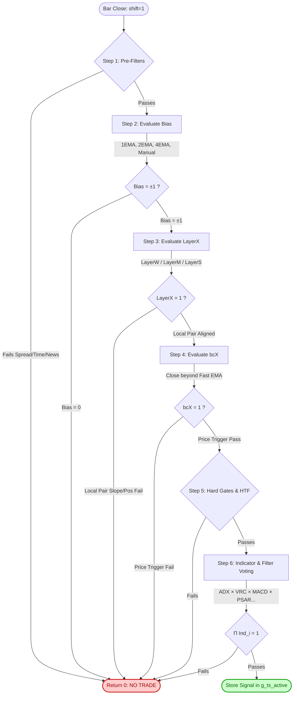
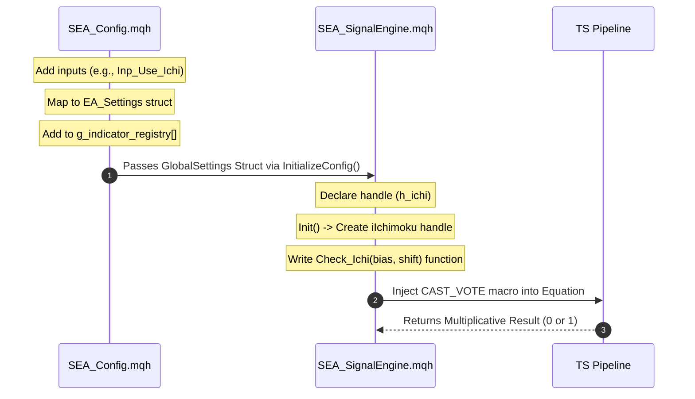

# SEA Signal Reference & Indicator Engine

## Overview
This document provides the complete technical documentation for the SimpleEA signal processing pipeline, the indicator voting logic, and the developer guide for extending the system with custom indicators via the Centralized Registry.

The Signal Engine evaluates **EVERY condition on the CLOSED candle** (shift=1, the **TS — Trade Setup** evaluation) before allowing any trade. 

The core system uses a strict multiplicative formula where unanimous agreement is required. The canonical form (post-F-AUDIT 2026-06) is:

$$TS = B \times P \times F \times L \times I$$

Expanded with the layer-and-bar-close detail and the F sub-filters:

$$TS = Bias \times Phase \times \prod_{j=1}^{m} F_{j} \times Layer_{X} \times bc_{X} \times \prod_{i=1}^{n} Ind_{i}$$

Where each factor returns 1 (pass/enabled), 0 (fail), or -1 (contradicts). Any 0 or -1 stops the pipeline.

The **Climax / Exhaustion Guard** (previously called `CX` or `CG` as a separate sixth factor) was merged into **F** as a sub-filter in the 2026-06 F-AUDIT. `F = 0` with `F_reason = CLIMAX_GUARD` now blocks an otherwise fully-aligned signal when price has over-extended into a blow-off impulse (single-bar range > `ClimaxGuard_BarATRMult` × ATR, or cumulative move > `ClimaxGuard_MoveATRMult` × ATR, in the trade direction). The conceptual veto (climax-as-veto) is unchanged — only the position in the equation moved, so reason-code reporting reads cleanly under the F factor. The check still re-scans the last `ClimaxGuard_Lookback` bars on every bar (a sliding window, not a stored countdown), so it stays blocking only while the triggering bar is inside that window.

---

## Part 1: The Core Signal Pipeline



### Step 1: Pre-Filters (Safety Checks)
**Purpose:** Ensure market conditions are safe for trading.
* **Spread Filter:** Current spread < `MaxSpreadPips`. (If fails: reason "SPREAD").
* **Time/Session Filter:** Current time within `StartHr` and `EndHr`. (If fails: reason "TIME").
* **News Filter:** No high-impact news within `NewsPre` and `NewsPost` window.
**Result:** If ANY fail → Return 0 (NO TRADE).

### Step 2: Evaluate Bias
**Purpose:** Determine the PRIMARY trend direction (LONG/SHORT/NEUTRAL).
* **BIAS_MANUAL:** Fixed operator direction.
* **BIAS_1EMA:** Single EMA slope direction (up=LONG, down=SHORT, flat=NEUTRAL).
* **BIAS_2EMA:** Two EMAs crossover or position+slope validation.
  * `STRAT_2EMA_CROSS`: Signal at cross point only (one-bar signal)
  * `STRAT_PRICE_CROSS`: Signal when price crosses EMA (one-bar signal)
  * `STRAT_2EMA_POSITION`: Continuous signal when Fast>Slow + slopes agree
* **BIAS_4EMA:** Four EMAs phase detection. Uses EMA1=5, EMA2=13, EMA3=34, EMA4=89.
    * *TRENDING:* 3 of 3 layers agree on position + slope. (Bias = ±1)
    * *EMERGING:* 2 of 3 layers agree. (Bias = ±1)
    * *UNORDERED:* < 2 layers agree. Bias forced to 0.

### Step 3: Evaluate LayerX ($Layer_{W}, Layer_{M}, Layer_{S}$)
**Purpose:** Confirm that the EMA pair is structurally aligned AND has completed a pullback-recovery cycle at this depth.

Each layer runs two independent checks. Both must pass.

**3a. Positional alignment:** the fast EMA is on the correct side of the slow EMA (above for LONG, below for SHORT). If misaligned, the layer fails immediately — the cascade rule (EMA1 crosses EMA2 → LayerW blocked, LayerM evaluates instead) is enforced here purely through position.

**3b. Pullback-recovery state machine:** each layer independently tracks whether a pullback has occurred and recovered. Three states:
- `LAYER_PB_NONE` — no pullback seen yet → **blocked** (must earn a pullback-recovery cycle first)
- `LAYER_PB_DETECTED` — pullback in progress → **blocked**
- `LAYER_PB_RECOVERED` — pullback completed, trend resumed → **allowed**

**DETECTED triggers (OR logic — any one fires):**
- Slope weakened: `|current_pace| / |baseline_pace| < LayerPullbackRatio` (default 0.65)
- Slope flat: ratio `< LayerFlatRatio` (default 0.1)
- Slope reversed: EMA direction flipped vs baseline (`LayerAllowReversalPullback=true` — catches shallow M1/M5 pullbacks where EMA barely decelerates)
- **Price-zone touch (S2):** wick enters lower portion of EMA band — `bar_low ≤ EMA_slow + zone_factor × (EMA_fast − EMA_slow)` for LONG, mirrored for SHORT; `zone_factor = 1 − LayerPullbackRatio`. Oracle: *"price pulls back to touch EMA2"* (flexible). Toggle: `LayerPriceTouchEnabled` (default true).

**Minimum duration gate (A21):** DETECTED must persist for at least `LayerMinPullbackBars_W/M/S` bars (defaults: W=2, M=2, S=1) before RECOVERED is allowed. Prevents 1-bar spike entries.

**RECOVERED triggers:** close beyond the fast EMA in trade direction (close > EMA_fast LONG, close < EMA_fast SHORT) — after the minimum bar count is satisfied.

Each layer's state is reset to NONE after a TS=1 signal consumes it, requiring a fresh pullback-recovery before the next entry on that layer.

### Step 4: Evaluate bcX ($bc_{W}, bc_{M}, bc_{S}$)
**Purpose:** The final price action trigger verifying momentum resumption (Bar Close confirmation).
* **Logic:** Evaluates to 1 ONLY if the closed candle body strictly crosses or closes beyond the fast EMA of the active layer. 
* *Example (Short LayerW):* Bias is -1. LayerW is 1. `bcW` becomes 1 only when `Close < EMA1`.

### Step 5 & 6: Gates, Indicators, and Filters
Each ENABLED indicator calls its `Check_XXX(bias, shift)` function. The system enforcing a multiplicative unanimous agreement. Disabled indicators automatically return $1$. If all active equations pass, the final TS is approved and stored in `g_ts_active`.

### The Three Trade Setups (BIAS_4EMA Mode)

When using 4-EMA bias detection, the system evaluates **3 potential setups simultaneously**:

1. **LayerW × bcW (Weak/Ribbon Setup)**
   - Structural check: EMA1 vs EMA2 position + slope aligned
   - Trigger: Close beyond EMA1 (fast EMA)
   - Characteristics: Shallow pullback, fastest entry, lower risk
   - Example (LONG): EMA1 > EMA2, both rising, Close > EMA1

2. **LayerM × bcM (Medium/Ghost Setup)**
   - Structural check: EMA2 vs EMA3 position + slope aligned
   - Trigger: Close beyond EMA2
   - Characteristics: Medium pullback, balanced risk/reward
   - Example (LONG): EMA2 > EMA3, both rising, Close > EMA2

3. **LayerS × bcS (Strong/Shark Setup)**
   - Structural check: EMA3 vs EMA4 position + slope aligned
   - Trigger: Close beyond EMA3
   - Characteristics: Deep pullback, highest confirmation, higher risk
   - Example (LONG): EMA3 > EMA4, both rising, Close > EMA3

**Important**: Only **ONE** of these three setups needs to be active to generate a trade signal. The system takes the first active setup that passes all filters.

---

## Part 2: Indicator Voting Logic & UI Audit
To maintain institutional transparency, the Signal Engine generates a "Live Audit" string for the UI Cockpit. 

### The Audit Format
Each enabled indicator must report its status using the following nomenclature:
- **[+] PASS:** The indicator matches the primary bias (e.g., Bias is LONG and MACD > Signal).
- **[-] FAIL:** The indicator contradicts the primary bias (e.g., Bias is LONG but RSI is Overbought).
- **[.] NEUTRAL:** The indicator is enabled but currently returning a 0/Flat signal.

### Telemetry Mapping
The `ST_SignalTelemetry.active_indicators` field is a newline-delimited string:
`MACD [+]\nPSAR [+]\nCCI [.]\nADX [-]`

The UI Agent is responsible for parsing these symbols into the visual Cockpit grid using the primary Theme colors (`clr_Pass`, `clr_Fail`, `clr_Disabled`).

### ADX (Trend Strength)
* **Static Mode:** ADX > fixed threshold (e.g., 25.0).
* **Dynamic Percentile Mode:** Adaptive threshold based on recent history.
    $$Threshold = Percentile(Buffer_{ADX}, Lookback_{100}, Percentile_{50})$$
* **Phase-Aware Mode:** Threshold scales by market phase (e.g., 12.0 for Unordered, 25.0 for Trending).

### VRC (Volatility Regime Classifier)
Filters out trades during low volatility regimes. Evaluates as a non-directional vote.
* **Check:** $$ATR_{current} \geq Percentile(Buffer_{ATR}, 100, 33)$$
* **Result:** VOLATILITY_LOW (reject) or VOLATILITY_NORMAL (pass). Cache updated every 4 hours.

### MACD (Momentum)
* **LONG:** Main > 0 AND Main > Signal.
* **SHORT:** Main < 0 AND Main < Signal.

### PSAR (Trend Direction)
* **LONG:** Close > PSAR dot.
* **SHORT:** Close < PSAR dot.
* **PSAR Flip Logic:** (If `Vote_AllowPsarFlip=true`), checks `bars_since_flip <= Vote_PsarFlipDelay` to ensure entry happens early in the flip cycle.

### DPI (Dynamic Price Index) — Momentum Direction Voter

**Purpose:** Primary momentum direction confirmation using MACD-based histogram with optional CCI trend filter.

**How it works:**
- **Blue Line (LEAD):** Fast MACD core = EMA(Fast) - EMA(Slow)
- **Red Line (FOLLOW):** Smoothed signal line (EMA of Blue, or Double EMA)
- **Histogram:** Blue - Red (divergence/convergence)
- **Ribbon Color:** Determines vote direction
  - **Yellow ribbon** → DPI votes bullish (confirms LONG bias)
  - **Red ribbon** → DPI votes bearish (confirms SHORT bias)

**Vote Logic (used by EA):**
```mql5
// Ribbon color drives the vote (histogram color after CCI filter)
if (ribbon_color == YELLOW && bias == LONG)  return +1;  // Pass
if (ribbon_color == RED && bias == SHORT)    return +1;  // Pass
return 0;  // Fail
```

**Histogram Color Logic:**

*Without CCI:*
- hist > 0 → Yellow (bullish momentum)
- hist < 0 → Red (bearish momentum)

*With CCI Reset Enabled (trend filter):*
- hist > 0 AND CCI > 0 → Yellow (strong bullish)
- hist > 0 AND CCI < 0 → **Red** (bullish weakening — CCI reset!)
- hist < 0 AND CCI > 0 → **Yellow** (bearish weakening — CCI reset!)
- hist < 0 AND CCI < 0 → Red (strong bearish)

**GREEN Histogram (visualization only, not a vote):**
- Appears when Blue line and histogram are aligned (both positive OR both negative)
- Indicates momentum confirmation strength
- Does NOT affect EA voting logic

**EA Settings (PRESET_RRM_ORG):**
- `Ind_Dpi_Enabled` — Enable/disable DPI voter (default: true in RRM_ORG)
- `DPI_MACD_Fast` — Fast EMA period (default: 8)
- `DPI_MACD_Slow` — Slow EMA period (default: 13)
- `DPI_RedSignalType` — Red signal line calculation (1-5):
  1. EMA5 of Blue
  2. EMA8 of Blue
  3. EMA13 of Blue (default)
  4. EMA21 of Blue
  5. Double smoothed EMA
- `DPI_UseCCIReset` — Enable CCI trend filter (default: true)
- `DPI_CCI_Period` — CCI calculation period (default: 13)
- `DPI_UseGreenHist` — Enable GREEN visualization overlay (default: true)

**DPI Deceleration Filter** (advanced):
- When enabled via `DpiDecelFilterEnabled`, blocks entries when GREEN histogram is shrinking
- Prevents late entries when momentum is weakening
- Only active when `Ind_Dpi_Enabled = true`

**Standalone Indicator Files:**
- `DPI_mc_main.mq5` — Full version with GREEN momentum overlay (toggleable)
- `DPI_mc_simple.mq5` — Simplified version without GREEN overlay
- `DPI_tm_simple.mq5` — TSI+MACD math variant (William Blau Ergodic)

**Trading Interpretation:**
- **Strong signals:** Yellow/Red histogram with no CCI resets
- **Weak signals:** Histogram color contradicts position (CCI reset active)
- **Avoid:** Ribbon color contradicts the bias direction

**Example (LONG setup):**
```
Bias = LONG (+1)
DPI Blue = 0.0005 (positive)
DPI hist = 0.0003 (positive)
CCI = +50 (bullish)
→ Ribbon = YELLOW (hist > 0, CCI > 0)
→ DPI vote = +1 (PASS)
→ GREEN visible (Blue and hist aligned)
```

See also:
- [`PRESET_RRM_ORG` preset flow](README_SEA_PRESETS.md#preset_rrm_org)
- [DPI `mc_main` EA integration notes](../DPI_mc_main_README.md#ea-integration-preset_rrm_org)

### CandleBody (CB) — Over-Extension Voter

**Purpose:** blocks entries on a bar whose body is abnormally large vs the recent average — a single-bar over-extension filter inside the indicator product ∏Ind.

**Sub-equation:** `CB = CB_body × CBOEB`

- **CB_body** (stateless, per bar): `0` if any of the last `CandleBody_CheckBars` bars has body `|close-open| > CandleBody_MaxMult ×` the average body of the prior `CandleBody_AvgPeriod` bars, in the trade direction. Shift-relative (evaluates the signal bar, never bar 0). Optional close-in-range quality check (`CandleBody_MinCloseRatio`).
- **CBOEB** (over-extension carry, stateful) — **[PENDING compile]**: once `CB_body` flags an over-extended bar, `CBOEB = 0` and holds the whole CB vote at 0 — so `CB = 1 × 0 = 0` even on a later bar whose own body is fine — until the **first of W/M/S completes a fresh pullback-recovery**, then it returns to 1. Edge-detected so a layer already recovered at trip-time does not clear it instantly. Toggle `CandleBody_CarryOnOverext` (default ON). Advanced once per bar in `UpdateLayerPullbackStates` (and the warmup replay), so live and scanner agree.

CandleBody is independent of the Climax factor `CX`: **CB** measures *body size* inside ∏Ind; **CX** measures *range / cumulative move vs ATR* over a lookback window as its own top-level factor. Neither reads the other. (Neither measures *distance from the EMAs* — a bar far from EMA89 with a normal body and no fresh range spike passes both.)

**Inputs:** `Ind_CandleBody_Enabled`, `CandleBody_AvgPeriod`, `CandleBody_MaxMult`, `CandleBody_CheckBars`, `CandleBody_RequireDirection`, `CandleBody_MinCloseRatio`, `CandleBody_CarryOnOverext` [PENDING].

---

## Part 3: Extending the System (Plugin Architecture)



SimpleEA uses a centralized indicator registry. To add a custom indicator (e.g., Ichimoku), you only modify `SEA_Config.mqh` and `SEA_SignalEngine.mqh`. No UI or preset files need changing.

### The 5-Component Plugin Pattern
1.  **Inputs (`SEA_Config.mqh`):** Add `Inp_Use_Ichi`, `Inp_W_Ichi`, and period variables.
2.  **Settings Struct (`SEA_Config.mqh`):** Add `Use_Ichi`, `W_Ichi`, and periods to `ST_Settings`. Map them in `InitializeConfig()`.
3.  **Handle (`SEA_SignalEngine.mqh`):** Declare `int h_ichi`. Create in `Init()` via `iIchimoku()`. Release in `Release()`.
4.  **Vote Function (`SEA_SignalEngine.mqh`):** 

```c
    bool Check_Ichi(int bias, int shift) {
        if(h_ichi == INVALID_HANDLE) return false;
        double cloud_top = MathMax(span_a, span_b);
        if(bias == 1) return (close > cloud_top);
        return false;
    }
```

5.  **CAST_VOTE macro (`SEA_SignalEngine.mqh`):** Add `CAST_VOTE(m_settings.Use_Ichi, m_settings.W_Ichi, Check_Ichi(bias, v_shift))` into `GetDirection()`.

### The Centralized Registry
To ensure the UI, Cockpit, and Status Panels automatically track your new indicator, add it to the registry in `SEA_Config.mqh`:

```c
// Inside InitializeIndicatorRegistry()
g_indicator_registry[i].name       = "Ichimoku";
g_indicator_registry[i].short_name = "Ichi";
g_indicator_registry[i].is_enabled = cfg.Use_Ichi;
g_indicator_registry[i].weight     = cfg.W_Ichi;
i++;
```

## Indicator Audit & Cockpit Grid (Restored v1.03)

The UI Cockpit uses a dynamic "Strategy Logic" zone to display the real-time status of the 9-step voting pipeline.

### The Telemetry Protocol
The Signal Engine generates the `active_indicators` string at the end of each bar evaluation. This string acts as the source of truth for the UI Agent.

| Symbol | UI Translation | Color Logic | Meaning |
| :--- | :--- | :--- | :--- |
| `[+]` | `(+)` | `clr_Pass` | Indicator confirms the Trade Setup (TS). |
| `[-]` | `(-)` | `clr_Fail` | Indicator contradicts the Trade Setup. |
| `[.]` | `(.)` | `clr_Disabled` | Indicator is neutral or below threshold. |

### Visual Layout
The UI renders these as a vertical audit list within the Cockpit panel, providing the operator with instant feedback on why a signal was accepted or rejected.

---

## KISS Refactor Notes (v1.04+)

The signal evaluation pipeline was significantly simplified in v1.04, then the pullback-recovery state machine was re-introduced and extended in subsequent sessions.

**What was removed in v1.04:**
- The original wick-touch pullback detection (1% tolerance, historical bar scanning, ~300 lines)
- Complex multi-pass recovery state machines from the pre-v1.04 architecture
- `RequirePullback`, `PullbackLookback`, `Gate_UseMultiLayer` legacy inputs

**What replaced it (v1.04):**
- **EvaluateLayerX()**: Pure structural alignment (position + slope) per EMA pair
- **EvaluateBcX()**: Simple price close confirmation beyond fast EMA
- ~500 lines of dead code removed, clearer logic, faster execution

**What was re-introduced and extended (post-v1.04, Sessions A1–S2):**
- Full pullback-recovery state machine (`LAYER_PB_NONE / DETECTED / RECOVERED`) — one independent machine per layer
- Slope-ratio DETECTED trigger: `|current_pace| / |baseline_pace| < LayerPullbackRatio`
- Slope-reversal DETECTED trigger: `LayerAllowReversalPullback` — catches shallow pullbacks
- **S2 price-zone DETECTED trigger:** wick entering lower EMA band zone fires DETECTED independently of slope
- **A21 minimum pullback duration gate:** `LayerMinPullbackBars_W/M/S` — prevents 1-bar spike entries
- VPRR (Volume Pullback-Recovery Ratio) — institutional volume confirmation gate on recovery
- CBOEB (CandleBody Over-Extension Carry) — CB vote held at 0 until a fresh pullback-recovery cycle

**Enum Clarity (v1.04):**
- `BIAS_AUTO` renamed to `BIAS_2EMA` (2-EMA crossover)
- `BIAS_AUTO_PHASE` renamed to `BIAS_4EMA` (4-EMA phase detection)

**Enum Clarity (v1.05):**
- `BIAS_1EMA` added (single EMA slope direction)
- `STRAT_SINGLE_SLOPE` renamed to `STRAT_1EMA_SLOPE`
- `STRAT_PAIR_CROSS` renamed to `STRAT_2EMA_CROSS`
- `STRAT_POSITION_SLOPE` renamed to `STRAT_2EMA_POSITION`
- `STRAT_LAYER_DETECTION` renamed to `STRAT_4EMA_LAYER`
- `ValidateBiasStratCombo()` added to enforce valid combinations

The current formula including the pullback gate:
```
TS = Bias × Phase × F × (LayerW_rec × bcW  OR  LayerM_rec × bcM  OR  LayerS_rec × bcS) × Indicators × CG
```
Where `LayerX_rec` = 1 only when that layer's state machine is in `LAYER_PB_RECOVERED`.
