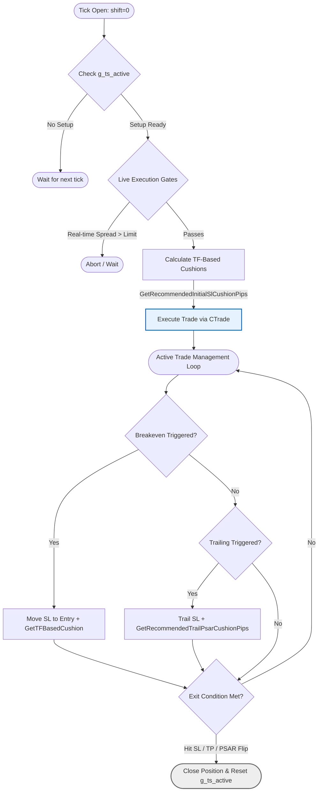
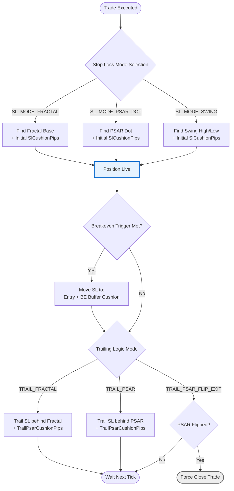

***

### File 2: `SEA_TRADE_LOGIC.md`
*(Consolidates `README_EXIT_MANAGEMENT.md` and `README_ADAPTIVE_SETTINGS.md`. Save as `README_SEA_TRADE_LOGIC.md`)*

```markdown
# SEA Execution, Risk & Trade Logic

## Overview
This document covers the Phase 2 (TE - Trade Entry) execution mechanics, stop loss and take profit modes, timeframe-based auto-scaling cushions, and adaptive spread limits. 

SimpleEA handles execution dynamically. All cushion and buffer values auto-adjust by timeframe and symbol type—no manual optimization or input is required.

---

## 1. Adaptive Spread Limits (Zone 3C)
Different instruments have inherently different liquidity and spread profiles. SimpleEA auto-detects the pair type and applies strict maximum spread limits at the exact moment of execution (shift=0).

| Pair Type | Example | Default Max Spread |
|-----------|---------|--------------------|
| **Major** | EURUSD  | 2.0 pips |
| **Minor** | EURJPY  | 4.0 pips |
| **Exotic** | USDZAR | 10.0 pips |
| **Gold** | XAUUSD  | 5.0 pips |
| **Crypto**| BTCUSD  | 50.0 pips |

*Note: ATR gates (Zone 2A) handle volatility filtering; these adaptive limits strictly handle execution cost management.*

---

## 2. TF-Based Cushions
Cushions automatically scale with the timeframe to provide appropriate noise protection for stops and trailing features. JPY pairs are automatically detected and scaled appropriately (×100 vs standard ×10).

### SL Cushion (`GetRecommendedInitialSlCushionPips`)
Applied to `SL_MODE_PSAR_DOT`, `SL_MODE_SWING`, and `SL_MODE_FRACTAL`.

| Timeframe | Standard Pair | JPY Pair |
|-----------|---------------|----------|
| M1        | 2 pips        | 3 pips   |
| M5        | 3 pips        | 5 pips   |
| M15       | 5 pips        | 8 pips   |
| M30       | 7 pips        | 12 pips  |
| H1        | 10 pips       | 15 pips  |
| H4        | 15 pips       | 25 pips  |
| D1        | 25 pips       | 40 pips  |

### Trail Cushion (`GetRecommendedTrailPsarCushionPips`)
Applied to `TRAIL_PSAR` logic.

| Timeframe | Standard Pair | JPY Pair |
|-----------|---------------|----------|
| M1        | 1 pip         | 2 pips   |
| M5        | 2 pips        | 3 pips   |
| M15       | 3 pips        | 5 pips   |
| H1        | 7 pips        | 10 pips  |
| H4        | 10 pips       | 15 pips  |

### Breakeven Buffer (`GetTFBasedCushion`)
Used as the padding space when moving stops to breakeven (e.g., locking in +5 pips instead of exactly 0.0).
* **M1/M5:** 3 pips
* **M15:** 5 pips
* **H1:** 10 pips
* **H4:** 15 pips

## 2.1 The Trade Lifecycle



---

## 3. Exit Management Modes



### Stop Loss Modes (`ESLMode`)
* `SL_MODE_FIXED_PIPS`: Uses strict user-defined `Inp_SL_FixedPips`.
* `SL_MODE_PSAR_DOT`: Places SL at the last confirmed PSAR dot + TF-based SL Cushion.
* `SL_MODE_SWING`: Finds the highest high / lowest low over `SwingLookback` bars + TF-based SL Cushion.
* `SL_MODE_FRACTAL`: Places SL at the last confirmed Bill Williams 5-bar fractal + TF-based SL Cushion.
* `SL_MODE_PERCENT`: Uses `Inp_SLPercent` of the entry price.

### Take Profit Modes (`ETPMode`)
* `TP_MODE_FIXED_PIPS`: Strict pip distance via `Inp_FixedTPPips`.
* `TP_MODE_RR`: Calculates TP based on actual SL distance multiplied by `Inp_RRRatio` (e.g., 2.0 = 1:2 R:R). 
* `TP_MODE_FRACTAL`: Targets the next opposing market fractal.
* `TP_MODE_PSAR_FLIP`: No fixed TP; exits solely when the PSAR indicator flips direction.
* `TP_MODE_NONE`: Relies entirely on the Trailing Stop to close the trade.

### Breakeven Modes (`EBeMode`)
* `BE_MODE_OFF`: Breakeven logic disabled.
* `BE_MODE_TP_PROGRESS_PCT`: Moves SL to Entry + BE Buffer when price travels a specific percentage of the way to the Take Profit target.
* `BE_MODE_R_MULTIPLE`: Moves SL to Entry + BE Buffer when price reaches a multiple of the initial risk (e.g., at +1R).

### Trailing Stop Modes (`ETrailingMode`)
* `TRAIL_PSAR`: Trails the SL strictly behind the PSAR dot, padded by the TF-Based Trail Cushion.
* `TRAIL_FRACTAL`: Trails behind established fractal structures.
* `TRAIL_BREAKEVEN`: Enforces breakeven first, then begins trailing at a fixed distance.
* `TRAIL_PSAR_FLIP_EXIT`: Forces position closure immediately upon PSAR reversal (identical utility to TP_MODE_PSAR_FLIP but handled by the trailing engine).

---

## 4. Legacy Settings Removed (v1.03)
To enforce automation and prevent over-optimization, the following manual parameters were permanently removed and replaced by the systemic TF-based functions:
* ❌ `Inp_SL_PsarPipsCushion`, `Inp_SL_SwingPipsCushion` (Replaced by `GetRecommendedInitialSlCushionPips()`)
* ❌ `Inp_PSAR_TrailPipsCushion` (Replaced by `GetRecommendedTrailPsarCushionPips()`)
* ❌ `Inp_RRM_BE_BufferPips` (Replaced by `GetTFBasedCushion()`)
* ❌ `Use_BE`, `BE_Trig`, `BE_Buff` (Replaced by clean `BE_Mode` enums)
* ❌ ATR multipliers (`SL_Mult`, `TP_Mult`, `Trail_Mult`) — no longer used in RRM execution.