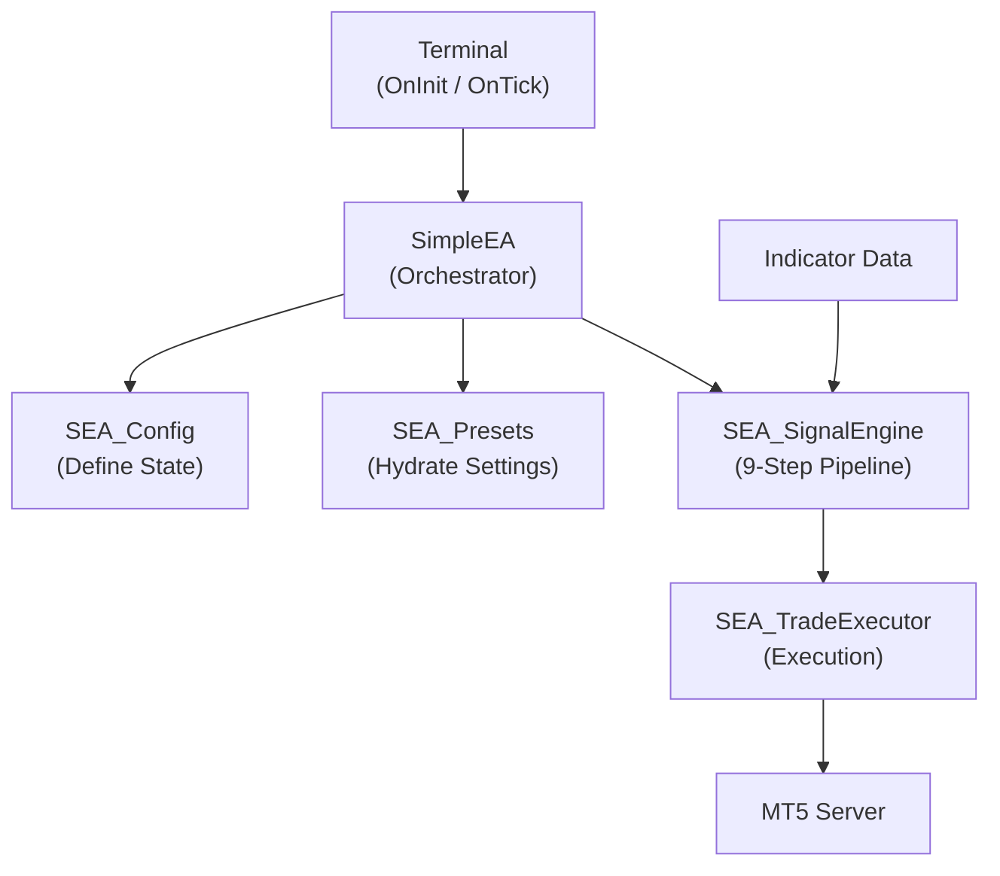
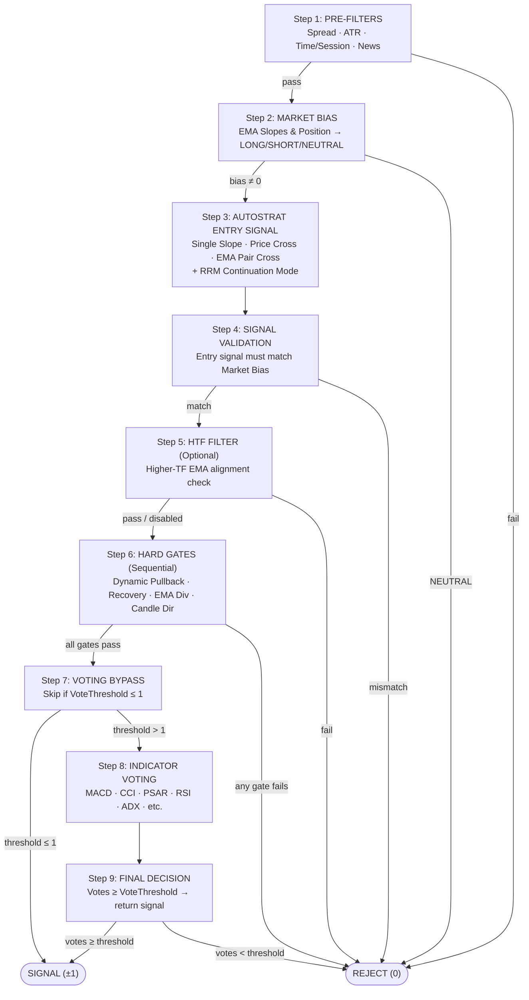
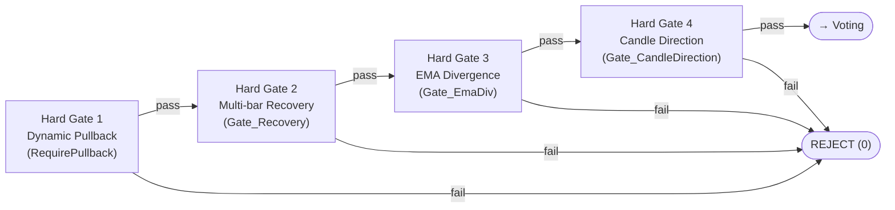

# SimpleEA - Professional Trading System for MT5

## Overview

SimpleEA is a professional-grade Expert Advisor for MetaTrader 5 that implements a comprehensive 9-step signal validation pipeline combining market bias analysis, multi-indicator voting, and risk-aware position management. Designed specifically for macOS + Wine + MT5 environments, it uses an MQL5-only modular architecture.

The system trades quality over quantity, using a strict multiplicative voting system where ALL enabled indicators must agree before entering a position. This results in fewer but higher-probability trades.

Core Philosophy: Simple systems that work > Complex systems that don't.

## Table of Contents

* System Architecture
* How SimpleEA Works: Complete Process Flow
* The 9-Step Signal Pipeline: Visual Overview
* Key Concepts (Quick Summary)
* Key Design Principles
* Architecture Changes (PR9–PR12)
  * Multi-Layer Adaptive EMA System
  * Hard Gate System
  * RRM Continuation Mode
  * Dynamic Pullback Detection
* Configuration Guide
* AI Agent Manifest

For detailed technical documentation: See README_INDICATORS.md

## System Architecture

The v1.02.016d refactor decoupled the system into specialized modules to separate state, logic, and execution.

## Core Components

* SimpleEA (Main Orchestrator): File: SimpleEA_v1-02-016d_05-9_RRM.mq5. Coordinates all components, handles the OnTick() loop, and manages new bar detection.
* SEA_Config (State Master): File: SEA_Config.mqh. Centralized repository for all enums, the ST_Settings structure, and global input parameters.
* SEA_Presets (Strategy Router): File: SEA_Presets.mqh. Maps raw inputs to the global struct and applies hardcoded strategy overrides for RRM, Scalp, and Swing setups.
* SEA_SignalEngine (Signal Pipeline): File: SEA_SignalEngine.mqh. Implements the 9-step validation pipeline and manages indicator handles.
* SEA_TradeExecutor (Trade Management): File: SEA_TradeExecutor.mqh. Manages position sizing, trade entries, and trailing stops.
* SEA_UI & Reporting: Files: SEA_UI.mqh and SEA_Reporting.mqh. Handles real-time status panels, cockpits, and CSV data exports.

## Component Interaction Diagram

## How SimpleEA Works: Complete Process Flow

Main Execution Loop (OnTick)

Every time a new bar closes:

1. Check if we have an open position: 
    * YES → Manage it (breakeven, trailing stops).
    * NO → Look for new signal.
2. Detect if new bar formed: Compare current iTime[0] with stored last bar time.
3. Evaluate signal: Call SignalEngine.GetDirection(). Evaluation happens on shift=1 (closed candle).
4. Execute trade: If a valid signal (1 or -1) is returned and no position is open: 
    * Calculate position size based on RiskPercent.
    * Calculate SL/TP levels based on selected mode.
    * Execute trade at shift=0 (current candle open).

## The 9-Step Signal Pipeline: Visual Overview

All evaluation happens on the CLOSED candle (shift=1) to prevent repainting.

## Key Principle:

$TS (Trade Signal) = Market\_Bias x Indicator_1 x Indicator_2 x ... x Indicator_n$.

* ANY component = 0 → Entire result = 0 (NO TRADE).
* ALL components = 1 → Result = bias direction ($\pm1$).

## Key Concepts (Quick Summary)

# Market Bias vs Entry Signal

* Market Bias: Primary trend filter (Step 2) that determines if the market is in a LONG, SHORT, or NEUTRAL state.
* Entry Signal: Timing signal (Step 3) generated by the AutoStrat strategy (Single Slope, Price Cross, or Pair Cross).

# The Multiplicative Voting System

The system uses a multiplicative formula where ANY component = 0 → entire result = 0. This strict filtering requires unanimous agreement (or meeting the required threshold) before entering a position.

# Signal Timing: shift=1 vs shift=0

* Signal evaluation: Happens on shift=1 (CLOSED candle) for stable, confirmed data.
* Trade entry: Happens on shift=0 (NEW candle open) for predictable execution.

## Architecture Changes (PR9–PR12)

### Multi-Layer Adaptive EMA System (PR12)

The RRM preset uses a **3-layer cascading EMA system** (`Gate_UseMultiLayer = true`) instead of a single fixed EMA reference. `DetectActiveLayer()` selects the first valid layer shallow-to-deep:

| Layer | EMA Pair | LONG condition | SHORT condition |
|-------|----------|----------------|-----------------|
| 1 (fastest) | EMA1–EMA2 | EMA1 > EMA2 and price ≥ EMA2 | EMA1 < EMA2 and price ≤ EMA2 |
| 2 (medium)  | EMA2–EMA3 | EMA2 > EMA3 and price ≥ EMA3 | EMA2 < EMA3 and price ≤ EMA3 |
| 3 (deepest) | EMA3–EMA4 | EMA3 > EMA4 and price ≥ EMA4 | EMA3 < EMA4 and price ≤ EMA4 |

- Layers are checked in order 1→2→3; the first valid layer is used.
- A broken shallow layer does **not** prevent a deeper layer from being active (layers are independent).
- If no layer is valid, Hard Gate 1 rejects the signal immediately.
- Default EMA periods (RRM): EMA1=5, EMA2=13, EMA3=34, EMA4=89.

### Hard Gate System (PR9)

Step 6 of the pipeline runs **four sequential hard gates**. Any gate failure immediately rejects the signal (returns 0). All gates are configurable via `SGateConfig { EGateScaleMode mode; double value; }`.

**Gate scale modes (`EGateScaleMode`):**
- `GATE_SCALE_OFF` — gate disabled (always passes).
- `GATE_SCALE_FIXED` — fixed pip threshold (`value` field).
- `GATE_SCALE_AUTO_TF` — auto-scales by timeframe and pair (JPY vs non-JPY); `value` acts as a multiplier.

**PRESET_RRM gate defaults:**

| Gate | Mode | Notes |
|------|------|-------|
| Dynamic Pullback | enabled | Multi-layer mode, `PullbackLookback` = 15 (M1/M5) or 10 (M15+) |
| Recovery | `GATE_SCALE_AUTO_TF` × 1.0 | Lookback = 5 (M1/M5) or 7 (M15+) |
| EMA Divergence | `GATE_SCALE_AUTO_TF` × 1.0 | Minimum spread between fast and slow EMA |
| Candle Direction | `GATE_SCALE_FIXED` × 1.0 | Checks bar at shift=2 |

### RRM Continuation Mode (PR10)

When `ExitProfile = EXIT_PROFILE_RRM_STRICT_NO_ATR` and `AutoStrat = STRAT_PAIR_CROSS`, the entry signal generator allows entries **within an established trend** even when no fresh EMA crossover has occurred on the current bar.

**Condition for continuation entry:**
- Market bias is non-zero (trend is established).
- The EMA position matches the bias (fast EMA is on the correct side of slow EMA).
- No new crossover is required — the system detects that the trend is intact and issues a continuation signal equal to the current bias.

This is the primary entry mode for `PRESET_RRM`. It enables the EA to re-enter after pullbacks without waiting for a new crossover, provided the downstream hard gates (especially Dynamic Pullback) confirm a valid structure.

**Standard crossover** logic still applies first — continuation mode is only engaged when no fresh crossover is detected.

### Dynamic Pullback Detection (PR11)

Hard Gate 1 (`Check_Gate_DynamicPullback`) uses **structure-based detection** with no fixed pip thresholds. It validates the following sequence against the selected EMA layer:

1. **Reclaim check** — the current closed bar (shift=1) has closed on the trend side of the layer's fast EMA.
2. **Pullback found** — within `PullbackLookback` bars, price touched (low ≤ EMA for LONG; high ≥ EMA for SHORT) the fast EMA of the active layer.
3. **Layer alignment** — at the bar where the pullback occurred, the fast EMA was correctly above (LONG) or below (SHORT) the slow EMA.
4. **Momentum** *(optional, `RequireRecoveryMomentum`)* — the current bar closes in the trend direction (close > open for LONG).

Key settings (`PRESET_RRM` defaults):

| Setting | Value | Description |
|---------|-------|-------------|
| `RequirePullback` | `true` | Enables Hard Gate 1 |
| `Gate_UseMultiLayer` | `true` | Use 3-layer cascading detection |
| `PullbackLookback` | 15 / 10 | Bars to search for the pullback touch |
| `RequireRecoveryMomentum` | `false` | Optional: require bullish/bearish close |

## PRESET_RRM: Strict No-ATR Trend Pullback

`PRESET_RRM` enforces the following SL/TP contract. These are **not user-configurable** under this preset:

**SL Placement:**
- Primary: Swing high/low (`SL_SWING_HIGHLOW`) with timeframe-based cushion
- Backup: PSAR dot with timeframe-based cushion (used by `RRM_GetStrictSL` fallback)
- ATR: **DISABLED** (`SL_Mult = 0.0`, `ExitProfile = EXIT_PROFILE_RRM_STRICT_NO_ATR`)

**Cushion Auto-Scaling (non-JPY / JPY):**

| Timeframe | Initial SL Cushion | Trailing Cushion |
|-----------|-------------------|-----------------|
| M1        | 2 / 3 pips        | 1 / 2 pips      |
| M5        | 3 / 5 pips        | 2 / 3 pips      |
| M15       | 5 / 8 pips        | 3 / 5 pips      |
| H1        | 10 / 15 pips      | 7 / 10 pips     |
| H4        | 15 / 25 pips      | 10 / 15 pips    |
| D1        | 25 / 40 pips      | 15 / 25 pips    |

**TP:** 3R based on actual SL distance (not ATR) — `TP_Mult = 3.0`

**Trailing:** PSAR with timeframe-based cushion only (`TRAIL_PSAR`, `PSAR_CUSHION_PIPS`)

**Breakeven:** OFF (`BE_Mode = BE_MODE_OFF`)

**Stop Level Validation:** Before every order, `ValidateStopLevels()` checks that SL and TP distances
meet the broker's minimum stop level (`SYMBOL_TRADE_STOPS_LEVEL`). If validation fails, the trade is
aborted and an error is logged (prevents Error 10041 / TRADE_RETCODE_LOCKED).

**PRESET_RRM_ATR** is the ATR-based hybrid variant (`SL_ATR`, `SL_Mult = 2.0`). Use `PRESET_RRM_ATR`
when you prefer ATR-scaled stops (adapts to current volatility) and are comfortable with tighter
SLs on low-volatility sessions. Use `PRESET_RRM` when you need swing-anchored stops that respect
structure regardless of ATR size, and to avoid broker minimum-stop rejections on small ATR readings.

## PSAR/Swing Cushion System (Dual Cushion)

SimpleEA implements an auto-scaling cushion system for stop loss placement and trailing:

| Timeframe | Initial SL (non-JPY) | Initial SL (JPY) | Trailing (non-JPY) | Trailing (JPY) |
|-----------|---------------------|------------------|-------------------|----------------|
| M1        | 3 pips              | 20 pips          | 2 pips            | 10 pips        |
| M5        | 5 pips              | 30 pips          | 3 pips            | 15 pips        |
| M15       | 8 pips              | 40 pips          | 4 pips            | 20 pips        |
| H1        | 12 pips             | 60 pips          | 5 pips            | 25 pips        |
| H4        | 20 pips             | 100 pips         | 8 pips            | 40 pips        |
| D1        | 40 pips             | 200 pips         | 15 pips           | 80 pips        |

## AI Agent Manifest

As the Lead System Architect, I orchestrate a team of 7 specialized coding agents. I am the only agent authorized and capable of modifying the system documentation (README.md and README_INDICATORS.md). All code generation and modification tasks are strictly delegated to the following specialized agents to maintain a clean modular architecture:

1. SEA Architect (Me): Lead orchestrator, system design, code routing, and sole owner of documentation.
2. SEA Config: Owns SEA_Config.mqh. Manages global EA_Settings struct, enums, and mapping user inputs via InitializeConfig().
3. SEA Presets: Owns SEA_Presets.mqh. Translates trading setups into hardcoded struct assignments.
4. SEA SignalEngine: Owns SEA_SignalEngine.mqh. Manages indicator handles and the 9-step multiplicative voting pipeline.
5. SEA TradeExecutor: Owns SEA_TradeExecutor.mqh. Manages risk, position sizing, trade entries, and trailing stops.
6. SEA UI: Owns SEA_UI.mqh. Handles chart graphics, status panels, and GUI objects.
7. SEA Reporting: Owns SEA_Reporting.mqh. Manages Strategy Tester metrics and CSV exports.
8. SEA Core: Owns SimpleEA.mq5 (main file). Integrator of all .mqh modules, manages global event handlers (OnInit, OnTick), and maintains a clean global scope.

## AI Agent Manifest (SEA Workflow)

This project uses a strict, file-owned, multi-agent workflow coordinated by **SEA Architect**.

**Canonical workflow docs (authoritative):**
- `Readme/README_SEA_RULES.md` — ownership boundaries, constraints (MQL5-only), shift rules, and **Preset Policy (Model A)**
- `Readme/README_SEA_BOOTSTRAP.md` — how to start a new chat/task and run the SEA process
- `Readme/README_SEA_AI-AGENTS.md` — SEA Agents v.03 prompts (roles/guardrails/output formats)
**Important:**
- Legacy documentation is archived in `Legacy/` and must not be used unless explicitly requested.
- Preset behavior is intentionally anti-confusion:
  - `PRESET_CUSTOM` → inputs control the strategy
  - any other preset → preset fully defines strategy-critical settings and overrides strategy inputs

## Input Parameter Layout (4 Visual Zones)

`SEA_Config.mqh` organises all EA inputs into four clearly marked zones visible in the MT5 Inputs dialog:

| Zone | Header | Purpose |
|------|--------|---------|
| 🎯 ZONE 1 | `══ ZONE 1: PRESET SELECTION ══` | Magic number and strategy preset selection |
| ✅ ZONE 2 | `══ ZONE 2: USER CONTROLS (Policy A — always editable) ══` | Operator gates and UI/diagnostic settings — always respected regardless of preset |
| ℹ️ ZONE 3A | `══ ZONE 3A: PRESET INFO (presets override these when active) ══` | Reference defaults — effective in `PRESET_CUSTOM`; preset overrides these when any other preset is active |
| 🔓 ZONE 3B | `══ ZONE 3B: ADMIN OVERRIDE (set true to activate §1-§4 below) ══` | Four numbered admin override sections for preset testing |

### Zone 2 — User Controls (Policy A gates)

Zone 2 groups the inputs that are **always editable** under any preset:

- `--- ✅ Operator Gates: Spread & ATR Limits ---` — `MaxSpreadPips`, `MinATRPips`, `MaxATRPips`
- `--- ✅ Operator Gates: Session Time Filter ---` — `UseTime`, `StartHour`, `EndHour`
- `--- ✅ Operator Gates: News Filter ---` — `UseNews`, `NewsFile`, `NewsPre`, `NewsPost`
- `--- ✅ Operator Gates: HTF Trend Filter ---` — `UseHTF`, `HtfPeriod`, `HtfEmaPeriod`
- `--- ✅ UI: Status Panel ---`, `--- ✅ UI: Cockpit Panel ---`, `--- ✅ UI: Signal Markers ---`, `--- ✅ UI: Colors & Framing ---`
- `--- ✅ Diagnostics ---`, `--- ✅ Reporting ---`

### Zone 3B — Admin Override (§1–§4 sections)

When `Inp_AdminOverridePreset = true`, the four numbered sections become active:

| Section | Header | Contents |
|---------|--------|----------|
| §1 | `--- 🔓 §1 Admin Override: Strategy, EMAs & Votes ---` | AutoStrat, VoteThreshold, EMA1–4, all vote enables, RRM gates |
| §2 | `--- 🔓 §2 Admin Override: Indicator Periods & Thresholds ---` | MACD, ADX, RSI, STO, PSAR, CCI, BB, MFI, ATR periods/thresholds |
| §3 | `--- 🔓 §3 Admin Override: Risk & Entry ---` | RequirePriceCross, UseHTF, CloseOnReverse, RiskPercent, SL placement |
| §4 | `--- 🔓 §4 Admin Override: Exits — TP, Breakeven & Trailing ---` | TP_Mult, BE settings, TrailMode, PSAR trail cushion |

### Status Panel — Admin Override Change Markers

When `Inp_AdminOverridePreset = true` and a preset is active, the Status Panel appends `[adm]` to all fields that are controlled by the admin override sections (§1–§4). This makes it immediately visible which effective-config values came from admin overrides rather than preset defaults.

## AdminOverride System (Preset Testing)

### Overview

The AdminOverride system allows experienced users (admins) to test variations of preset configurations directly in the MT5 Strategy Tester without editing code. It also protects normal users from accidentally changing strategy-critical settings that presets own.

### User Modes

**Normal User Mode (default, `Inp_AdminOverridePreset = false`):**
- Preset values are enforced (hardcoded from `SEA_Presets.mqh`)
- User can only modify Policy A operator gates: `MaxSpreadPips`, `MinATRPips`, `MaxATRPips`, `UseTime`, `StartHr`, `EndHr`, `UseNews`, `NewsPre`, `NewsPost`, `UseHTF`, `HTF_Period`, `HTF_Timeframe`, and exit settings
- Strategy-critical settings (MACD periods, AutoStrat, VoteThreshold, EMA roles, enabled votes, RRM gates) are preset-owned and cannot be changed by the user
- The Status Panel shows: "AdminOverride: OFF [Normal User Mode]"
- The Cockpit Panel shows the preset contract wording (what the preset controls vs. what the user controls)

**Admin User Mode (testing, `Inp_AdminOverridePreset = true`):**
- All preset-enforced parameters become editable via override input fields (prefixed `[Admin]` in MT5 Inputs)
- Overrides apply on top of the selected preset after preset defaults are set
- Admin can test variations directly in Strategy Tester without recompiling
- The Status Panel shows: "AdminOverride: ACTIVE [Admin Mode - Testing]"
- Tested configurations can be saved as `.set` files for sharing or future reference

### Override Inputs Reference

All override inputs are in **Zone 3B (§1–§4)** in MT5 Inputs (visible only when `Inp_AdminOverridePreset = true`).

**Strategy parameters:**

| Input | Type | Default | Description |
|-------|------|---------|-------------|
| `Inp_Override_AutoStrat` | EAutoStrategy | STRAT_PAIR_CROSS | Override AutoStrat (single slope / pair cross / price cross) |
| `Inp_Override_VoteThreshold` | int | 4 | Override required vote count |
| `Inp_Override_EMA1` | int | 5 | Override EMA1 period |
| `Inp_Override_EMA2` | int | 13 | Override EMA2 period |
| `Inp_Override_EMA3` | int | 34 | Override EMA3 period |
| `Inp_Override_EMA4` | int | 89 | Override EMA4 period |
| `Inp_Override_MACD_Fast` | int | 8 | Override MACD fast period |
| `Inp_Override_MACD_Slow` | int | 13 | Override MACD slow period |
| `Inp_Override_MACD_Signal` | int | 8 | Override MACD signal period |
| `Inp_Override_Use_EmaSig` | bool | true | Override EMA signal vote enabled |
| `Inp_Override_Use_Macd` | bool | true | Override MACD vote enabled |
| `Inp_Override_Use_Psar` | bool | true | Override PSAR vote enabled |
| `Inp_Override_Use_Cci` | bool | true | Override CCI vote enabled |
| `Inp_Override_Use_Rsi` | bool | false | Override RSI vote enabled |
| `Inp_Override_Use_Adx` | bool | false | Override ADX vote enabled |
| `Inp_Override_Use_Mfi` | bool | false | Override MFI vote enabled |
| `Inp_Override_Use_Sto` | bool | false | Override Stochastic vote enabled |
| `Inp_Override_Use_Bb` | bool | false | Override Bollinger Bands vote enabled |
| `Inp_Override_Use_P123` | bool | false | Override 1-2-3 pattern vote enabled |
| `Inp_Override_Use_Ross` | bool | false | Override Ross hook vote enabled |
| `Inp_Override_RRM_RequirePullbackReclaim` | bool | false | Override RRM pullback reclaim gate |
| `Inp_Override_RRM_RequireEmaDiv` | bool | false | Override RRM EMA divergence gate |

**Indicator parameters (threshold testing):**

| Input | Type | Default | Description |
|-------|------|---------|-------------|
| `Inp_Override_ADX_Period` | int | 14 | Override ADX period |
| `Inp_Override_ADX_Threshold` | int | 20 | Override ADX trend threshold |
| `Inp_Override_RSI_Period` | int | 14 | Override RSI period |
| `Inp_Override_RSI_OB` | double | 70.0 | Override RSI overbought level |
| `Inp_Override_RSI_OS` | double | 30.0 | Override RSI oversold level |
| `Inp_Override_STO_K` | int | 5 | Override Stochastic %K period |
| `Inp_Override_STO_D` | int | 3 | Override Stochastic %D period |
| `Inp_Override_STO_Slow` | int | 3 | Override Stochastic slowing period |
| `Inp_Override_STO_OB` | double | 80.0 | Override Stochastic overbought level (zone filter mode) |
| `Inp_Override_STO_OS` | double | 20.0 | Override Stochastic oversold level (zone filter mode) |
| `Inp_Override_PSAR_Step` | double | 0.05 | Override PSAR acceleration step |
| `Inp_Override_PSAR_Max` | double | 0.5 | Override PSAR maximum acceleration |
| `Inp_Override_CCI_Period` | int | 14 | Override CCI period |
| `Inp_Override_BB_Period` | int | 20 | Override Bollinger Bands period |
| `Inp_Override_BB_Dev` | double | 2.0 | Override Bollinger Bands deviation |
| `Inp_Override_MFI_Period` | int | 14 | Override MFI period |
| `Inp_Override_MFI_OB` | double | 50.0 | Override MFI overbought threshold (buy if MFI > OB) |
| `Inp_Override_MFI_OS` | double | 50.0 | Override MFI oversold threshold (sell if MFI < OS) |
| `Inp_Override_ATR_Period` | int | 14 | Override ATR period |
| `Inp_Override_ATR_MinPips` | double | 0.0 | Override ATR minimum pips gate (0 = disabled) |
| `Inp_Override_ATR_MaxPips` | double | 0.0 | Override ATR maximum pips gate (0 = disabled) |
| `Inp_Override_ATR_UseAsVote` | bool | false | Override ATR use-as-vote flag |

**Entry/exit parameters:**

| Input | Type | Default | Description |
|-------|------|---------|-------------|
| `Inp_Override_RequirePriceCross` | bool | false | Override RequirePriceCross entry filter |
| `Inp_Override_UseHTF` | bool | false | Override HTF trend filter enabled |
| `Inp_Override_CloseOnReverse` | bool | true | Override CloseOnReverse on opposite signal |
| `Inp_Override_RiskPercent` | double | 2.0 | Override risk per trade (%) |
| `Inp_Override_SL_PlacementMode` | ESlPlacementMode | SL_ATR | Override initial SL placement mode |
| `Inp_Override_SL_Mult` | double | 1.5 | Override SL ATR multiplier |
| `Inp_Override_SL_PsarPipsCushion` | double | 5.0 | Override SL PSAR cushion (pips) |
| `Inp_Override_SL_SwingPipsCushion` | double | 10.0 | Override SL swing high/low cushion (pips) |
| `Inp_Override_TP_Mult` | double | 3.0 | Override TP R-multiple |
| `Inp_Override_Use_BE` | bool | false | Override breakeven enabled |
| `Inp_Override_BE_Trig` | double | 1.0 | Override BE trigger (R-multiple) |
| `Inp_Override_BE_Buff` | double | 0.1 | Override BE buffer (pips) |
| `Inp_Override_TrailMode` | ETrailingMode | TRAIL_NONE | Override trailing stop mode |
| `Inp_Override_Trail_Mult` | double | 1.5 | Override trail ATR multiplier |
| `Inp_Override_PSAR_TrailCushionMode` | EPsarTrailCushionMode | PSAR_CUSHION_PIPS | Override PSAR trail cushion mode |
| `Inp_Override_PSAR_TrailPipsCushion` | double | 5.0 | Override PSAR trail cushion (pips) |

### Workflow

**Normal User Workflow:**
1. Open MT5 Inputs window
2. Select preset (e.g., `PRESET_RRM`)
3. `Inp_AdminOverridePreset = false` (default)
4. Adjust only operator gates (spread limits, time filters, etc.)
5. See Status Panel showing: preset name, "AdminOverride: OFF", effective strategy config, and active votes

**Admin User Workflow:**
1. Open MT5 Inputs window
2. Select preset (e.g., `PRESET_RRM`)
3. Set `Inp_AdminOverridePreset = true`
4. Override input fields become active — adjust as needed (e.g., change `Inp_Override_MACD_Fast = 10`)
5. Test in Strategy Tester
6. See Status Panel showing "AdminOverride: ACTIVE" and "** ADMIN OVERRIDES APPLIED **"
7. Save tested configuration as `.set` file: click "Save" in MT5 Inputs → e.g., `RRM_Test_v2.set`
8. If results are better, manually update `SEA_Presets.mqh` and commit to Git

### Saving Tested Configurations

After testing with AdminOverride active, configurations can be saved as MT5 `.set` files:
- Click "Save" in the MT5 Expert Properties → Inputs dialog
- The `.set` file captures all input values including `Inp_AdminOverridePreset=true` and all override values
- Load the `.set` file later to reproduce the exact tested configuration
- `.set` files can be shared with the team or used as the basis for a new preset definition

**End of README**
