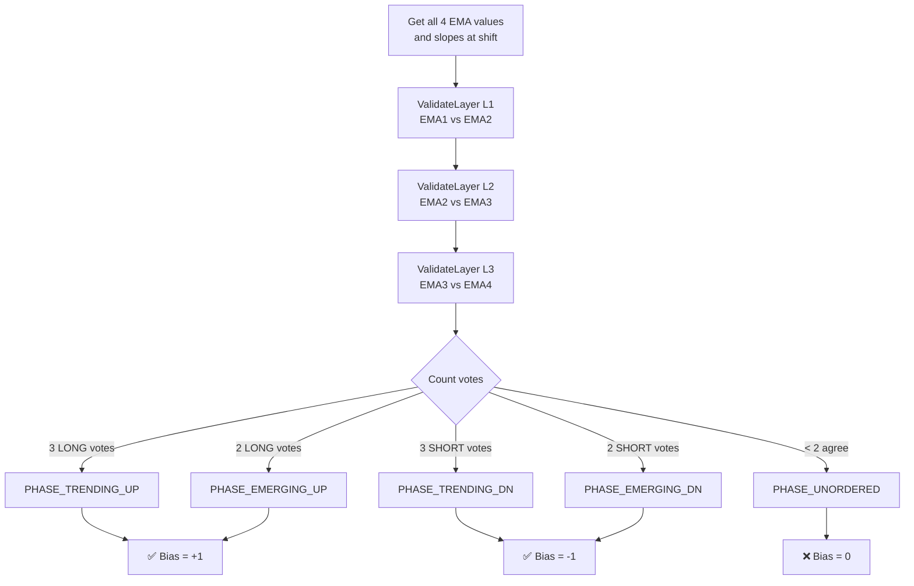
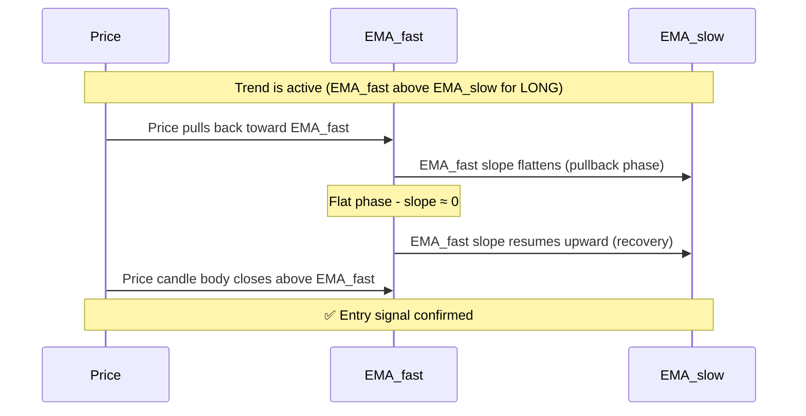
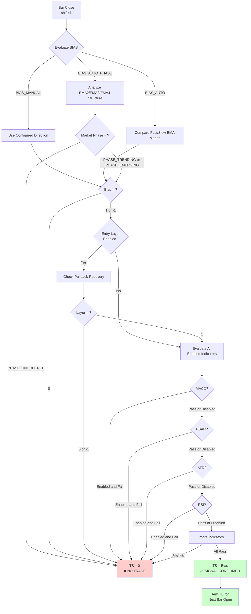
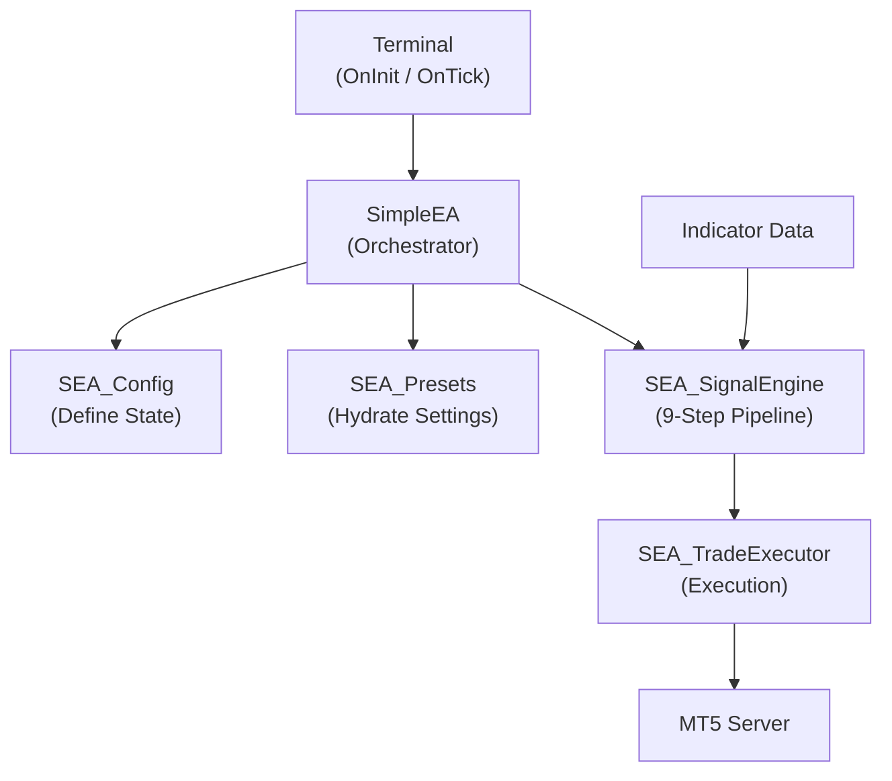
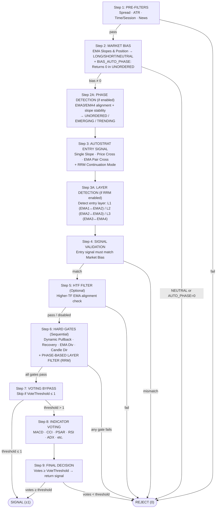
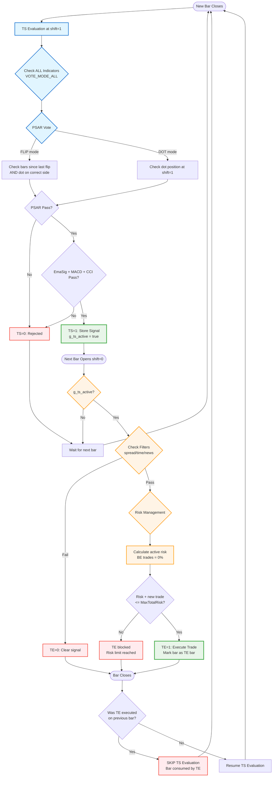
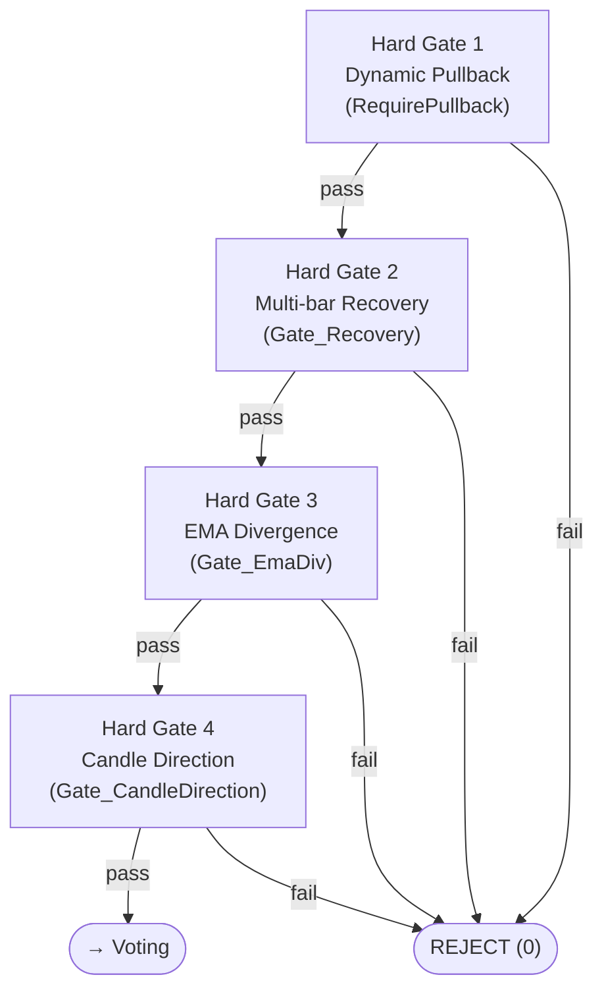

# SimpleEA - Professional Trading System for MT5


## Overview

SimpleEA is a professional-grade Expert Advisor for MetaTrader 5 that implements a comprehensive 9-step signal validation pipeline combining market bias analysis, multi-indicator voting, and risk-aware position management. Designed specifically for macOS + Wine + MT5 environments, it uses an MQL5-only modular architecture.

The system trades quality over quantity, using a strict multiplicative voting system where ALL enabled indicators must agree before entering a position. This results in fewer but higher-probability trades.

Core Philosophy: Simple systems that work > Complex systems that don't.


## Table of Contents

* System Architecture
* Bias, Market Phase, and Entry Layer Concepts
  * Overview
  * Bias
  * Market Phase
  * Entry Layer
  * How They Work Together
  * TS Evaluation Priority
  * Complete TS Formula
  * Configuration Examples
  * Complete TS Evaluation Flow
* How SimpleEA Works: Complete Process Flow
* The 9-Step Signal Pipeline: Visual Overview
* Key Concepts (Quick Summary)
* Key Design Principles
* Architecture Changes (PR9–PR12)
  * Multi-Layer Adaptive EMA System
  * Hard Gate System
  * RRM Continuation Mode
  * Dynamic Pullback Detection
* Configuration Guide
* AI Agent Manifest

For detailed technical documentation: See README_INDICATORS.md


## System Architecture

The v1.02.016d refactor decoupled the system into specialized modules to separate state, logic, and execution.


## Bias, Market Phase, and Entry Layer Concepts

### Overview

The TS (Trade Setup) evaluation pipeline uses three hierarchical, **separate** evaluations that multiply together. Understanding each concept independently is essential before reading the code.

| Concept | Purpose | Depends on |
|---|---|---|
| **Bias** | Direction of the trade (LONG / SHORT / NONE) | Bias mode setting |
| **Market Phase** | Structure quality of the trend | Only used with `BIAS_AUTO_PHASE` |
| **Entry Layer** | Pullback-recovery timing within that trend | Bias direction (any mode) |

These are **not** the same thing. Bias says *which way*, Market Phase says *how strong the structure is*, and Entry Layer says *when to time the entry*.

**Formula:**
```
TS = Bias × MarketPhase × EntryLayer × [all indicators]
```

Because they multiply, **any zero stops the trade**.

---

### Bias

The Bias determines the primary trend direction. Three modes are available:

**Option 1: `BIAS_AUTO` (Traditional EMA method)**
```
Uses: Fast EMA vs Slow EMA comparison (NOT just price position)
Logic:
├─ EMA_Fast > EMA_Slow AND both slopes up    → Bias = 1 (LONG)
├─ EMA_Fast < EMA_Slow AND both slopes down  → Bias = -1 (SHORT)
└─ EMAs crossing or slopes conflicting       → Bias = 0 (no trade)
```

**Option 2: `BIAS_AUTO_PHASE` (Market Phase method)**
```
Uses: 4 EMAs (EMA1, EMA2, EMA3, EMA4) 3-layer hierarchical validation
Logic:
1. Validate Layer 1 (EMA1-EMA2): position + slope agreement
2. Validate Layer 2 (EMA2-EMA3): position + slope agreement
3. Validate Layer 3 (EMA3-EMA4): position + slope agreement
4. Count layer votes: 3=TRENDING, 2=EMERGING, <2=UNORDERED
5. Extract Bias direction from phase result
Special: UNORDERED phase forces Bias = 0 → blocks all trades
```

**Option 3: `BIAS_MANUAL`**
```
Uses: Operator-configured fixed direction
Logic: Always returns the configured side (LONG, SHORT, or BOTH)
Use case: Override mode, single-direction backtesting
```

---

### Complete TS Evaluation Pipeline

The TS evaluation follows this exact order:

```
┌─────────────────────────────────────────────────────────────┐
│ EvaluateTS() - Called on Bar Close (shift=1)                │
└─────────────────────────────────────────────────────────────┘
                          ↓
┌─────────────────────────────────────────────────────────────┐
│ STEP 1: PRE-FILTERS (Hard Gates)                            │
│   ✓ Spread < MaxSpreadPips                                  │
│   ✓ MinATR < ATR < MaxATR                                   │
│   ✓ Time within session window                              │
│   ✓ No high-impact news events                              │
│   → ANY fail → return 0 (unless Stats_FullEvaluation=true)  │
└─────────────────────────────────────────────────────────────┘
                          ↓
┌─────────────────────────────────────────────────────────────┐
│ STEP 2: DIAGNOSTIC UPDATES (Passive - For UI/Stats)         │
│   UpdatePhaseDiagnostics(shift):                            │
│     → m_diag_last_phase = TRENDING/EMERGING/UNORDERED       │
│   UpdateLayerDiagnostics(shift):                            │
│     → m_diag_last_entry_layer = L1/L2/L3/NONE              │
│   → Does NOT block trades yet                               │
└─────────────────────────────────────────────────────────────┘
                          ↓
┌─────────────────────────────────────────────────────────────┐
│ STEP 3: BIAS DETERMINATION (Active - Returns 1/-1/0)        │
│                                                             │
│ Route by BiasMode:                                          │
│ ┌─────────────────────────────────────────────────────┐    │
│ │ BIAS_MANUAL:                                        │    │
│ │   → bias = user setting (LONG/SHORT/NONE)           │    │
│ └─────────────────────────────────────────────────────┘    │
│ ┌─────────────────────────────────────────────────────┐    │
│ │ BIAS_AUTO (Traditional):                            │    │
│ │   → bias = FastEMA vs SlowEMA + slope check         │    │
│ └─────────────────────────────────────────────────────┘    │
│ ┌─────────────────────────────────────────────────────┐    │
│ │ BIAS_AUTO_PHASE (4-EMA Phase):                      │    │
│ │   → GetBias_PhaseBased():                           │    │
│ │      • Uses m_diag_last_phase (from Step 2)         │    │
│ │      • TRENDING/EMERGING → bias = ±1                │    │
│ │      • UNORDERED → bias = 0                         │    │
│ │                                                     │    │
│ │   Phase Detection Logic:                            │    │
│ │   DetectMarketPhase():                              │    │
│ │     1. Validate Layer 1 (EMA1-EMA2): pos+slopes     │    │
│ │     2. Validate Layer 2 (EMA2-EMA3): pos+slopes     │    │
│ │     3. Validate Layer 3 (EMA3-EMA4): pos+slopes     │    │
│ │     4. Count layer votes:                           │    │
│ │        • 3 of 3 agree → TRENDING                    │    │
│ │        • 2 of 3 agree → EMERGING                    │    │
│ │        • < 2 agree → UNORDERED                      │    │
│ └─────────────────────────────────────────────────────┘    │
│                                                             │
│   → If bias = 0 → return 0 (unless Stats_FullEvaluation)   │
└─────────────────────────────────────────────────────────────┘
                          ↓
┌─────────────────────────────────────────────────────────────┐
│ STEP 4: PHASE-LAYER FILTERING (Active - Blocks Trades)      │
│   Only if EnableLayerDetection=true AND                     │
│          PhaseDetectionEnabled=true                         │
│                                                             │
│   Rules:                                                    │
│   • UNORDERED phase → Block ALL layers (L1/L2/L3)          │
│   • EMERGING phase → Block Layer 3 (deep pullback risky)   │
│   • TRENDING phase → Allow ALL layers                       │
│                                                             │
│   → If blocked → return 0 (unless Stats_FullEvaluation)    │
└─────────────────────────────────────────────────────────────┘
                          ↓
┌─────────────────────────────────────────────────────────────┐
│ STEP 5: INDICATOR VOTING (Multiplicative)                   │
│   For each enabled indicator (EmaSig, MACD, PSAR, CCI...): │
│   • Check vote against bias direction                       │
│   • In VOTE_MODE_ALL: ALL must pass                         │
│   • In VOTE_MODE_THRESHOLD: Sum weights ≥ threshold         │
│                                                             │
│   → If voting fails → return 0                              │
└─────────────────────────────────────────────────────────────┘
                          ↓
              ┌───────────────────┐
              │  TS = 1 or -1 ✅  │
              │  (Signal Valid)   │
              └───────────────────┘
                          ↓
                   Next Bar Opens
                          ↓
              ┌───────────────────┐
              │   EvaluateTE()    │
              │  (Execution Gate) │
              └───────────────────┘
```

**Key Points:**
1. **Diagnostic vs Active**: Steps 1-2 populate variables; Steps 3-5 make pass/fail decisions
2. **Phase Detection**: Only active when `BiasMode = BIAS_AUTO_PHASE`
3. **Layer Filtering**: Only active when BOTH `PhaseDetectionEnabled=true` AND `EnableLayerDetection=true`
4. **Stats_FullEvaluation**: When `true`, continues evaluating all steps even after failures (for statistics)

---

### Market Phase

Market Phase is **only** evaluated when `BiasMode = BIAS_AUTO_PHASE`. It uses **3-layer hierarchical validation** across all 4 EMAs.

**`PHASE_TRENDING`**
```
├─ All 3 layers confirm same direction (3 of 3 votes agree)
├─ Each layer: fast EMA above slow AND both slopes aligned
└─ Result: Allow trades, Bias = 1 or -1
```

**`PHASE_EMERGING`**
```
├─ 2 of 3 layers confirm same direction
├─ Trend is forming — partial alignment
└─ Result: Allow trades (but block L3), Bias = 1 or -1
```

**`PHASE_UNORDERED`**
```
├─ Fewer than 2 layers agree on direction
├─ No clear trend structure
└─ Result: Block ALL trades (TS = 0), Bias forced to 0
```

### Phase Detection: 3-Layer Hierarchical Validation

When `BiasMode = BIAS_AUTO_PHASE`, phase detection evaluates **3 interwired sub-markets** simultaneously.

Each layer checks **two conditions**:
1. **Position**: Which EMA is on top?
2. **Slopes**: Do both EMAs' slopes agree with the position?

**Layer 1 (WEAK) - EMA1 vs EMA2:**
```
LONG:  EMA1 > EMA2, slope1=UP, slope2=UP   → Layer 1 votes LONG
SHORT: EMA2 > EMA1, slope1=DN, slope2=DN   → Layer 1 votes SHORT
Other: Any mismatch between pos and slopes  → INVALID (no vote)
```

**Layer 2 (MEDIUM) - EMA2 vs EMA3:**
Same validation logic using EMA2 and EMA3 values/slopes.

**Layer 3 (STRONG) - EMA3 vs EMA4:**
Same validation logic using EMA3 and EMA4 values/slopes.

**Phase Determination by Layer Votes:**

| Long Votes | Short Votes | Phase Result       | Bias |
|------------|-------------|-------------------|------|
| 3          | 0           | PHASE_TRENDING_UP  | +1   |
| 0          | 3           | PHASE_TRENDING_DN  | -1   |
| 2          | 0           | PHASE_EMERGING_UP  | +1   |
| 0          | 2           | PHASE_EMERGING_DN  | -1   |
| < 2        | < 2         | PHASE_UNORDERED    | 0    |

**Debug output example** (when `DebugFlow = true`):
```
[LAYER L1_WEAK]   LONG confirmed: FastEMA > SlowEMA, slopes both UP
[LAYER L2_MEDIUM] LONG confirmed: FastEMA > SlowEMA, slopes both UP
[LAYER L3_STRONG] INVALID: pos=F>S, slopeF=+1, slopeS=0
[260304_PHASE]    Layer votes: LONG=2 SHORT=0 (L1=1 L2=1 L3=0)
[260304_PHASE]    EMERGING_UP: 2 LONG votes
[260304_BIAS]     EMERGING_UP → LONG bias (trend forming)
```

**Market Phase Determination Flow:**


---

### Entry Layer

Entry Layer detects a **pullback-recovery pattern** to time entries. It can be used with **any** Bias mode and is independent of Market Phase.

Three layers represent different pullback depths:

| Layer | EMA Pair | Nickname | Depth | Risk/Reward |
|---|---|---|---|---|
| `LAYER_1_WEAK` | EMA1 – EMA2 | "Ribbon" | Shallow | Lower risk, lower reward |
| `LAYER_2_MEDIUM` | EMA2 – EMA3 | "Ghost" | Medium | Balanced |
| `LAYER_3_STRONG` | EMA3 – EMA4 | "Shark" | Deep | Higher risk, higher reward |

**Pullback-Recovery Detection Pattern:**

1. **Pullback Phase:** EMA_fast slope moves toward EMA_slow (or flattens)
2. **Flat Phase:** EMA_fast slope becomes flat (brief consolidation)
3. **Recovery Phase:** EMA_fast slope resumes trend direction
4. **Confirmation:** Price candle body closes beyond EMA_fast (in bias direction)

**Return values from layer check:**
- `1` = Recovery detected, matches bias direction → **PASS**
- `0` = No recovery detected → **FAIL**
- `-1` = Recovery contradicts bias direction → **FAIL**

**Pullback-Recovery Sequence:**


---

### How They Work Together

**Example 1: `BIAS_AUTO` + Entry Layer**
```
1. BiasMode = BIAS_AUTO
2. Bias: EMA_Fast (13) > EMA_Slow (34), both slopes up → Bias = 1 (LONG)
3. MarketPhase = 1 (not evaluated, treated as pass)
4. EntryLayer: Pullback to EMA3-EMA4 zone detected, recovery confirmed → 1
5. TS = 1 × 1 × 1 × [indicators] → if all pass → LONG signal
```

**Example 2: `BIAS_AUTO_PHASE` + Entry Layer**
```
1. BiasMode = BIAS_AUTO_PHASE
2. Analyze EMA2/EMA3/EMA4: EMA2 > EMA3 > EMA4, all slopes up
3. Phase = PHASE_TRENDING → Bias = 1 (LONG), MarketPhase = 1
4. EntryLayer: Pullback to EMA2-EMA3 "Ghost" zone, recovery confirmed → 1
5. TS = 1 × 1 × 1 × [indicators] → if all pass → LONG signal
```

**Example 3: UNORDERED Phase blocks everything**
```
1. BiasMode = BIAS_AUTO_PHASE
2. Analyze EMA2/EMA3/EMA4: EMAs crossed/mixed, slopes conflicting
3. Phase = PHASE_UNORDERED → Bias forced to 0, MarketPhase = 0
4. TS = 0 × 0 × ? = 0 → NO TRADE (evaluation stops here)
```

---

### TS Evaluation Priority

The pipeline evaluates in this order:

```
1. BIAS (direction)          → If 0, stop immediately
2. MARKET PHASE (structure)  → If UNORDERED, stop (only with BIAS_AUTO_PHASE)
3. ENTRY LAYER (pullback)    → If 0 or -1, stop (only if layer detection enabled)
4. INDICATORS (all equal)    → If any fail, stop
```

**Why this order?**
- Determine *which way* first (Bias) — no point evaluating structure without direction
- Validate *how strong* the structure is (Market Phase) — prevent trading in choppy conditions
- Confirm *timing of entry* (Entry Layer) — ensure the pullback is complete before entering
- Apply *final quality filters* (Indicators) — all indicators evaluated after structural checks pass

---

### Complete TS Formula

```
TS = Bias × MarketPhase × EntryLayer × MACD × CCI × PSAR × ATR × RSI × Stoch × ADX × BB × HTF × ...

Where each factor is:
  1  = pass (condition met, or feature disabled → neutral)
  0  = fail (condition not met)
 -1  = contradicts (used by directional checks)

Multiplicative system: ANY 0 or -1 in the chain → TS = 0 (no trade)
Disabled factors always contribute 1 (they are ignored, not blocking).
```

---

### Configuration Examples

**Conservative (RRM-style)**
```
BiasMode       = BIAS_AUTO_PHASE   ← Use 4-EMA structure check
BlockUnordered = true              ← Hard-block in choppy markets
LayerDetect    = true              ← Require pullback-recovery
AllowLayer1    = false             ← No shallow entries
AllowLayer2    = true              ← Medium pullbacks only
AllowLayer3    = true              ← Deep pullbacks allowed
VoteThreshold  = 3                 ← Need 3+ indicators to agree
```

**Aggressive (Scalp-style)**
```
BiasMode       = BIAS_AUTO         ← Simple Fast/Slow EMA comparison
BlockUnordered = false             ← Don't block by phase
LayerDetect    = false             ← No pullback requirement
AllowLayer1    = true              ← All entries allowed
VoteThreshold  = 1                 ← Any single indicator passes
```

**Flexible (Custom)**
```
BiasMode       = BIAS_AUTO_PHASE   ← Market Phase analysis
BlockUnordered = true              ← Block choppy conditions
LayerDetect    = true              ← Pullback detection on
AllowLayer1    = true              ← All layer depths allowed
AllowLayer2    = true
AllowLayer3    = true
VoteThreshold  = 2                 ← Moderate indicator consensus
```

---

### Complete TS Evaluation Flow



---

## Core Components

* SimpleEA (Main Orchestrator): File: SimpleEA_v1-02-016d_05-9_RRM.mq5. Coordinates all components, handles the OnTick() loop, and manages new bar detection.
* SEA_Config (State Master): File: SEA_Config.mqh. Centralized repository for all enums, the ST_Settings structure, and global input parameters.
* SEA_Presets (Strategy Router): File: SEA_Presets.mqh. Maps raw inputs to the global struct and applies hardcoded strategy overrides for RRM, Scalp, and Swing setups.
* SEA_SignalEngine (Signal Pipeline): File: SEA_SignalEngine.mqh. Implements the 9-step validation pipeline and manages indicator handles.
* SEA_TradeExecutor (Trade Management): File: SEA_TradeExecutor.mqh. Manages position sizing, trade entries, and trailing stops.
* SEA_UI & Reporting: Files: SEA_UI.mqh and SEA_Reporting.mqh. Handles real-time status panels, cockpits, and CSV data exports.


## Component Interaction Diagram



ASCII fallback:
```
┌──────────────────────┐
│   MT5 Terminal       │
│  (OnInit / OnTick)   │
└──────────┬───────────┘
           │
           ↓
┌──────────────────────┐
│    SimpleEA          │
│  (Orchestrator)      │
└──────────┬───────────┘
           │
           ├──→ SEA_Config (State)
           ├──→ SEA_Presets (Router)
           ├──→ SEA_SignalEngine (Pipeline)
           │    └─→ Steps 1-9
           └──→ SEA_TradeExecutor
                └──→ MT5 Server
```


## How SimpleEA Works: Complete Process Flow

Main Execution Loop (OnTick)

Every time a new bar closes:

1. Check if we have an open position: 
    * YES → Manage it (breakeven, trailing stops).
    * NO → Look for new signal.
2. Detect if new bar formed: Compare current iTime[0] with stored last bar time.
3. Evaluate signal: Call SignalEngine.GetDirection(). Evaluation happens on shift=1 (closed candle).
4. Execute trade: If a valid signal (1 or -1) is returned and no position is open: 
    * Calculate position size based on RiskPercent.
    * Calculate SL/TP levels based on selected mode.
    * Execute trade at shift=0 (current candle open).


## The 9-Step Signal Pipeline: Visual Overview

All evaluation happens on the CLOSED candle (shift=1) to prevent repainting.



ASCII fallback:
```
Signal Pipeline Flow (9 Steps)
═══════════════════════════════

Bar Closes (shift=1)
    ↓
┌─────────────────────────────────────┐
│ STEP 1: BIAS CALCULATION            │
│ Result: -1 (SHORT), 0, +1 (LONG)    │
└────────────┬────────────────────────┘
             │ Pass ✓
             ↓
┌─────────────────────────────────────┐
│ STEP 2: ENTRY SIGNAL                │
│ Strategy: PAIR_CROSS / PRICE_CROSS  │
└────────────┬────────────────────────┘
             │ Pass ✓
             ↓
┌─────────────────────────────────────┐
│ STEP 3: SIGNAL-BIAS MATCH           │
└────────────┬────────────────────────┘
             │ Pass ✓
             ↓
┌─────────────────────────────────────┐
│ STEP 4: HTF FILTER (Optional)       │
└────────────┬────────────────────────┘
             │ Pass ✓
             ↓
┌─────────────────────────────────────┐
│ STEP 5: STRUCTURE GATE              │
│ Multi-layer pullback-recovery       │
└────────────┬────────────────────────┘
             │ Pass ✓
             ↓
┌─────────────────────────────────────┐
│ STEP 6: INDICATOR VOTING            │
│ All must agree (or threshold)       │
└────────────┬────────────────────────┘
             │ Pass ✓
             ↓
┌─────────────────────────────────────┐
│ STEP 7: POSITION CHECK              │
└────────────┬────────────────────────┘
             │ Pass ✓
             ↓
┌─────────────────────────────────────┐
│ STEP 8: OPERATOR GATES              │
│ Spread, session, news               │
└────────────┬────────────────────────┘
             │ Pass ✓
             ↓
┌─────────────────────────────────────┐
│ STEP 9: EXECUTE                     │
│ TS Signal → Next bar: Place order   │
└─────────────────────────────────────┘
```


## Key Principle:

$TS (Trade Signal) = Market\_Bias x Indicator_1 x Indicator_2 x ... x Indicator_n$.

* ANY component = 0 → Entire result = 0 (NO TRADE).
* ALL components = 1 → Result = bias direction ($\pm1$).


## Key Concepts (Quick Summary)

# Market Bias vs Entry Signal

* Market Bias: Primary trend filter (Step 2) that determines if the market is in a LONG, SHORT, or NEUTRAL state.
* Entry Signal: Timing signal (Step 3) generated by the AutoStrat strategy (Single Slope, Price Cross, or Pair Cross).

# The Multiplicative Voting System

The system uses a multiplicative formula where ANY component = 0 → entire result = 0. This strict filtering requires unanimous agreement (or meeting the required threshold) before entering a position.

# Signal Timing: shift=1 vs shift=0

* Signal evaluation: Happens on shift=1 (CLOSED candle) for stable, confirmed data.
* Trade entry: Happens on shift=0 (NEW candle open) for predictable execution.


## TS→TE Two-Phase Signal Architecture

SimpleEA implements a two-phase signal evaluation system that separates **Trade Setup (TS)** validation from **Trade Entry (TE)** execution checks. This architecture was implemented in PR #53 to align with the proven Python reference system.

### Phase 1: TS (Trade Setup) Evaluation

**When**: Every bar close (shift=1)  
**Function**: `GetDirection()` in `SEA_SignalEngine.mqh`  
**Purpose**: Complete signal validation using closed/confirmed bar data

**9-Step Pipeline**:
```
Bar N closes (shift=1)
  ├─ Step 1: Pre-filters (spread, ATR, time, news)
  ├─ Step 2: Market bias (EMA structure)
  ├─ Step 3: AutoStrat signal generation
  ├─ Step 4: Signal validation
  ├─ Step 5: HTF filter
  ├─ Step 6: RRM gates (pullback/divergence)
  ├─ Step 7: Voting bypass check
  ├─ Step 8: Indicator voting (ALL-mode in presets)
  └─ Step 9: Final decision → TS=1 or TS=0
```

**Evaluation details**:
- Uses `Vote_EvalShift` (default=1, forced in RRM presets)
- All presets use `VOTE_MODE_ALL` (unanimous indicator agreement)
- PSAR flip-count validation (1-2 flips required when enabled)

**If TS=1**: Store signal state (`g_ts_active = true`, `g_ts_direction`, `g_ts_bar_time`) for next bar's TE evaluation.

### Phase 2: TE (Trade Entry) Evaluation

**When**: First tick of bar N+1 open (shift=0), only if `g_ts_active == true`  
**Function**: `EvaluateTE()` in `SEA_SignalEngine.mqh`  
**Purpose**: Validate execution-moment conditions only

**Pipeline**:
```
Bar N+1 opens (shift=0) - if g_ts_active == true
  └─ EvaluateTE(ts_direction)
       └─ CheckFilters() at shift=0
            ├─ Spread check (live spread vs MaxSpread)
            ├─ Time filter (current hour vs session window)
            ├─ News filter (imminent high-impact events)
            └─ ATR filter (if MinATR/MaxATR enabled)
       └─ Result: TE=1 (execute) or TE=0 (reject)
```

**If TE=1**: Execute trade immediately via `Executor.ProcessSignal()`  
**If TE=0**: Reject entry, clear TS state (`g_ts_active = false`), continue evaluating TS on subsequent bars

**Critical**: TE does NOT re-validate signal logic (bias, indicators, price direction). It only checks if **right now** is a good moment to execute based on execution costs and timing.

### Design Rationale

- **TS at shift=1**: Uses confirmed closed-bar data for reliable signal detection
- **TE at shift=0**: Real-time execution checks (spread/news can change tick-to-tick)
- **1-bar delay**: Prevents premature entries on unconfirmed price action
- **Separation of concerns**: Signal logic (TS) vs execution conditions (TE)
- **Continuous monitoring**: TS evaluated every bar; TE only when TS=1

This architecture matches the proven Python reference system where TS+ signals on bar N lead to TE+ execution on bar N+1, achieving 55-60% win ratios.

### Key Implementation Changes (PR #53)

1. **OrchestrateTick() restructure**: Runs TE check on every tick (before new-bar gate), evaluates TS on new bars only
2. **Global state tracking**: `g_ts_active`, `g_ts_direction`, `g_ts_bar_time` replace old immediate-entry logic
3. **EvaluateTE() function**: New shift=0 validation layer (spread/time/news only, no signal re-validation)
4. **Vote_EvalShift setting**: Controls TS evaluation bar shift (default=1, forced in presets)
5. **VOTE_MODE_ALL enforcement**: All 7 presets require unanimous indicator agreement
6. **PSAR flip countdown**: `DetectPSARFlipAt()`, `UpdatePSARFlipTracking()`, `GetBarsSinceLastFlip()`, and `Check_PSAR_WithFlip()` implement countdown-based flip validation

### Process Flow Diagram

The following diagram illustrates the complete bar-by-bar evaluation cycle:



### Bar-by-Bar Timeline Example

```
Bar N+2 closes (shift=1 from current perspective):
  ├─ TS evaluation: ALL indicators checked including PSAR
  ├─ PSAR FLIP mode: Check bars since last flip <= delay AND dot on correct side
  └─ If ALL pass → TS=1 stored

Bar N+1 opens (shift=0):
  ├─ TE evaluation: Filters ONLY (spread, time, news)
  ├─ Risk check: (active_risk + new_trade_risk) <= MaxTotalRisk?
  └─ If both OK → Execute trade, mark bar as "TE bar"

Bar N+1 closes:
  └─ SKIP TS evaluation (bar consumed by TE, indicators haven't reset)

Bar N closes (shift=0→1):
  └─ Resume TS evaluation (fresh setup possible)
```

### PSAR Logic Modes

**Mode A: PSAR FLIP (Vote_AllowPsarFlip=true)**
- Flip is detected when PSAR crosses price on a closed bar and stored with its timestamp
- Each bar calculates `bars_since_flip` from the stored flip time
- Passes only if `bars_since_flip <= Vote_PsarFlipDelay` and dot is on correct side
- Example: Flip at bar 5, delay=2 → valid for bars 5 (N=2) and 4 (N=1), expires at bar 3

**Mode B: Simple PSAR DOT (Vote_AllowPsarFlip=false)**
- Just checks: is dot on correct side at shift=1?
- No flip requirement, simpler logic

### Risk Management

**Portfolio-Level Gates:**
- `MaxTotalRisk`: Maximum % of account at risk simultaneously (e.g., 4%)
- `MaxOpenTrades`: Maximum concurrent positions (e.g., 3)
- `CountBEasZeroRisk`: Trades at breakeven count as 0% risk

**Example:**
```
MaxTotalRisk = 4%, RiskPercent = 2%
Open trades:
  - Trade1: 2% risk (active SL)
  - Trade2: 0% risk (at BE)
New trade: 2% risk
Calculation: 2% + 0% + 2% = 4% <= 4% → ALLOWED
```


## Architecture Changes (PR9–PR12)

### Multi-Layer Adaptive EMA System (PR12)

The RRM preset uses a **3-layer cascading EMA system** (`Gate_UseMultiLayer = true`) instead of a single fixed EMA reference. `DetectActiveLayer()` selects the first valid layer shallow-to-deep:

| Layer | EMA Pair | LONG condition | SHORT condition |
|-------|----------|----------------|-----------------|
| 1 (fastest) | EMA1–EMA2 | EMA1 > EMA2 and price ≥ EMA2 | EMA1 < EMA2 and price ≤ EMA2 |
| 2 (medium)  | EMA2–EMA3 | EMA2 > EMA3 and price ≥ EMA3 | EMA2 < EMA3 and price ≤ EMA3 |
| 3 (deepest) | EMA3–EMA4 | EMA3 > EMA4 and price ≥ EMA4 | EMA3 < EMA4 and price ≤ EMA4 |

- Layers are checked in order 1→2→3; the first valid layer is used.
- A broken shallow layer does **not** prevent a deeper layer from being active (layers are independent).
- If no layer is valid, Hard Gate 1 rejects the signal immediately.
- Default EMA periods (RRM): EMA1=5, EMA2=13, EMA3=34, EMA4=89.

```
Multi-Layer Cascade (SHORT trend example)
═════════════════════════════════════════

┌─────────────────────────────────────┐
│ Layer 1: EMA5 ↔ EMA13 (Fast)        │
├─────────────────────────────────────┤
│ Pullback: Price → EMA5              │
│ Recovery: Price resumes down        │
│ Intact: EMA5 < EMA13 ✓              │
│ → FAST ENTRY                        │
└─────────────────────────────────────┘
           │ If broken
           ↓
┌─────────────────────────────────────┐
│ Layer 2: EMA13 ↔ EMA34 (Medium)     │
├─────────────────────────────────────┤
│ Pullback: Price → EMA13             │
│ Recovery: Price resumes down        │
│ Intact: EMA13 < EMA34 ✓             │
│ → MEDIUM ENTRY                      │
└─────────────────────────────────────┘
           │ If broken
           ↓
┌─────────────────────────────────────┐
│ Layer 3: EMA34 ↔ EMA89 (Deep)       │
├─────────────────────────────────────┤
│ Pullback: Price → EMA34             │
│ Recovery: Price resumes down        │
│ Intact: EMA34 < EMA89 ✓             │
│ → DEEP ENTRY (bias EMAs!)           │
└─────────────────────────────────────┘
```

### Two-Tier Bias Architecture (PR15)

`PRESET_RRM` separates **trend direction** (bias) from **entry timing** into two distinct tiers:

| Tier | Role | EMAs Used | Period | Purpose |
|------|------|-----------|--------|---------|
| Bias | Trend direction filter (Step 2) | EMA3 / EMA4 | 34 / 89 | Stable — holds through pullbacks and minor corrections |
| Entry | Entry timing signal (Step 3) | EMA1 / EMA2 | 5 / 13 | Fast — detects crossovers and continuation entries |

This applies to **both** `RRM_SCALP` and `RRM_SWING` modes. Key benefits:
- Bias (34/89) does not flip on shallow pullbacks or noise, providing a stable trend anchor.
- Layers 1 and 2 (EMA1–EMA2, EMA2–EMA3) provide fast entry signals **within** the stable bias direction.
- Layer 3 (EMA3–EMA4) matches the bias EMAs, serving as the deepest confirmation layer.
- Clear separation: slow EMAs own trend direction; fast EMAs own entry timing.

```
PRESET_RRM Two-Tier Architecture (PR15)
════════════════════════════════════════

Tier 1: BIAS (Major Trend - Stable)
┌─────────────────────────────────────┐
│ EMA34 vs EMA89                      │
│ Purpose: Identify major trend       │
│ Changes: Rarely (major shifts only) │
│ Holds during: Shallow/medium pulls  │
└─────────────────────────────────────┘
           │
           ↓
Tier 2: ENTRY TIMING (Multi-Layer - Adaptive)
┌─────────────────────────────────────┐
│ Layer 1: EMA5 ↔ EMA13               │
│   → Fast entries, shallow pulls     │
│ Layer 2: EMA13 ↔ EMA34              │
│   → Medium entries, deeper pulls    │
│ Layer 3: EMA34 ↔ EMA89              │
│   → Deep entries, strongest confirm │
└─────────────────────────────────────┘
```

### Phase Detection System (PRs 1-5)

The RRM preset (`PRESET_RRM`) automatically detects market phase using EMA3/EMA4 alignment and slope stability. Phase detection and layer filtering are **enabled by default** in `PRESET_RRM`.

#### Three Market Phases

| Phase | Definition | EMAs | Slope Stability | Trade Strategy |
|-------|------------|------|-----------------|----------------|
| **UNORDERED** | Choppy, no clear trend | EMA3 ≈ EMA4 (misaligned or flat) | Inconsistent recent slopes | **Block all trades** |
| **EMERGING** | Trend starting to form | EMA3 and EMA4 aligned AND both sloping | 2-3 bars stable direction | **L1 and L2 entries** (shallow pullbacks only) |
| **TRENDING** | Strong established trend | EMA3 and EMA4 aligned AND both sloping | 4+ bars stable direction | **L1, L2, and L3 entries** (all depths allowed) |

#### Detection Logic

`DetectMarketPhase()` checks (in order):

1. **EMA Alignment:** Are EMA3 and EMA4 both rising (LONG) or both falling (SHORT)?
   - NO → `PHASE_UNORDERED`
   - YES → Continue

2. **Recent Slope Consistency:** Count bars with consistent EMA3/EMA4 slopes
   - 0-1 bars consistent → `PHASE_UNORDERED`
   - 2-3 bars consistent → `PHASE_EMERGING`
   - 4+ bars consistent → `PHASE_TRENDING`

#### Configuration

| Input | Location | Purpose |
|-------|----------|---------|
| `InpBiasMode = BIAS_AUTO_PHASE` | Zone 3B §1 | Bias returns 0 (NEUTRAL) in UNORDERED phase |
| `RRM_FilterByPhase = true` | Zone 3B §3 | Enable phase-based filtering |
| `RRM_FilterLayersByPhase = true` | Zone 3B §3 | Apply layer restrictions per phase |

#### RRM Phase-Based Filtering Rules

When `RRM_FilterByPhase=true` AND `RRM_FilterLayersByPhase=true`:

```
┌─────────────────────────────────────────────┐
│ PHASE: UNORDERED                            │
├─────────────────────────────────────────────┤
│ Status: Market is choppy, no clear trend    │
│ Action: BLOCK ALL LAYERS (L1, L2, L3)       │
│ Reason: High risk of whipsaw                │
└─────────────────────────────────────────────┘

┌─────────────────────────────────────────────┐
│ PHASE: EMERGING                             │
├─────────────────────────────────────────────┤
│ Status: Trend forming but not confirmed     │
│ Action: ALLOW L1 (EMA1↔EMA2)  ✅ Shallow   │
│        ALLOW L2 (EMA2↔EMA3)   ✅ Medium    │
│        BLOCK L3 (EMA3↔EMA4)   ❌ Blocked   │
│ Reason: Trend not strong enough for deep    │
│         pullbacks; avoid deep reversals     │
└─────────────────────────────────────────────┘

┌─────────────────────────────────────────────┐
│ PHASE: TRENDING                             │
├─────────────────────────────────────────────┤
│ Status: Strong established trend            │
│ Action: ALLOW L1 (EMA1↔EMA2)  ✅ Fast      │
│        ALLOW L2 (EMA2↔EMA3)   ✅ Medium    │
│        ALLOW L3 (EMA3↔EMA4)   ✅ Deep      │
│ Reason: Strong trend can handle all         │
│         pullback depths (ALL ALLOWED)       │
└─────────────────────────────────────────────┘
```

#### Example: SHORT Trending Market

```
Phase: TRENDING
Bias: SHORT (EMA3 < EMA4, both falling consistently)
Entry Layer Detected: L2 (price pulled back to EMA13, recovering down)

Check:
  Is L2 allowed in TRENDING phase? YES ✅
  
→ Trade ALLOWED (proceed to voting)
```

#### Example: SHORT Emerging Market

```
Phase: EMERGING
Bias: SHORT (EMA3 < EMA4, recently aligned)
Entry Layer Detected: L3 (price pulled back to EMA34)

Check:
  Is L3 allowed in EMERGING phase? NO ❌
  Only L1 and L2 allowed in EMERGING
  
→ Trade REJECTED (reason: "LAYER_NOT_ALLOWED_IN_PHASE")
```

#### Logging

When phase filtering rejects a trade:
```
STRUCTURE GATE 2 FAIL: Layer=L3 Phase=EMERGING (LAYER_NOT_ALLOWED_IN_PHASE)
```

---

## Phase 2: Bias Mode Refactoring and Layer Detection (PR #12)

### Overview

Phase 2 refactored the bias evaluation system to support three distinct modes and integrated market phase detection with entry layer filtering. This implementation matches the Python EA's fractal methodology.

### Three Bias Modes

The system now supports three independent bias calculation methods:

#### Mode 1: BIAS_MANUAL (Manual Direction)
```
User sets:
├─ SIDE_LONG  → Always returns Bias = 1
├─ SIDE_SHORT → Always returns Bias = -1
└─ SIDE_BOTH  → Returns Bias = 0 (no directional preference)

Use case: Testing, directional trading sessions
```

#### Mode 2: BIAS_AUTO (Traditional 2-EMA)
```
Logic:
├─ Compare Fast EMA vs Slow EMA (configurable via BiasFastID/BiasSlowID)
├─ Check BOTH position AND slopes
│
LONG conditions:
  Fast > Slow  AND  Fast rising  AND  Slow rising  → Bias = 1
│
SHORT conditions:
  Fast < Slow  AND  Fast falling  AND  Slow falling  → Bias = -1
│
Mixed/Conflicting:
  Any other configuration  → Bias = 0 (no trade)

Use case: Standard trend-following strategies
Function: GetBias_2EMA()
```

#### Mode 3: BIAS_AUTO_PHASE (4-EMA Market Phase)
```
Logic:
├─ Analyze EMA2, EMA3, EMA4 structure
├─ Determine Market Phase (TRENDING/EMERGING/UNORDERED)
├─ Extract Bias direction from phase
│
TRENDING/EMERGING (up):
  EMA2 > EMA3 > EMA4  AND  both sloping up  → Bias = 1
│
TRENDING/EMERGING (down):
  EMA2 < EMA3 < EMA4  AND  both sloping down  → Bias = -1
│
UNORDERED:
  Mixed EMA positions or flat slopes  → Bias = 0
│
Phase confirmation:
  Uses configurable MinPhaseConfirmBars to validate stability

Use case: RRM strategy, advanced trend detection
Function: GetBias_4EMA() → calls DetectMarketPhase()
```

### Market Phase Detection (BIAS_AUTO_PHASE only)

When `BiasMode = BIAS_AUTO_PHASE`, the system classifies market structure quality:

#### DetectMarketPhase() Algorithm

```
Step 1: Check EMA3/EMA4 Slope Alignment
├─ Get EMA3 slope (current vs previous)
├─ Get EMA4 slope (current vs previous)
│
If slopes don't match or either is flat:
  → PHASE_UNORDERED (choppy market)
│
Step 2: Count Consistent Slope Bars
├─ Scan last N bars (configurable via MinPhaseConfirmBars)
├─ Count bars where EMA3 and EMA4 slopes agree
│
Consistency thresholds (CONFIGURABLE):
  0-1 bars consistent → PHASE_UNORDERED
  2-3 bars consistent → PHASE_EMERGING
  4+ bars consistent  → PHASE_TRENDING
│
Step 3: Check EMA Order
├─ TRENDING: EMAs properly ordered (2>3>4 for LONG, 2<3<4 for SHORT)
├─ EMERGING: EMA4 temporarily between EMA2 and EMA3
└─ UNORDERED: Any other configuration

Step 4: Return Phase + Direction
├─ PHASE_TRENDING_UP / PHASE_TRENDING_DN
├─ PHASE_EMERGING_UP / PHASE_EMERGING_DN
└─ PHASE_UNORDERED
```

**Key Feature:** `MinPhaseConfirmBars` is **CONFIGURABLE** because:
- Signals may occur at the current bar (shift=0) or the previous bar (shift=1)
- Different symbols/timeframes need different stability thresholds
- Lower values (1-2) = more responsive, more trades
- Higher values (4-5) = more stable, fewer false signals

### Entry Layer Detection

Detects pullback-recovery patterns within the trend:

#### Layer Definitions

| Layer | EMA Pair | Nickname | Depth | Risk/Reward |
|-------|----------|----------|-------|-------------|
| **L1** | EMA1–EMA2 | "Ribbon" | Shallow | Lower risk, quick entries |
| **L2** | EMA2–EMA3 | "Ghost" | Medium | Balanced |
| **L3** | EMA3–EMA4 | "Shark" | Deep | Higher risk, trend confirmation |

#### CheckLayerPullbackRecovery() Pattern

```
Pullback-Recovery Detection:
├─ Step 1: EMAs aligned with bias
│    LONG: Fast EMA > Slow EMA
│    SHORT: Fast EMA < Slow EMA
│
├─ Step 2: Price touched Fast EMA (within tolerance)
│    Tolerance = LayerTouchTolerance (default 1%)
│
├─ Step 3: Recovery - Fast EMA slope resuming trend direction
│    LONG: Fast EMA rising again
│    SHORT: Fast EMA falling again
│
└─ Step 4: Confirmation (optional via RequireRecoveryMomentum)
     LONG: Candle closes above Fast EMA (bullish body)
     SHORT: Candle closes below Fast EMA (bearish body)

Returns:
  true  = Pullback-recovery detected, matches bias → PASS
  false = No pattern detected → FAIL
```

#### GetEntryLayer() Priority

Checks layers from **strongest to weakest** (L3 → L2 → L1):
- Deepest pullback takes precedence
- Returns first matching layer or LAYER_NONE

### Phase-Layer Filtering Integration

When `RRM_FilterByPhase=true` AND `RRM_FilterLayersByPhase=true`:

#### IsLayerAllowedInPhase() Rules

```
┌─────────────────────────────────────────────┐
│ PHASE: UNORDERED                            │
├─────────────────────────────────────────────┤
│ Allowed Layers: NONE                        │
│ Action: BLOCK L1, L2, L3                    │
│ Reason: No clear trend, high whipsaw risk   │
└─────────────────────────────────────────────┘

┌─────────────────────────────────────────────┐
│ PHASE: EMERGING                             │
├─────────────────────────────────────────────┤
│ Allowed Layers: L1, L2 ONLY                 │
│ Action: ALLOW L1 (shallow), L2 (medium)     │
│         BLOCK L3 (deep)                     │
│ Reason: Trend forming, avoid deep reversals │
└─────────────────────────────────────────────┘

┌─────────────────────────────────────────────┐
│ PHASE: TRENDING                             │
├─────────────────────────────────────────────┤
│ Allowed Layers: L1, L2, L3 (ALL)            │
│ Action: ALLOW all pullback depths           │
│ Reason: Strong trend can handle deep pulls  │
└─────────────────────────────────────────────┘
```

**Logic:** Progressive risk management
- **EMERGING**: Be cautious, trend not proven → shallow entries only
- **TRENDING**: Aggressive, trend confirmed → all entries allowed

### New Configuration Settings

#### Zone 3B: RRM/Phase Settings

| Input | Type | Default | Description |
|-------|------|---------|-------------|
| **Inp_PhaseDetectionEnabled** | bool | false* | Enable market phase detection |
| **Inp_BlockUnorderedPhase** | bool | true | Block trades in UNORDERED phase |
| **Inp_MinPhaseConfirmBars** | int | 2 | Lookback window for slope consistency check (0-5) |
| | | | Phase determined by count of consistent bars: 0-1→UNORDERED, 2-3→EMERGING, 4+→TRENDING |
| **Inp_EnableLayerDetection** | bool | false* | Enable entry layer detection |
| **Inp_LayerTouchTolerance** | double | 0.01 | Price-EMA touch tolerance (% of EMA value) |
| **Inp_RequireRecoveryMomentum** | bool | false | Require bullish/bearish candle close |
| **Inp_RRM_FilterByPhase** | bool | false* | Enable phase-based layer filtering |
| **Inp_RRM_FilterLayersByPhase** | bool | false* | Apply strict layer rules per phase |

\* **Note:** Default = false for backward compatibility. `PRESET_RRM` enables these automatically.

### New Enums

#### EMarketPhase
```mql5
enum EMarketPhase
{
   PHASE_UNORDERED,    // Choppy, no clear trend
   PHASE_EMERGING_UP,  // Trend forming upward
   PHASE_EMERGING_DN,  // Trend forming downward
   PHASE_TRENDING_UP,  // Strong established uptrend
   PHASE_TRENDING_DN   // Strong established downtrend
};
```

#### EEntryLayer
```mql5
enum EEntryLayer
{
   LAYER_NONE,         // No layer detected
   LAYER_1_WEAK,       // EMA1–EMA2 (Ribbon) - Shallow
   LAYER_2_MEDIUM,     // EMA2–EMA3 (Ghost) - Medium
   LAYER_3_STRONG      // EMA3–EMA4 (Shark) - Deep/Bias
};
```

### Function Reference

#### Core Bias Functions

| Function | Purpose | Returns |
|----------|---------|---------|
| `GetBias(shift)` | Master bias dispatcher | 1 (LONG), -1 (SHORT), 0 (NEUTRAL) |
| `GetBias_Manual()` | Manual direction mode | Per user config |
| `GetBias_2EMA(shift)` | Traditional 2-EMA comparison | Based on position + slopes |
| `GetBias_4EMA(shift)` | Market phase analysis | Based on EMA structure |

#### Phase Detection Functions

| Function | Purpose | Returns |
|----------|---------|---------|
| `DetectMarketPhase(shift)` | Classify market structure | EMarketPhase enum |
| `CountConsistentSlopes(h3, h4, shift)` | Count stable slope bars | int (0-5+) |

#### Layer Detection Functions

| Function | Purpose | Returns |
|----------|---------|---------|
| `GetEntryLayer(shift, bias)` | Detect pullback-recovery | EEntryLayer enum |
| `CheckLayerPullbackRecovery(...)` | Pattern matcher | true/false |
| `IsLayerAllowedInPhase(layer, phase)` | Validate layer vs phase | true/false |

### Updated EvaluateTS() Pipeline

```mql5
int EvaluateTS(const int v_shift = 1)
{
   // STEP 1: Determine Bias (direction)
   int bias = GetBias(v_shift);  // Dispatches to Manual/2EMA/4EMA
   if(bias == 0) return 0;        // No bias = reject
   
   // STEP 2: Market Phase Check (O3 mode only)
   if(m_settings.BiasMode == BIAS_AUTO_PHASE) {
      phase = DetectMarketPhase(v_shift);
      if(phase == PHASE_UNORDERED && BlockUnorderedPhase)
         return 0;  // Reject choppy markets
   }
   
   // STEP 3: Entry Layer Check (if enabled)
   if(EnableLayerDetection) {
      layer = GetEntryLayer(v_shift, bias);
      if(layer == LAYER_NONE) return 0;  // No pullback signal
      
      // Phase-layer filtering (if enabled)
      if(!IsLayerAllowedInPhase(layer, phase))
         return 0;  // Layer not allowed in this phase
   }
   
   // STEP 4: Indicator Voting (unchanged)
   // ALL enabled indicators must agree with bias
   // ...
   
   return bias;  // 1 or -1
}
```

### PRESET_RRM Configuration

Phase 2 features are **enabled by default** in `PRESET_RRM`:

```mql5
case PRESET_RRM:
{
   // Bias Mode
   cfg.BiasMode = BIAS_AUTO_PHASE;
   
   // Phase Detection
   cfg.PhaseDetectionEnabled = true;
   cfg.BlockUnorderedPhase = true;
   cfg.MinPhaseConfirmBars = 2;  // Configurable (2-3 = EMERGING)
   
   // Entry Layer Detection
   cfg.EnableLayerDetection = true;
   cfg.LayerTouchTolerance = 0.01;  // 1%
   cfg.RequireRecoveryMomentum = false;
   
   // Phase-Layer Filtering
   cfg.RRM_FilterByPhase = true;
   cfg.RRM_FilterLayersByPhase = true;
   
   // ... (rest of RRM settings)
}
```

### Expected Performance Improvement

| Implementation Stage | Win Rate | Trade Frequency | Notes |
|---------------------|----------|-----------------|-------|
| Phase 1 (no phase/layer) | 30-40% | 2-3/day | Simple bias, over-trading |
| + Phase detection (O3) | 40-50% | 1-2/day | Blocks choppy markets |
| + Layer detection | 50-55% | 2-4/day | Better entry timing |
| + Phase-layer filtering | 55-60% | 3-5/day | **Target: Python EA parity** |

---


Step 6 of the pipeline runs **four sequential hard gates**. Any gate failure immediately rejects the signal (returns 0). All gates are configurable via `SGateConfig { EGateScaleMode mode; double value; }`.



**Gate scale modes (`EGateScaleMode`):**
- `GATE_SCALE_OFF` — gate disabled (always passes).
- `GATE_SCALE_FIXED` — fixed pip threshold (`value` field).
- `GATE_SCALE_AUTO_TF` — auto-scales by timeframe and pair (JPY vs non-JPY); `value` acts as a multiplier.

**PRESET_RRM gate defaults:**

| Gate | Mode | Notes |
|------|------|-------|
| Dynamic Pullback | enabled | Multi-layer mode, `PullbackLookback` = 15 (M1/M5) or 10 (M15+) |
| Recovery | `GATE_SCALE_AUTO_TF` × 1.0 | Lookback = 5 (M1/M5) or 7 (M15+) |
| EMA Divergence | `GATE_SCALE_AUTO_TF` × 1.0 | Minimum spread between fast and slow EMA |
| Candle Direction | `GATE_SCALE_FIXED` × 1.0 | Checks bar at shift=2 |

### RRM Continuation Mode (PR10)

When `ExitProfile = EXIT_PROFILE_RRM_STRICT_NO_ATR` and `AutoStrat = STRAT_PAIR_CROSS`, the entry signal generator allows entries **within an established trend** even when no fresh EMA crossover has occurred on the current bar.

**Condition for continuation entry:**
- Market bias is non-zero (trend is established).
- The EMA position matches the bias (fast EMA is on the correct side of slow EMA).
- No new crossover is required — the system detects that the trend is intact and issues a continuation signal equal to the current bias.

This is the primary entry mode for `PRESET_RRM`. It enables the EA to re-enter after pullbacks without waiting for a new crossover, provided the downstream hard gates (especially Dynamic Pullback) confirm a valid structure.

**Standard crossover** logic still applies first — continuation mode is only engaged when no fresh crossover is detected.

### Dynamic Pullback Detection (PR11, updated PR14)

Hard Gate 1 (`Check_Gate_DynamicPullback`) uses **recovery-based detection** with no fixed pip thresholds. In multi-layer mode, the active EMA layer is selected by alignment only (no price-position requirement), allowing the gate to function correctly when price is still within the pullback zone. It validates the following sequence:

1. **Layer selection** — select the shallowest EMA layer whose fast/slow EMAs are still trend-aligned (fast > slow for LONG; fast < slow for SHORT), regardless of current price position.
2. **Pullback extreme** — within `PullbackLookback` bars (bars 2 to lookback), find the bar with the most price movement against bias (highest high for SHORT; lowest low for LONG).
3. **Recovery started** — the current closed bar (shift=1) has moved back from the pullback extreme (close < extreme high for SHORT; close > extreme low for LONG).
4. **Momentum** *(optional, `RequireRecoveryMomentum`)* — the current bar closes in the trend direction (close > open for LONG; close < open for SHORT).
5. **Layer intact** — at the pullback extreme bar, the active layer's EMAs were still trend-aligned.

Key settings (`PRESET_RRM` defaults):

| Setting | Value | Description |
|---------|-------|-------------|
| `RequirePullback` | `true` | Enables Hard Gate 1 |
| `Gate_UseMultiLayer` | `true` | Use 3-layer cascading detection |
| `PullbackLookback` | 15 / 10 | Bars to search for the pullback touch |
| `RequireRecoveryMomentum` | `false` | Optional: require bullish/bearish close |

## PRESET_RRM: Strict No-ATR Trend Pullback

`PRESET_RRM` enforces the following SL/TP contract. These are **not user-configurable** under this preset:

**SL Placement:**
- Primary: Swing high/low (`SL_SWING_HIGHLOW`) with timeframe-based cushion
- Backup: PSAR dot with timeframe-based cushion (used by `RRM_GetStrictSL` fallback)
- ATR: **DISABLED** (`SL_Mult = 0.0`, `ExitProfile = EXIT_PROFILE_RRM_STRICT_NO_ATR`)

**Cushion Auto-Scaling (non-JPY / JPY):**

| Timeframe | Initial SL Cushion | Trailing Cushion |
|-----------|-------------------|-----------------|
| M1        | 2 / 3 pips        | 1 / 2 pips      |
| M5        | 3 / 5 pips        | 2 / 3 pips      |
| M15       | 5 / 8 pips        | 3 / 5 pips      |
| H1        | 10 / 15 pips      | 7 / 10 pips     |
| H4        | 15 / 25 pips      | 10 / 15 pips    |
| D1        | 25 / 40 pips      | 15 / 25 pips    |

**TP:** 3R based on actual SL distance (not ATR) — `TP_Mult = 3.0`

**Trailing:** PSAR with timeframe-based cushion only (`TRAIL_PSAR`, `PSAR_CUSHION_PIPS`)

**Breakeven:** OFF (`BE_Mode = BE_MODE_OFF`)

**Stop Level Validation:** Before every order, `ValidateStopLevels()` checks that SL and TP distances
meet the broker's minimum stop level (`SYMBOL_TRADE_STOPS_LEVEL`). If validation fails, the trade is
aborted and an error is logged (prevents Error 10041 / TRADE_RETCODE_LOCKED).

**PRESET_RRM_ATR** is the ATR-based hybrid variant (`SL_ATR`, `SL_Mult = 2.0`). Use `PRESET_RRM_ATR`
when you prefer ATR-scaled stops (adapts to current volatility) and are comfortable with tighter
SLs on low-volatility sessions. Use `PRESET_RRM` when you need swing-anchored stops that respect
structure regardless of ATR size, and to avoid broker minimum-stop rejections on small ATR readings.

## PSAR/Swing Cushion System (Dual Cushion)

SimpleEA implements an auto-scaling cushion system for stop loss placement and trailing:

| Timeframe | Initial SL (non-JPY) | Initial SL (JPY) | Trailing (non-JPY) | Trailing (JPY) |
|-----------|---------------------|------------------|-------------------|----------------|
| M1        | 3 pips              | 20 pips          | 2 pips            | 10 pips        |
| M5        | 5 pips              | 30 pips          | 3 pips            | 15 pips        |
| M15       | 8 pips              | 40 pips          | 4 pips            | 20 pips        |
| H1        | 12 pips             | 60 pips          | 5 pips            | 25 pips        |
| H4        | 20 pips             | 100 pips         | 8 pips            | 40 pips        |
| D1        | 40 pips             | 200 pips         | 15 pips           | 80 pips        |


## Extensible Indicator System (PR16)

Each indicator in the voting step operates as a plugin: it can be independently enabled/disabled, weighted, and configured. This makes the system easy to extend with new indicators.

```
Extensible Indicator System (PR16)
═══════════════════════════════════

Each indicator = Plugin with:
┌──────────────────────┐
│ • Enable toggle      │
│ • Vote weight        │
│ • Settings           │
└──────────────────────┘
         ↓
┌──────────────────────┐
│ Indicator 1: EmaSig  │ → Vote: -1/0/+1
├──────────────────────┤
│ Indicator 2: MACD    │ → Vote: -1/0/+1
├──────────────────────┤
│ Indicator 3: CCI     │ → Vote: -1/0/+1
├──────────────────────┤
│ Indicator 4: PSAR    │ → Vote: -1/0/+1
├──────────────────────┤
│ ... (add more!)      │
└──────────────────────┘
         ↓
    Aggregate votes
         ↓
    Mode: ALL or THRESHOLD
         ↓
      PASS/FAIL
```


## AI Agent Manifest

As the Lead System Architect, I orchestrate a team of 7 specialized coding agents. I am the only agent authorized and capable of modifying the system documentation (README.md and README_INDICATORS.md). All code generation and modification tasks are strictly delegated to the following specialized agents to maintain a clean modular architecture:

1. SEA Architect (Me): Lead orchestrator, system design, code routing, and sole owner of documentation.
2. SEA Config: Owns SEA_Config.mqh. Manages global EA_Settings struct, enums, and mapping user inputs via InitializeConfig().
3. SEA Presets: Owns SEA_Presets.mqh. Translates trading setups into hardcoded struct assignments.
4. SEA SignalEngine: Owns SEA_SignalEngine.mqh. Manages indicator handles and the 9-step multiplicative voting pipeline.
5. SEA TradeExecutor: Owns SEA_TradeExecutor.mqh. Manages risk, position sizing, trade entries, and trailing stops.
6. SEA UI: Owns SEA_UI.mqh. Handles chart graphics, status panels, and GUI objects.
7. SEA Reporting: Owns SEA_Reporting.mqh. Manages Strategy Tester metrics and CSV exports.
8. SEA Core: Owns SimpleEA.mq5 (main file). Integrator of all .mqh modules, manages global event handlers (OnInit, OnTick), and maintains a clean global scope.

## AI Agent Manifest (SEA Workflow)

This project uses a strict, file-owned, multi-agent workflow coordinated by **SEA Architect**.

**Canonical workflow docs (authoritative):**
- `Readme/README_SEA_RULES.md` — ownership boundaries, constraints (MQL5-only), shift rules, and **Preset Policy (Model A)**
- `Readme/README_SEA_BOOTSTRAP.md` — how to start a new chat/task and run the SEA process
- `Readme/README_SEA_AI-AGENTS.md` — SEA Agents v.03 prompts (roles/guardrails/output formats)
**Important:**
- Legacy documentation is archived in `Legacy/` and must not be used unless explicitly requested.
- Preset behavior is intentionally anti-confusion:
  - `PRESET_CUSTOM` → inputs control the strategy
  - any other preset → preset fully defines strategy-critical settings and overrides strategy inputs


## Input Parameter Layout (4 Visual Zones)

`SEA_Config.mqh` organises all EA inputs into four clearly marked zones visible in the MT5 Inputs dialog:

| Zone | Header | Purpose |
|------|--------|---------|
| 🎯 ZONE 1 | `══ ZONE 1: PRESET SELECTION ══` | Magic number and strategy preset selection |
| ✅ ZONE 2 | `══ ZONE 2: USER CONTROLS (Policy A — always editable) ══` | Operator gates and UI/diagnostic settings — always respected regardless of preset |
| ℹ️ ZONE 3A | `══ ZONE 3A: PRESET INFO (presets override these when active) ══` | Reference defaults — effective in `PRESET_CUSTOM`; preset overrides these when any other preset is active |
| 🔓 ZONE 3B | `══ ZONE 3B: ADMIN OVERRIDE (set true to activate §1-§5 below) ══` | Five numbered admin override sections for preset testing |

### Zone 2 — User Controls (Policy A gates)

Zone 2 groups the inputs that are **always editable** under any preset:

- `--- ✅ Operator Gates: Spread & ATR Limits ---` — `MaxSpreadPips`, `MinATRPips`, `MaxATRPips`
- `--- ✅ Operator Gates: Session Time Filter ---` — `UseTime`, `StartHour`, `EndHour`
- `--- ✅ Operator Gates: News Filter ---` — `UseNews`, `NewsFile`, `NewsPre`, `NewsPost`
- `--- ✅ Operator Gates: HTF Trend Filter ---` — `UseHTF`, `HtfPeriod`, `HtfEmaPeriod`
- `--- ✅ UI: Status Panel ---`, `--- ✅ UI: Cockpit Panel ---`, `--- ✅ UI: Signal Markers ---`, `--- ✅ UI: Colors & Framing ---`
- `--- ✅ Diagnostics ---`, `--- ✅ Reporting ---`

### Zone 3B — Admin Override (§1–§5 sections)

When `Inp_AdminOverridePreset = true`, the five numbered sections become active:

| Section | Header | Contents |
|---------|--------|----------|
| §1 | `--- 🔓 §1 Admin Override: Strategy, EMAs & Votes ---` | AutoStrat, VoteThreshold, EMA1–4, all vote enables, RRM gates |
| §2 | `--- 🔓 §2 Admin Override: Indicator Periods & Thresholds ---` | MACD, ADX, RSI, STO, PSAR, CCI, BB, MFI, ATR periods/thresholds |
| §3 | `--- 🔓 §3 Admin Override: Risk & Entry ---` | RequirePriceCross, UseHTF, CloseOnReverse, RiskPercent, SL placement |
| §4 | `--- 🔓 §4 Admin Override: Exits — TP, Breakeven & Trailing ---` | TP_Mult, BE settings, TrailMode, PSAR trail cushion |
| §5 | `--- 🔓 §5 Admin Override: Phase Detection & Layer Filtering ---` | PhaseDetectionEnabled, EnableLayerDetection, BlockUnorderedPhase, MinPhaseConfirmBars, per-layer phase permissions |

### Status Panel — Admin Override Change Markers

When `Inp_AdminOverridePreset = true` and a preset is active, the Status Panel appends `[adm]` to all fields that are controlled by the admin override sections (§1–§5). This makes it immediately visible which effective-config values came from admin overrides rather than preset defaults.


## AdminOverride System (Preset Testing)

### Overview

The AdminOverride system allows experienced users (admins) to test variations of preset configurations directly in the MT5 Strategy Tester without editing code. It also protects normal users from accidentally changing strategy-critical settings that presets own.

### User Modes

**Normal User Mode (default, `Inp_AdminOverridePreset = false`):**
- Preset values are enforced (hardcoded from `SEA_Presets.mqh`)
- User can only modify Policy A operator gates: `MaxSpreadPips`, `MinATRPips`, `MaxATRPips`, `UseTime`, `StartHr`, `EndHr`, `UseNews`, `NewsPre`, `NewsPost`, `UseHTF`, `HTF_Period`, `HTF_Timeframe`, and exit settings
- Strategy-critical settings (MACD periods, AutoStrat, VoteThreshold, EMA roles, enabled votes, RRM gates) are preset-owned and cannot be changed by the user
- The Status Panel shows: "AdminOverride: OFF [Normal User Mode]"
- The Cockpit Panel shows the preset contract wording (what the preset controls vs. what the user controls)

**Admin User Mode (testing, `Inp_AdminOverridePreset = true`):**
- All preset-enforced parameters become editable via override input fields (prefixed `[Admin]` in MT5 Inputs)
- Overrides apply on top of the selected preset after preset defaults are set
- Admin can test variations directly in Strategy Tester without recompiling
- The Status Panel shows: "AdminOverride: ACTIVE [Admin Mode - Testing]"
- Tested configurations can be saved as `.set` files for sharing or future reference

### Override Inputs Reference

All override inputs are in **Zone 3B (§1–§5)** in MT5 Inputs (visible only when `Inp_AdminOverridePreset = true`).

**Strategy parameters:**

| Input | Type | Default | Description |
|-------|------|---------|-------------|
| `Inp_Override_AutoStrat` | EAutoStrategy | STRAT_PAIR_CROSS | Override AutoStrat (single slope / pair cross / price cross) |
| `Inp_Override_VoteThreshold` | int | 4 | Override required vote count |
| `Inp_Override_EMA1` | int | 5 | Override EMA1 period |
| `Inp_Override_EMA2` | int | 13 | Override EMA2 period |
| `Inp_Override_EMA3` | int | 34 | Override EMA3 period |
| `Inp_Override_EMA4` | int | 89 | Override EMA4 period |
| `Inp_Override_MACD_Fast` | int | 8 | Override MACD fast period |
| `Inp_Override_MACD_Slow` | int | 13 | Override MACD slow period |
| `Inp_Override_MACD_Signal` | int | 8 | Override MACD signal period |
| `Inp_Override_Use_EmaSig` | bool | true | Override EMA signal vote enabled |
| `Inp_Override_Use_Macd` | bool | true | Override MACD vote enabled |
| `Inp_Override_Use_Psar` | bool | true | Override PSAR vote enabled |
| `Inp_Override_Use_Cci` | bool | true | Override CCI vote enabled |
| `Inp_Override_Use_Rsi` | bool | false | Override RSI vote enabled |
| `Inp_Override_Use_Adx` | bool | false | Override ADX vote enabled |
| `Inp_Override_Use_Mfi` | bool | false | Override MFI vote enabled |
| `Inp_Override_Use_Sto` | bool | false | Override Stochastic vote enabled |
| `Inp_Override_Use_Bb` | bool | false | Override Bollinger Bands vote enabled |
| `Inp_Override_Use_P123` | bool | false | Override 1-2-3 pattern vote enabled |
| `Inp_Override_Use_Ross` | bool | false | Override Ross hook vote enabled |
| `Inp_Override_RRM_RequirePullbackReclaim` | bool | false | Override RRM pullback reclaim gate |
| `Inp_Override_RRM_RequireEmaDiv` | bool | false | Override RRM EMA divergence gate |

**Indicator parameters (threshold testing):**

| Input | Type | Default | Description |
|-------|------|---------|-------------|
| `Inp_Override_ADX_Period` | int | 14 | Override ADX period |
| `Inp_Override_ADX_Threshold` | int | 20 | Override ADX trend threshold |
| `Inp_Override_RSI_Period` | int | 14 | Override RSI period |
| `Inp_Override_RSI_OB` | double | 70.0 | Override RSI overbought level |
| `Inp_Override_RSI_OS` | double | 30.0 | Override RSI oversold level |
| `Inp_Override_STO_K` | int | 5 | Override Stochastic %K period |
| `Inp_Override_STO_D` | int | 3 | Override Stochastic %D period |
| `Inp_Override_STO_Slow` | int | 3 | Override Stochastic slowing period |
| `Inp_Override_STO_OB` | double | 80.0 | Override Stochastic overbought level (zone filter mode) |
| `Inp_Override_STO_OS` | double | 20.0 | Override Stochastic oversold level (zone filter mode) |
| `Inp_Override_PSAR_Step` | double | 0.05 | Override PSAR acceleration step |
| `Inp_Override_PSAR_Max` | double | 0.5 | Override PSAR maximum acceleration |
| `Inp_Override_CCI_Period` | int | 14 | Override CCI period |
| `Inp_Override_BB_Period` | int | 20 | Override Bollinger Bands period |
| `Inp_Override_BB_Dev` | double | 2.0 | Override Bollinger Bands deviation |
| `Inp_Override_MFI_Period` | int | 14 | Override MFI period |
| `Inp_Override_MFI_OB` | double | 50.0 | Override MFI overbought threshold (buy if MFI > OB) |
| `Inp_Override_MFI_OS` | double | 50.0 | Override MFI oversold threshold (sell if MFI < OS) |
| `Inp_Override_ATR_Period` | int | 14 | Override ATR period |
| `Inp_Override_ATR_MinPips` | double | 0.0 | Override ATR minimum pips gate (0 = disabled) |
| `Inp_Override_ATR_MaxPips` | double | 0.0 | Override ATR maximum pips gate (0 = disabled) |
| `Inp_Override_ATR_UseAsVote` | bool | false | Override ATR use-as-vote flag |

**Entry/exit parameters:**

| Input | Type | Default | Description |
|-------|------|---------|-------------|
| `Inp_Override_RequirePriceCross` | bool | false | Override RequirePriceCross entry filter |
| `Inp_Override_UseHTF` | bool | false | Override HTF trend filter enabled |
| `Inp_Override_CloseOnReverse` | bool | true | Override CloseOnReverse on opposite signal |
| `Inp_Override_RiskPercent` | double | 2.0 | Override risk per trade (%) |
| `Inp_Override_SL_PlacementMode` | ESlPlacementMode | SL_ATR | Override initial SL placement mode |
| `Inp_Override_SL_Mult` | double | 1.5 | Override SL ATR multiplier |
| `Inp_Override_SL_PsarPipsCushion` | double | 5.0 | Override SL PSAR cushion (pips) |
| `Inp_Override_SL_SwingPipsCushion` | double | 10.0 | Override SL swing high/low cushion (pips) |
| `Inp_Override_TP_Mult` | double | 3.0 | Override TP R-multiple |
| `Inp_Override_Use_BE` | bool | false | Override breakeven enabled |
| `Inp_Override_BE_Trig` | double | 1.0 | Override BE trigger (R-multiple) |
| `Inp_Override_BE_Buff` | double | 0.1 | Override BE buffer (pips) |
| `Inp_Override_TrailMode` | ETrailingMode | TRAIL_NONE | Override trailing stop mode |
| `Inp_Override_Trail_Mult` | double | 1.5 | Override trail ATR multiplier |
| `Inp_Override_PSAR_TrailCushionMode` | EPsarTrailCushionMode | PSAR_CUSHION_PIPS | Override PSAR trail cushion mode |
| `Inp_Override_PSAR_TrailPipsCushion` | double | 5.0 | Override PSAR trail cushion (pips) |

**Phase detection & layer filtering parameters (§5):**

| Input | Type | Default | Description |
|-------|------|---------|-------------|
| `Inp_Override_PhaseDetectionEnabled` | bool | true | Override phase detection master switch |
| `Inp_Override_EnableLayerDetection` | bool | true | Override layer filtering master switch |
| `Inp_Override_BlockUnorderedPhase` | bool | true | Override block-all-trades in UNORDERED phase |
| `Inp_Override_RequireMinPhaseConfirm` | bool | true | Override minimum phase confirmation bars required |
| `Inp_Override_MinPhaseConfirmBars` | int | 3 | Override number of bars required to confirm phase stability |
| `Inp_Override_Layer1_AllowTrending` | bool | true | Override Layer 1 (Weak): allow TRENDING phase entries |
| `Inp_Override_Layer1_AllowEmerging` | bool | true | Override Layer 1 (Weak): allow EMERGING phase entries |
| `Inp_Override_Layer2_AllowTrending` | bool | true | Override Layer 2 (Medium): allow TRENDING phase entries |
| `Inp_Override_Layer2_AllowEmerging` | bool | true | Override Layer 2 (Medium): allow EMERGING phase entries |
| `Inp_Override_Layer3_AllowTrending` | bool | true | Override Layer 3 (Strong): allow TRENDING phase entries |
| `Inp_Override_Layer3_AllowEmerging` | bool | false | Override Layer 3 (Strong): allow EMERGING phase entries |

### Workflow

**Normal User Workflow:**
1. Open MT5 Inputs window
2. Select preset (e.g., `PRESET_RRM`)
3. `Inp_AdminOverridePreset = false` (default)
4. Adjust only operator gates (spread limits, time filters, etc.)
5. See Status Panel showing: preset name, "AdminOverride: OFF", effective strategy config, and active votes

**Admin User Workflow:**
1. Open MT5 Inputs window
2. Select preset (e.g., `PRESET_RRM`)
3. Set `Inp_AdminOverridePreset = true`
4. Override input fields become active — adjust as needed (e.g., change `Inp_Override_MACD_Fast = 10`)
5. Test in Strategy Tester
6. See Status Panel showing "AdminOverride: ACTIVE" and "** ADMIN OVERRIDES APPLIED **"
7. Save tested configuration as `.set` file: click "Save" in MT5 Inputs → e.g., `RRM_Test_v2.set`
8. If results are better, manually update `SEA_Presets.mqh` and commit to Git

### Saving Tested Configurations

After testing with AdminOverride active, configurations can be saved as MT5 `.set` files:
- Click "Save" in the MT5 Expert Properties → Inputs dialog
- The `.set` file captures all input values including `Inp_AdminOverridePreset=true` and all override values
- Load the `.set` file later to reproduce the exact tested configuration
- `.set` files can be shared with the team or used as the basis for a new preset definition

---

## STRAT_LAYER_DETECTION (PR #57)

### Overview
Detects pullback depth by analyzing which EMA zones price has touched. This strategy replicates the Python EA's TrSet pattern detection (Ribbon/Ghost/Shark) using clearer naming.

### Layer Definitions
- **LAYER_1_WEAK**: Price touched EMA1/EMA2 zone (shallow pullback, fastest recovery, highest frequency)
- **LAYER_2_MEDIUM**: Price touched EMA2/EMA3 zone (moderate pullback, balanced risk/reward)
- **LAYER_3_STRONG**: Price touched EMA3/EMA4 zone (deep pullback, highest confirmation, lower frequency)

### Detection Logic
1. Check price position against each EMA pair using 1% tolerance
2. Priority: Deepest layer takes precedence (L3 > L2 > L1)
3. Evaluated once at bar close (shift=1) per TS/TE timing rules
4. Requires recovery momentum confirmation when `RequireRecoveryMomentum=true`

### Tolerance Calculation
- **LayerTouchTolerance**: Default 1% (0.01)
- Formula: `|price - EMA| <= EMA × tolerance`
- Example: EMA3=1.08500, tolerance=1% → valid touch range: 1.08393–1.08608

### Phase-Layer Integration (BiasMode = BIAS_AUTO_PHASE)
- **PHASE_TRENDING**: All layers allowed (L1, L2, L3)
- **PHASE_EMERGING**: L1 and L2 allowed; L3 blocked (trend still forming)
- **PHASE_UNORDERED**: No trades allowed (EMAs crossed/choppy market)

### Python EA Equivalence
This strategy maps directly to Python EA's TrSet pattern detection:

| Python EA | SimpleEA MQL5 | Pullback Depth |
|-----------|---------------|----------------|
| "Ribbon"  | LAYER_1_WEAK   | EMA1/2 zone   |
| "Ghost"   | LAYER_2_MEDIUM | EMA2/3 zone   |
| "Shark"   | LAYER_3_STRONG | EMA3/4 zone   |

### Configuration
- **Preset**: `PRESET_RRM` with `BiasMode = BIAS_AUTO_PHASE`
- **Key Settings**:
  - `EnableLayerDetection = true`
  - `LayerTouchTolerance = 0.01` (1%)
  - `MinPhaseConfirmBars = 4` (phase stability requirement)
  - `RequireRecoveryMomentum = true` (price must close beyond touched EMA)

### Tuning Guidance
- **Higher tolerance (1.5–2%)**: More trades, earlier entries, lower win rate
- **Lower tolerance (0.5%)**: Fewer trades, stricter entries, higher win rate
- **Disable recovery check**: Increases trade frequency but may catch false pullbacks
- **Reduce MinPhaseConfirmBars (2–3)**: Faster signal generation, less stable phase detection

### Performance Characteristics
Compared to Python EA (55–60% win rate, 5–8 trades/day on M1):
- **SimpleEA**: 35–40% win rate, 2–3 trades/day (as of March 2026)
- **Cause**: 7 additional protection filters in PRESET_RRM
  - `MinPhaseConfirmBars = 4` (delays entry)
  - `RequireRecoveryMomentum = true` (blocks weak signals)
  - `RRM_MinDivPips = 1.5` (divergence gate)
  - `PullbackLookback = 20` (strict pullback validation)
- **Trade-off**: Lower frequency but potentially higher quality setups

### Debugging
Enable diagnostic logging:
```mql5
Inp_DebugFlow = true;  // Shows "[260304_ENTRY] WEAK/MEDIUM/STRONG layer detected" messages
```
Check Status Panel for:
- Current phase: TRENDING/EMERGING/UNORDERED
- Detected layer: L1/L2/L3/(none)
- Filter status: ✓ ALLOWED / ✗ BLOCKED

**End of README**
