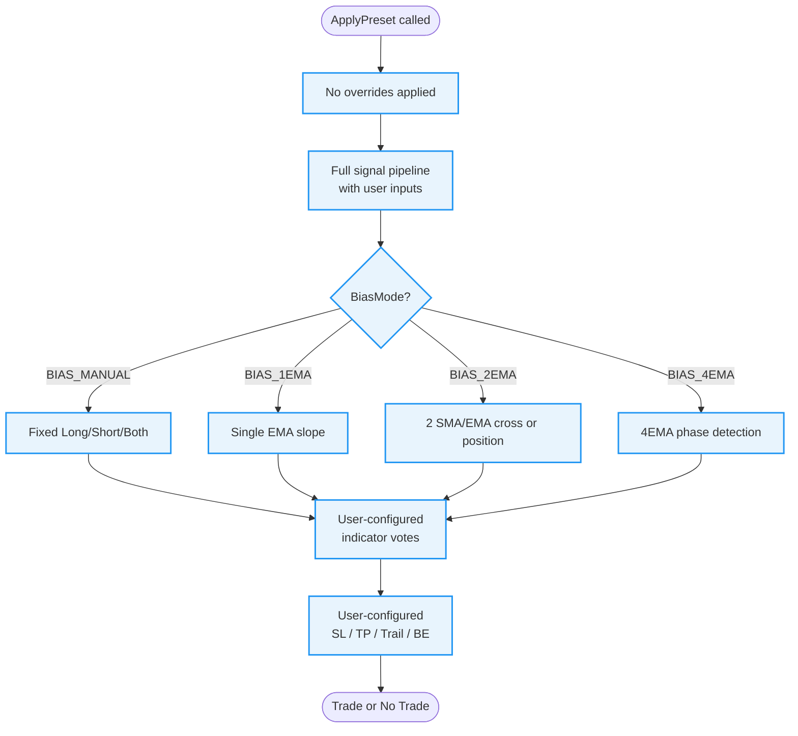
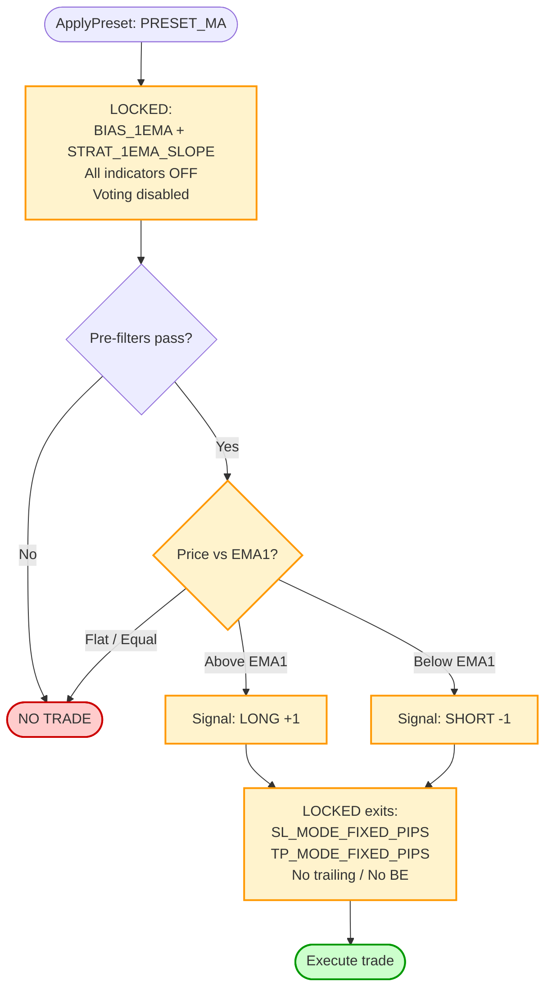
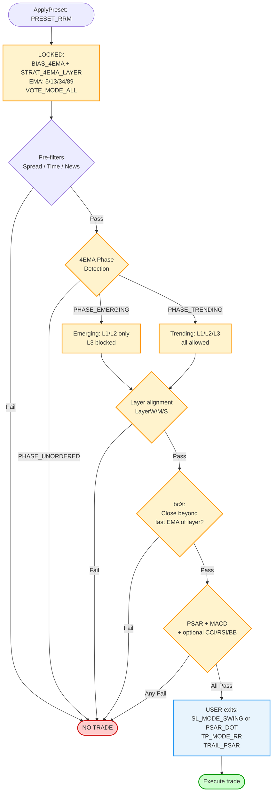
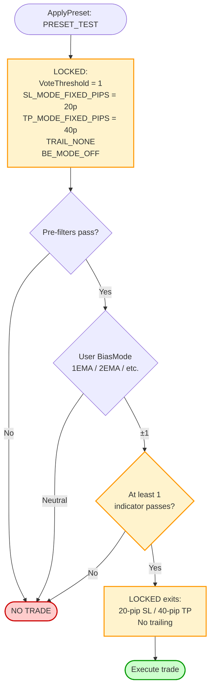
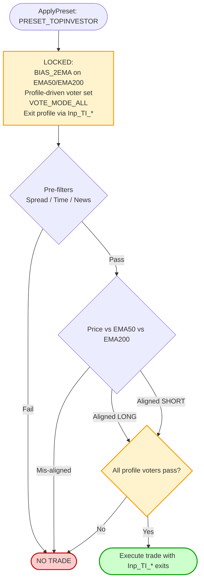
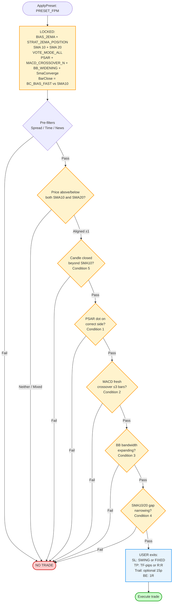
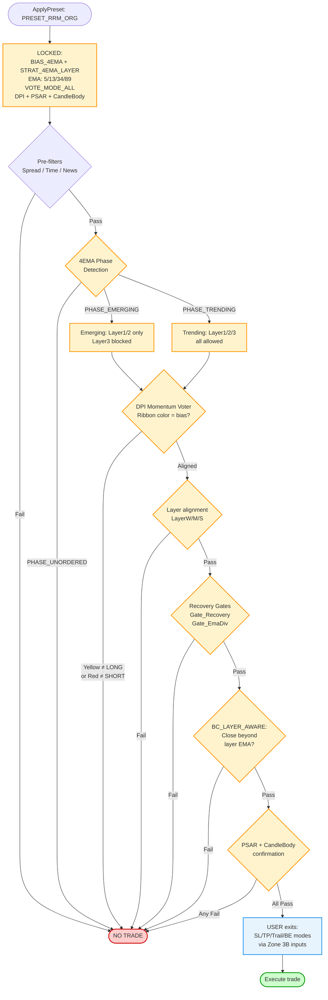

# SEA Preset Reference

## Overview

Presets are applied in `OnInit()` via `ApplyPreset()` (in `SEA_Presets.mqh`).
They overwrite strategy-critical fields **on top of** already-hydrated `Settings`.
**Policy A** gates (spread, time, news, risk) are **always user-controlled** — no preset ever locks them.

> **2026-06 refactor note.** Three presets were removed: `PRESET_CUSTOM` (its `Inp_CUSTOM_*` inputs were only seed defaults for other presets, not a real preset — globals moved to `Inp_Global_*`), `PRESET_RRM` (an untraded variant of `PRESET_RRM_ORG`), and `PRESET_TEST` (a dev scaffold that was `#ifdef`-gated off). The sections describing them further down this document are **historical only** and marked `[REMOVED]`. The current set is the four presets in the table below. The user-control surface that `PRESET_CUSTOM` formerly provided now lives in `Inp_Global_*` globals plus per-preset override blocks (`Inp_RRM_ORG_*`, `Inp_FPM_*`, `Inp_TI_*`, `Inp_MA_*`).

## Current presets

| Preset | Purpose | Indicators Locked? | Exits Locked? |
|---|---|---|---|
| `PRESET_RRM_ORG` | Russ Horn Original RRM — 4EMA, TM phase only, DPI+PSAR+CandleBody+MTF voting. **Current default.** | ✓ DPI+PSAR+CBody+MTF core | Configurable via `Inp_RRM_ORG_*` |
| `PRESET_FPM` | Five-Point Method (Crucial Carlos) | ✓ PSAR+MACD+BB widening+SmaConverge+bar-close | ✗ (SL/TP/Trail user-controlled) |
| `PRESET_TOPINVESTOR` | Dr Świerk TopInvestor / OXO — EMA50/200 confluence | ✓ profile-driven (CONSERVATIVE / BALANCED / AGGRESSIVE) | Configurable via `Inp_TI_*`. See `README_SEA_PRESET_TOPINVESTOR_MANUAL.md`. |
| `PRESET_MA` | MT5 `Moving Average.mq5` sample EA benchmark | ✓ (none — voting disabled, threshold-=1) | ✓ fixed pips |

---

## ~~PRESET_CUSTOM~~ [REMOVED 2026-06]

> Historical content preserved below for reference. `PRESET_CUSTOM` no longer exists. The user-control surface it provided has been split: cross-preset globals are now `Inp_Global_*`, and per-preset overrides live in dedicated blocks (`Inp_RRM_ORG_*`, `Inp_FPM_*`, `Inp_TI_*`, `Inp_MA_*`).

No overrides. Every input is respected exactly as entered by the user.
The signal pipeline runs in full with whatever indicators, bias mode, and exits are configured.



**Use when:** You want full manual control, backtesting custom indicator combinations, or building your own strategy on top of the SEA framework.

---

## PRESET_MA

Replicates the classic MT5 Moving Average sample EA. Single EMA, price-cross signal, no indicators, fixed pip exits. Exists purely as a benchmark baseline.



**Locked settings:** `BIAS_1EMA`, `STRAT_1EMA_SLOPE`, all indicators disabled, fixed SL/TP pips.
**User controls:** Policy A gates (spread/time/news/risk) only.
**Use when:** Benchmarking — run this alongside PRESET_RRM or PRESET_FPM to compare against the naive baseline.

---

## ~~PRESET_RRM~~ [REMOVED 2026-06]

> Historical content preserved below for reference. `PRESET_RRM` no longer exists. It was an untraded variant of `PRESET_RRM_ORG` (the current canonical RRM preset). The mechanics described here remain accurate for `PRESET_RRM_ORG` — phase-based trend pullback, 4EMA detection, layer-gated entries — though the indicator vote panel for `PRESET_RRM_ORG` is **DPI + PSAR + CandleBody + MTF** (not MACD + CCI/RSI/BB as listed for the old RRM).

Phase-based trend pullback system. Uses 4 EMAs to detect market structure phases, requires price to be in a valid pullback layer, and gates entry through PSAR + MACD + optional CCI/RSI/BB votes.



**Locked settings:** `BIAS_4EMA`, `STRAT_4EMA_LAYER`, EMA periods (5/13/34/89), `VOTE_MODE_ALL`, `MACD_CROSSOVER` mode, phase & layer detection ON.
**User controls (Zone 3B):** PSAR step/max, MACD fast/slow/sig, CCI period/mode, RSI period, SL mode, TP mode, R:R ratio, trailing mode, Policy A gates.
**Use when:** Trend-following on M5–H1 with structured pullback entries. Works best in directional trending markets.

---

## ~~PRESET_TEST~~ [REMOVED 2026-06]

> Historical content preserved below for reference. `PRESET_TEST` no longer exists. It was a dev scaffold preset that was `#ifdef`-gated off in shipping builds and never enabled in production.

Minimal development/debug preset. Bypasses the indicator consensus requirement (threshold = 1, so any single indicator passing is enough), uses fixed SL/TP, no trailing. Designed for rapid iteration during development.



**Locked settings:** Vote threshold = 1, fixed SL 20 pips, fixed TP 40 pips, no trailing, BE off.
**User controls:** Bias mode and indicator selection (to test individual indicators in isolation).
**Use when:** Debugging a new indicator or bias mode. Never use on a live account.

---

## PRESET_TOPINVESTOR

Dr Świerk TopInvestor / OXO methodology — EMA50/200 confluence with profile-driven indicator voting. Three profiles trade off filter strictness against trade frequency:

| Profile | Voters | Use case |
|---|---|---|
| `TI_CONSERVATIVE` | 4 (PSAR + ADX + CandleBody + MTF) | Strict, low-frequency, high-conviction setups |
| `TI_BALANCED` | 5 (adds MACD) | Default profile |
| `TI_AGGRESSIVE` | 6 (adds RSI) | More entries, looser filter |



**Locked settings:** `BIAS_2EMA` (EMA50/EMA200), profile-driven voter set, `VOTE_MODE_ALL`.
**User controls:** profile selection via `Inp_TI_Profile`, all exit logic via `Inp_TI_*` block, Policy-A gates.
**Use when:** longer-timeframe (M15-H4) trend-confluence trading where EMA50 over EMA200 is the structural anchor.

**See `README_SEA_PRESET_TOPINVESTOR_MANUAL.md` for the full configuration and methodology reference.**

---

## PRESET_FPM

Implements the Five-Point Method (Forex Profit Model) cheat sheet exactly. Five conditions must all pass. Exits are fully user-controlled.



### Entry Conditions (all 5 must pass)

| # | Cheat Sheet | EA Implementation |
|---|---|---|
| 1 | PSAR crossed below/above price | `Ind_Psar`: dot on correct side of price |
| 2 | MACD crossed above/below signal | `Ind_Macd`: `MACD_CROSSOVER_N` ≤ 3 bars fresh |
| 3 | Bollinger Bands widening | `Ind_Bb`: `BB_WIDENING` — bandwidth > previous bar |
| 4 | 10 + 20 SMA converging | `Ind_SmaConverge`: gap narrowing bar-to-bar |
| 5 | Candle closed above/below both SMAs | `BarClose`: `BC_BIAS_FAST` vs SMA10 |

### User-Controlled Exits (Zone 3C)

| Input | Default | Options |
|---|---|---|
| `Inp_FPM_SLMode` | `SL_MODE_SWING` | `SL_MODE_SWING` or `SL_MODE_FIXED_PIPS` |
| `Inp_FPM_SwingLookback` | `5` | Bars for swing anchor |
| `Inp_FPM_SLFixedPips` | `15.0` | Pips (fixed mode only) |
| `Inp_FPM_TPMode` | `TP_MODE_FIXED_PIPS` | `TP_MODE_FIXED_PIPS` (TF table) or `TP_MODE_RR` |
| `Inp_FPM_RRRatio` | `2.0` | Any double e.g. 1.5, 2.0, 3.0 |
| `Inp_FPM_UseTrailing` | `true` | On/off |
| `Inp_FPM_TrailDistancePips` | `15.0` | Pips |

**Cheat sheet TP targets** (used with `TP_MODE_FIXED_PIPS`):

| TF | Range | EA midpoint |
|---|---|---|
| M5 | 7–15 pips | 11 pips |
| M15 | 10–20 pips | 15 pips |
| M30 | 30–50 pips | 40 pips |
| H1+ | — | 50 pips |

**Breakeven** is always on at 1R (`BE_MODE_R_MULTIPLE`).
**Trailing** activates after breakeven (`TRIGGER_BREAKEVEN`), 15-pip distance by default.

### Recommended Configurations

**Cheat sheet faithful:**
```
Inp_FPM_SLMode             = SL_MODE_SWING
Inp_FPM_SwingLookback      = 5
Inp_FPM_TPMode             = TP_MODE_FIXED_PIPS
Inp_FPM_UseTrailing        = true
Inp_FPM_TrailDistancePips  = 15.0
```

**Proportional R:R:**
```
Inp_FPM_SLMode             = SL_MODE_SWING
Inp_FPM_TPMode             = TP_MODE_RR
Inp_FPM_RRRatio            = 2.0
Inp_FPM_UseTrailing        = true
```

**Fixed distance (no swing):**
```
Inp_FPM_SLMode             = SL_MODE_FIXED_PIPS
Inp_FPM_SLFixedPips        = 15.0
Inp_FPM_TPMode             = TP_MODE_RR
Inp_FPM_RRRatio            = 1.5
Inp_FPM_UseTrailing        = false
```

### Things to Remember
- **25-pip SL cap is manual.** No automatic cap. If swing anchor is deeper than 25 pips, skip the trade.
- **Late to the party? Wait.** `MACD_CROSSOVER_N` enforces a 3-bar freshness window automatically.
- **BB_WIDENING is a one-bar test.** Choppy days may produce false positives — the other 4 conditions filter them.
- **SmaConverge is direction-neutral.** Bias and bar-close handle direction; convergence only checks gap size.
- **Check the news.** Use `UseNews` + `NewsPre`/`NewsPost` to automate blackouts.

---

## PRESET_RRM_ORG

Implements the original Russ Horn RRM methodology with DPI (Dynamic Price Index) as the primary momentum voter. This is the "ORG" (original) version using inline MACD-based momentum confirmation instead of standalone MACD indicator voting.



### Signal Formula (6-step multiplicative chain)

All steps must pass for entry:

| Step | Component | Description |
|------|-----------|-------------|
| 1 | **DPI Voter** | Momentum direction — ribbon color must match bias |
| 2 | **Phase Detection** | 4-EMA structure (UNORDERED blocked, EMERGING/TRENDING allowed) |
| 3 | **Layer Alignment** | EMA pair spacing (WEAK/MEDIUM/STRONG) |
| 4 | **Recovery Gates** | Gate_Recovery + Gate_EmaDiv pullback validation |
| 5 | **Bar Close (BC_LAYER_AWARE)** | Close beyond role-based EMA |
| 6 | **PSAR + CandleBody** | Timing and direction confirmation |

### Locked Settings

**Signal Architecture:**
- `BiasMode = BIAS_4EMA` — 4-EMA phase detection
- `AutoStrat = STRAT_4EMA_LAYER` — Layer-based pullback entry
- `VoteMode = VOTE_MODE_ALL` — Unanimous indicator agreement required
- `PhaseDetectionEnabled = true` — Phase filtering active
- `EnableLayerDetection = true` — Layer filtering active
- `BlockUnorderedPhase = true` — UNORDERED phase blocked
- `BarClose_Mode = BC_LAYER_AWARE` — Layer-aware bar close confirmation

**Indicators (fixed):**
- `Ind_Dpi_Enabled = true` — DPI momentum voter (primary)
- `Ind_Psar_Enabled = true` — Timing confirmation
- `Ind_CandleBody_Enabled = true` — Direction confirmation
- All others OFF (MACD, RSI, CCI, etc. — not part of RRM_ORG)

**Recovery Gates:**
- `RequireRecoveryMomentum = true` — Pullback recovery detection active
- `Gate_Recovery` — Phase-scaled threshold
- `Gate_EmaDiv` — EMA divergence gate
- `RRM_Lookback` — Pullback lookback period

### User Controls (Zone 3D Inputs)

**DPI Settings:**
- `Inp_RRM_ORG_ForceDpiOn` — Force DPI voter ON (default: true)
- `Inp_RRM_ORG_MACD_Fast` — DPI Fast EMA (default: 8)
- `Inp_RRM_ORG_MACD_Slow` — DPI Slow EMA (default: 13)
- `Inp_RRM_ORG_DPI_RedSignalType` — Red signal calculation (1-5, default: 3=EMA13)
- `Inp_RRM_ORG_DPI_UseCCIReset` — Enable CCI trend filter (default: true)
- `Inp_RRM_ORG_DPI_CCI_Period` — CCI period (default: 13)
- `Inp_RRM_ORG_DPI_UseGreenHist` — Enable GREEN visualization (default: true)

**PSAR Settings:**
- `Inp_RRM_ORG_PsarStep` — PSAR step (default: 0.05)
- `Inp_RRM_ORG_PsarMax` — PSAR max (default: 0.5)
- `Inp_RRM_ORG_Vote_AllowPsarFlip` — Enable PSAR flip detection (default: true)
- `Inp_RRM_ORG_Vote_PsarFlipDelay` — PSAR flip delay window `(-1, 0, 1..10)` (default: 2)
- `Inp_RRM_ORG_PSAR_FlipGraceBars` — Grace bars after adverse flip (default: 0)

**Exit Settings (RRM_ORG-specific inputs):**

| Input | Default | Purpose |
|-------|---------|---------|
| `Inp_RRM_ORG_SLMode` | `SL_MODE_PSAR_DOT` | Initial SL placement method |
| `Inp_RRM_ORG_SwingLookback` | `20` | Swing SL lookback bars (if using SL_MODE_SWING) |
| `Inp_RRM_ORG_TPMode` | `TP_MODE_RR` | TP calculation mode |
| `Inp_RRM_ORG_RRRatio` | `2.0` | Risk-reward ratio (1:2 = risk 1 to win 2) |
| `Inp_RRM_ORG_TrailMode` | `TRAIL_PSAR` | Trailing stop mode |
| `Inp_RRM_ORG_TrailStartsAfterBE` | `false` | Only trail after BE hit |
| `Inp_RRM_ORG_PSAR_TrailCushionMode` | `PSAR_CUSHION_PIPS` | PSAR trail cushion mode |
| `Inp_RRM_ORG_BE_Mode` | `BE_MODE_R_MULTIPLE` | Breakeven trigger mode |
| `Inp_RRM_ORG_BE_RMultiple` | `1.0` | Move to BE at 1R profit |
| `Inp_RRM_ORG_BE_ProgressPct` | `33.0` | BE trigger % to TP (if using BE_MODE_TP_PROGRESS_PCT) |

**All RRM_ORG settings now in dedicated input groups** — no more mixing with CUSTOM inputs.

**Policy A Gates (always user-controlled):**
- Spread, Time, News, Risk limits

### DPI vs MACD Difference

**PRESET_RRM** uses:
- Standalone MACD indicator voting
- MACD crossover modes (histogram, crossover, slope)
- Separate from DPI

**PRESET_RRM_ORG** uses:
- DPI inline MACD calculation (internal)
- Ribbon color voting (Yellow = bullish, Red = bearish)
- DPI replaces standalone MACD entirely

**Why DPI instead of MACD?**
- **Russ Horn's original methodology** uses DPI as shown in reference screenshots
- **CCI reset logic** provides trend filter warnings (color resets)
- **Visual clarity** — single ribbon color = directional vote
- **GREEN overlay** — momentum strength visualization

### Phase A Quality Patches (TS=1 hardening)

Targets failure modes in 100-trades reference set:

| Issue | Fix | Setting |
|-------|-----|---------|
| (B) EM→TM flicker entries | Phase confirmation delay | `MinPhaseConfirmBars` TF-scaled |
| (C) Late-trend / overextended fan | Fan width filter | `EmaFanFilterEnabled = true` |
| (C) DPI deceleration leaks | Force DPI ON + decel filter | `Ind_Dpi_Enabled = true` + `DpiDecelFilterEnabled` |
| (D) Tangled-ribbon false TM | Phase + recovery gates | `MinPhaseConfirmBars` + recovery thresholds |

### Phase B: Recovery Sensitivity Tuning

These **opt-in** settings address pullback-recovery setups that are blocked by overly strict
filter thresholds during early market recovery.  All default to `false`/`0` so the original
PRESET_RRM_ORG contract is fully preserved.

> **Design principle:** enable only what the chart shows is failing. Start with one setting,
> backtest, then add the next if still needed.

#### `Inp_RRM_ORG_DPI_IgnoreCCIForVote` (default: `false`)

| Setting | Behaviour |
|---------|-----------|
| `false` (default) | DPI vote requires CCI direction to agree with histogram sign (existing RRM_ORG behaviour) |
| `true` | DPI vote uses **raw histogram direction only** — CCI-reset colour overrides are ignored |

**Use when:** DPI histogram is above zero (bullish) but CCI temporarily turns negative, flipping
the ribbon to RED and blocking valid LONG entries during a pullback.  CCI-reset warnings are
designed for divergence detection, not early-recovery entries.

> **Caution:** disabling the CCI check may allow entries when momentum is genuinely diverging.
> Use in combination with the DPI histogram deceleration filter
> (`Inp_RRM_ORG_DPI_Decel_Filter = true`, already default).

---

#### `Inp_RRM_ORG_Layer_SlopeTolerance` (default: `0.0` pips)

Controls how much an EMA pair's slope may be **flat or marginally reversed** before the
layer-alignment check fails.  With the default (`0.0`) both the fast and slow EMA of a layer
must be strictly rising (LONG) or falling (SHORT).

| Value | Meaning |
|-------|---------|
| `0.0` | Strict — both EMAs must be strictly moving in bias direction (existing behaviour) |
| `2.0` | EMAs are allowed to be flat or reversed by up to 2 pips since the lookback bar |
| `5.0` | Wider tolerance — useful on M1/M5 where EMAs are noisy but trend is intact |

**When to use:** layer rejections at `LAYER_NONE_ALIGNED` during early recovery when the fast
EMA is still decelerating (slope near zero) even though both EMAs are correctly positioned.

> **Caution:** higher values reduce the slope signal quality.  Keep at ≤ 3 pips on M5 and
> ≤ 7 pips on H1.  If rejections are coming from the slow EMA pair, a smaller value is usually
> sufficient.

---

#### `Inp_RRM_ORG_BarClose_PipTolerance` (default: `0.0` pips)

The bar-close confirmation (`BC_LAYER_AWARE`) requires the candle to close **beyond** the
layer-specific EMA.  With a positive tolerance, closes that are within N pips of the EMA
(either side) are accepted.

| Value | Meaning |
|-------|---------|
| `0.0` | Strict — close must be strictly beyond EMA in trade direction (existing behaviour) |
| `1.0` | Closes within 1 pip of the EMA are accepted (touch is enough) |
| `3.0` | Closes up to 3 pips on the "wrong" side of the EMA still pass |

**When to use:** bar-close rejections (`BC_NOT_CONFIRMED`) when the candle closed at or very
near the EMA but the body extension was fractional.

> **Caution:** too-large values make the bar-close check ineffective.  Recommended range:
> 0.5–3 pips.  Keep at 0 when `BarClose_Mode = BC_LAYER_AWARE` is used with loose layers.

---

#### `Inp_RRM_ORG_PSAR_FlipGraceBars` (default: `0`)

When PSAR temporarily flips **against** the trade direction during a pullback, this grace
period keeps the PSAR vote passing for up to N bars after the adverse flip, even though the
dot is now on the wrong side.

| Value | Meaning |
|-------|---------|
| `0` | Disabled — PSAR must be on the correct side at shift=1 (existing behaviour) |
| `2` | PSAR passes for 2 bars after an adverse flip — allows entries during brief dot reversals |
| `5` | Wider grace window, useful on H1 where PSAR flips can last several bars |

**When to use:** PSAR vote rejections (`PSAR_DOT_WRONG_SIDE`) when the dot flipped during a
pullback but all other conditions (DPI, layer, bar-close) are satisfied.

> **Caution:** a long grace window can allow entries when the PSAR flip signals a genuine
> trend reversal.  Combine with `Inp_RRM_ORG_Layer_SlopeTolerance = 0` (strict layer
> requirement) to maintain structural quality.

---

#### Recommended Starting Configuration for Missed Pullback-Recovery Entries

```
// Enable one at a time; backtest after each change
Inp_RRM_ORG_DPI_IgnoreCCIForVote   = false   // enable only if DPI CCI-reset is the primary rejection
Inp_RRM_ORG_Layer_SlopeTolerance   = 2.0     // start here if LAYER_NONE_ALIGNED dominates
Inp_RRM_ORG_BarClose_PipTolerance  = 1.0     // start here if BC_NOT_CONFIRMED dominates
Inp_RRM_ORG_PSAR_FlipGraceBars     = 2       // start here if PSAR_DOT_WRONG_SIDE dominates
```

Use `DebugFlow = true` (or `DebugLevel = DEBUG_INDICATORS`) on a historical bar to see the
exact rejection reason printed in the MT5 journal before choosing which setting to adjust.

### Use When

- Trading H1 timeframe with structured pullback entries
- Following Russ Horn RRM methodology exactly
- Need visual momentum confirmation (DPI ribbon + GREEN)
- Want CCI-filtered trend warnings (color resets)

### Differences from PRESET_RRM

| Feature | PRESET_RRM | PRESET_RRM_ORG |
|---------|------------|----------------|
| Momentum voter | Standalone MACD | DPI (inline MACD) |
| Voting indicators | MACD + PSAR + optional CCI/RSI/BB | DPI + PSAR + CandleBody (fixed) |
| CCI usage | Optional voting indicator | Integrated DPI trend filter |
| Visual feedback | MACD in subwindow | DPI ribbon + GREEN momentum |
| Methodology | Generic RRM framework | Russ Horn original RRM |

See also:
- [DPI vote and histogram behavior](README_SEA_SIGNAL_REFERENCE.md#dpi-dynamic-price-index--momentum-direction-voter)
- [DPI standalone + EA parity notes](../DPI_mc_main_README.md#ea-integration-preset_rrm_org)
